# 📊 Diagramas Completos — Capta.Credivoucher

> Colección completa de diagramas Mermaid del sistema Capta.Credivoucher.
> Generados a partir del análisis del código fuente.
> Todos se renderizan automáticamente en MkDocs Material, GitHub y VSCode.

---

## 📑 Índice

1. [Arquitectura](#1-arquitectura)
2. [Flujos de petición](#2-flujos-de-petición)
3. [Base de datos](#3-base-de-datos)
4. [Flujos de negocio](#4-flujos-de-negocio)
5. [Estados y máquinas de estado](#5-estados-y-máquinas-de-estado)
6. [Componentes y dependencias](#6-componentes-y-dependencias)
7. [Seguridad](#7-seguridad)
8. [Infraestructura y despliegue](#8-infraestructura-y-despliegue)
9. [Diagramas de clases](#9-diagramas-de-clases)

---

## 1. Arquitectura

### 1.1 Vista general del sistema

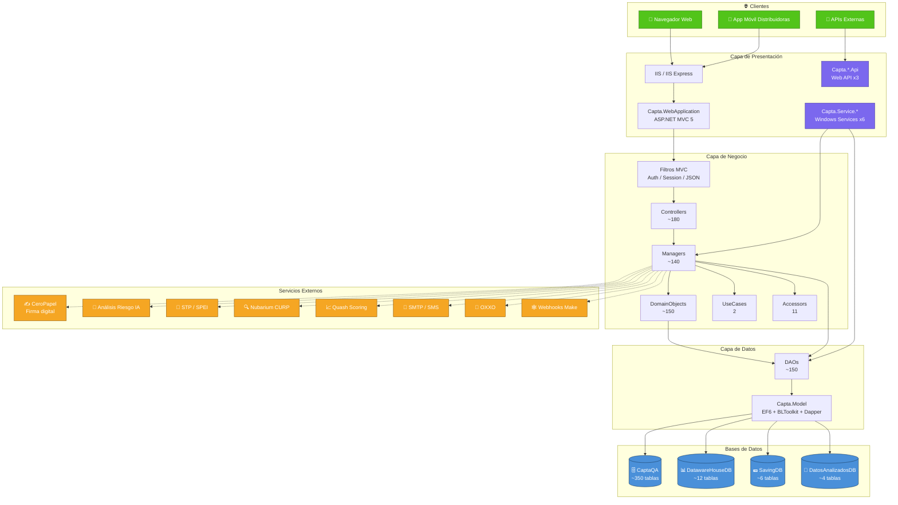
```mermaid
graph TB
    subgraph Clientes["🌐 Clientes"]
        Web[👤 Navegador Web]
        AppMovil[📱 App Móvil Distribuidoras]
        APIExt[🔌 APIs Externas]
    end

    subgraph Presentacion["Capa de Presentación"]
        IIS[IIS / IIS Express]
        MVC[Capta.WebApplication<br/>ASP.NET MVC 5]
        APIs[Capta.*.Api<br/>Web API x3]
        Services[Capta.Service.*<br/>Windows Services x6]
    end

    subgraph Negocio["Capa de Negocio"]
        Controllers[Controllers<br/>~180]
        Filters[Filtros MVC<br/>Auth / Session / JSON]
        Managers[Managers<br/>~140]
        DomainObjects[DomainObjects<br/>~150]
        UseCases[UseCases<br/>2]
        Accessors[Accessors<br/>11]
    end

    subgraph Datos["Capa de Datos"]
        DAOs[DAOs<br/>~150]
        Model[Capta.Model<br/>EF6 + BLToolkit + Dapper]
    end

    subgraph BD["Bases de Datos"]
        Core[(🗄️ CaptaQA<br/>~350 tablas)]
        DWH[(📊 DatawareHouseDB<br/>~12 tablas)]
        Savings[(💵 SavingDB<br/>~6 tablas)]
        DatosDB[(🤖 DatosAnalizadosDB<br/>~4 tablas)]
    end

    subgraph Externos["Servicios Externos"]
        CeroPapel[✍️ CeroPapel<br/>Firma digital]
        IA[🤖 Análisis Riesgo IA]
        STP[🏦 STP / SPEI]
        Nubarium[🔍 Nubarium CURP]
        Quash[📈 Quash Scoring]
        SMTP[📧 SMTP / SMS]
        Oxxo[🏪 OXXO]
        QuashWeb[🕸️ Webhooks Make]
    end

    Web --> IIS
    AppMovil --> IIS
    APIExt --> APIs
    IIS --> MVC
    MVC --> Filters
    Filters --> Controllers
    Controllers --> Managers
    Managers --> DomainObjects
    Managers --> UseCases
    Managers --> Accessors
    DomainObjects --> DAOs
    Managers --> DAOs
    DAOs --> Model
    Model --> Core
    Model --> DWH
    Model --> Savings
    Model --> DatosDB
    Managers -.-> CeroPapel
    Managers -.-> IA
    Managers -.-> STP
    Managers -.-> Nubarium
    Managers -.-> Quash
    Managers -.-> SMTP
    Managers -.-> Oxxo
    Managers -.-> QuashWeb
    Services --> Managers
    Services --> DAOs

    classDef bd fill:#4a90d9,stroke:#1a3a5c,color:#fff
    classDef ext fill:#f5a623,stroke:#8a5a10,color:#fff
    classDef svc fill:#7b68ee,stroke:#3e2f9e,color:#fff
    classDef cliente fill:#52c41a,stroke:#2a6e10,color:#fff
    class Core,DWH,Savings,DatosDB bd
    class CeroPapel,IA,STP,Nubarium,Quash,SMTP,Oxxo,QuashWeb ext
    class Services,APIs svc
    class Web,AppMovil,APIExt cliente
```

### 1.2 Capas de la solución

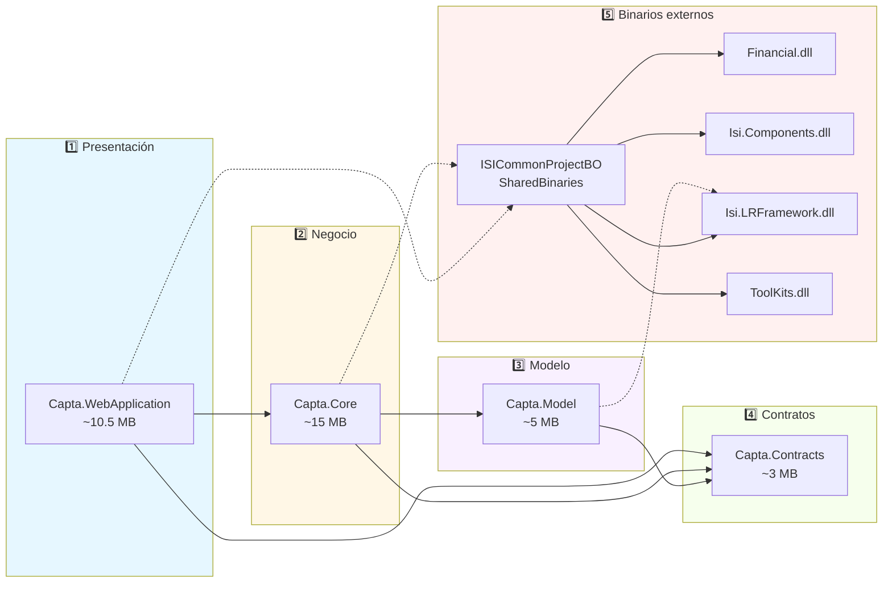
```mermaid
graph LR
    subgraph L1["1️⃣ Presentación"]
        WA[Capta.WebApplication<br/>~10.5 MB]
    end

    subgraph L2["2️⃣ Negocio"]
        Core[Capta.Core<br/>~15 MB]
    end

    subgraph L3["3️⃣ Modelo"]
        Model[Capta.Model<br/>~5 MB]
    end

    subgraph L4["4️⃣ Contratos"]
        Contracts[Capta.Contracts<br/>~3 MB]
    end

    subgraph L5["5️⃣ Binarios externos"]
        Shared[ISICommonProjectBO<br/>SharedBinaries]
        Financial[Financial.dll]
        IsiComp[Isi.Components.dll]
        IsiLR[Isi.LRFramework.dll]
        Tools[ToolKits.dll]
    end

    WA --> Core
    WA --> Contracts
    Core --> Model
    Core --> Contracts
    Model --> Contracts
    Core -.-> Shared
    WA -.-> Shared
    Model -.-> IsiLR
    Shared --> Financial
    Shared --> IsiComp
    Shared --> IsiLR
    Shared --> Tools

    style L1 fill:#e6f7ff
    style L2 fill:#fff7e6
    style L3 fill:#f9f0ff
    style L4 fill:#f6ffed
    style L5 fill:#fff1f0
```

### 1.3 Distribución de proyectos

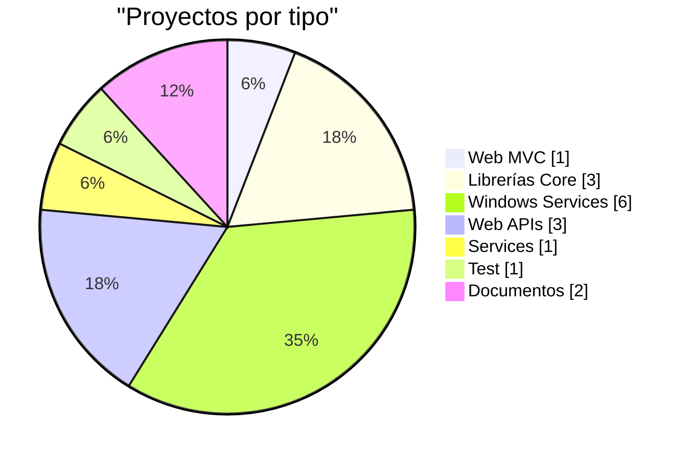
```mermaid
pie showData
    title "Proyectos por tipo"
    "Web MVC" : 1
    "Librerías Core" : 3
    "Windows Services" : 6
    "Web APIs" : 3
    "Services" : 1
    "Test" : 1
    "Documentos" : 2
```

---

## 2. Flujos de petición

### 2.1 Petición HTTP completa (MVC)

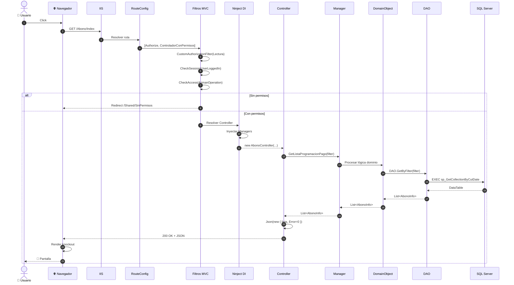
```mermaid
sequenceDiagram
    autonumber
    actor U as 👤 Usuario
    participant B as 🌐 Navegador
    participant IIS as IIS
    participant RF as RouteConfig
    participant F as Filtros MVC
    participant Ninj as Ninject DI
    participant C as Controller
    participant M as Manager
    participant DO as DomainObject
    participant D as DAO
    participant DB as SQL Server

    U->>B: Click
    B->>IIS: GET /Abono/Index
    IIS->>RF: Resolver ruta
    RF->>F: [Authorize, ControladorConPermisos]
    F->>F: CustomAuthorizationFilter(Lectura)
    F->>F: CheckSession(UserLoggedIn)
    F->>F: CheckAccess(AzmanOperation)
    
    alt Sin permisos
        F-->>B: Redirect /Shared/SinPermisos
    else Con permisos
        F->>Ninj: Resolver Controller
        Ninj->>Ninj: Inyectar Managers
        Ninj-->>C: new AbonoController(...)
        C->>M: GetListaProgramacionPago(filter)
        M->>DO: Procesar lógica dominio
        DO->>D: DAO.GetByFilter(filter)
        D->>DB: EXEC sp_GetCollectionByCutDate
        DB-->>D: DataTable
        D-->>DO: List<AbonoInfo>
        DO-->>M: List<AbonoInfo>
        M-->>C: List<AbonoInfo>
        C->>C: Json(new { lista, Error=0 })
        C-->>B: 200 OK + JSON
        B->>B: Render knockout
        B-->>U: 🎉 Pantalla
    end
```

### 2.2 Petición con Parallel.Invoke (AbonoController)

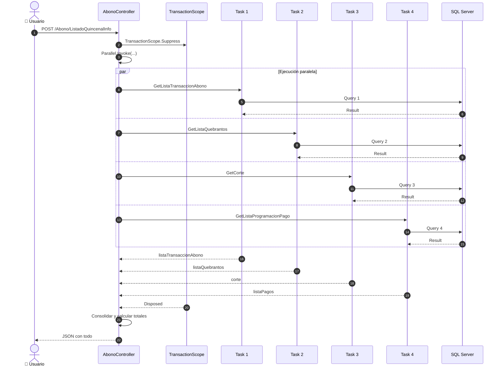
```mermaid
sequenceDiagram
    autonumber
    actor U as 👤 Usuario
    participant C as AbonoController
    participant TS as TransactionScope
    participant T1 as Task 1
    participant T2 as Task 2
    participant T3 as Task 3
    participant T4 as Task 4
    participant DB as SQL Server

    U->>C: POST /Abono/ListadoQuincenalInfo
    C->>TS: TransactionScope.Suppress
    C->>C: Parallel.Invoke(...)
    
    par Ejecución paralela
        C->>T1: GetListaTransaccionAbono
        T1->>DB: Query 1
        DB-->>T1: Result
    and
        C->>T2: GetListaQuebrantos
        T2->>DB: Query 2
        DB-->>T2: Result
    and
        C->>T3: GetCorte
        T3->>DB: Query 3
        DB-->>T3: Result
    and
        C->>T4: GetListaProgramacionPago
        T4->>DB: Query 4
        DB-->>T4: Result
    end
    
    T1-->>C: listaTransaccionAbono
    T2-->>C: listaQuebrantos
    T3-->>C: corte
    T4-->>C: listaPagos
    TS-->>C: Disposed
    
    C->>C: Consolidar y calcular totales
    C-->>U: JSON con todo
```

### 2.3 Reporte en segundo plano (ReporteSegundoPlanHelper)

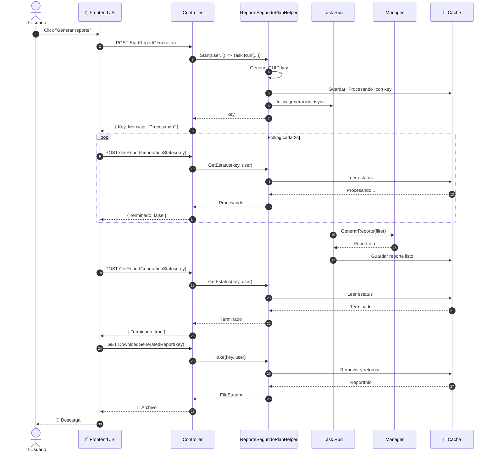
```mermaid
sequenceDiagram
    autonumber
    actor U as 👤 Usuario
    participant JS as 🖱️ Frontend JS
    participant C as Controller
    participant H as ReporteSegundoPlanHelper
    participant Task as Task.Run
    participant M as Manager
    participant Cache as 💾 Cache

    U->>JS: Click "Generar reporte"
    JS->>C: POST StartReportGeneration
    C->>H: Start(user, () => Task.Run(...))
    H->>H: Generar GUID key
    H->>Cache: Guardar "Procesando" con key
    H->>Task: Inicia generación async
    H-->>C: key
    C-->>JS: { Key, Mensaje: "Procesando" }
    
    loop Polling cada 2s
        JS->>C: POST GetReportGenerationStatus(key)
        C->>H: GetEstatus(key, user)
        H->>Cache: Leer estatus
        Cache-->>H: Procesando...
        H-->>C: Procesando
        C-->>JS: { Terminado: false }
    end
    
    Task->>M: GenerarReporte(filter)
    M-->>Task: ReportInfo
    Task->>Cache: Guardar reporte listo
    
    JS->>C: POST GetReportGenerationStatus(key)
    C->>H: GetEstatus(key, user)
    H->>Cache: Leer estatus
    Cache-->>H: Terminado
    H-->>C: Terminado
    C-->>JS: { Terminado: true }
    
    JS->>C: GET DownloadGeneratedReport(key)
    C->>H: Take(key, user)
    H->>Cache: Remover y retornar
    Cache-->>H: ReportInfo
    H-->>C: FileStream
    C-->>JS: 📄 Archivo
    JS-->>U: 🎉 Descarga
```

---

## 3. Base de datos

### 3.1 Diagrama ER completo del núcleo

```mermaid
erDiagram
    SUCURSAL ||--o{ ENLACE : "opera"
    SUCURSAL ||--o{ CLIENTE : "registra"
    SUCURSAL ||--o{ CAJA : "tiene"
    SUCURSAL ||--o{ USUARIO : "emplea"
    SUCURSAL ||--o{ TRANSACCION_ABONO : "captura"
    
    ENLACE ||--o{ CLIENTE : "atiende"
    ENLACE ||--o| ENLACE_CONFIG : "configura"
    ENLACE ||--o{ VALE : "coloca"
    ENLACE ||--o{ SOLICITUD_CREDITO : "solicita"
    ENLACE ||--o{ CONVENIO : "tiene"
    ENLACE ||--o{ CONDONACION : "tiene"
    ENLACE ||--o{ SEGURO_NULO : "tiene"
    ENLACE ||--o{ EVALUACION_FINANCIERA : "evalúa"
    
    CLIENTE ||--o{ CLIENTE_IMAGEN : "tiene"
    CLIENTE ||--o| INFORMACION_LABORAL : "tiene"
    CLIENTE ||--o{ REFERENCIA_CLIENTE : "tiene"
    CLIENTE ||--o{ CLIENTE_TARJETA : "tiene"
    CLIENTE ||--o{ AVAL : "tiene"
    CLIENTE ||--o{ BENEFICIARIO : "tiene"
    CLIENTE ||--o{ CLIENTE_IMAGENES_APP : "tiene"
    
    VALE ||--o| PAGARE : "se convierte"
    VALE ||--o{ PAGARE_EVENTO : "evento"
    VALE ||--o{ PAGARE_PERSONAL : "personal"
    VALE ||--o{ PAGARE_AUTO : "auto"
    VALE ||--o{ PAGARE_GEMS : "gems"
    VALE ||--o{ PAGARE_AHORRO : "ahorro"
    VALE ||--o{ PAGARE_SUSTENTABILIDAD : "sustentabilidad"
    
    PAGARE ||--|| TABLA_AMORTIZACION : "usa"
    PAGARE ||--o{ PROGRAMACION_PAGO : "genera"
    PAGARE ||--o| TRANSFERENCIA : "entrega"
    PAGARE ||--o{ PAGARE_DOMICILIO : "domicilios"
    
    PROGRAMACION_PAGO ||--o{ ABONO : "recibe"
    
    ABONO }o--|| TRANSACCION_ABONO : "en"
    TRANSACCION_ABONO }o--|| CUENTA : "usa"
    TRANSACCION_ABONO }o--|| MEDIO_PAGO : "usa"
    
    TRANSFERENCIA }o--o| CHEQUE : "puede ser"
    TRANSFERENCIA }o--|| TIPO_ABONO : "es"
    
    TRANSFER_BATCH ||--o{ TRANSFER : "agrupa"
    
    CONVENIO ||--o{ CONVENIO_DETALLE : "detalle"
    CONVENIO ||--o{ PAGARE_CONVENIO : "genera"
    CONVENIO ||--o{ TABLA_AMORTIZACION_CONVENIO : "genera"
    
    CONDONACION ||--o{ CONDONACION_DETALLE : "detalle"
    
    SEGURO_NULO ||--o{ SEGURO_NULO_DETALLE : "detalle"
    SEGURO_NULO ||--o{ PAGARE_SEGURO_NULO : "genera"
    
    FIDEICOMISO ||--o{ FIDEICOMISO_DETALLE : "contiene"
    FIDEICOMISO ||--o{ SOCIO_FIDEICOMISO_PORCENTAJE : "porcentajes"
    FIDEICOMISO_DETALLE }o--|| VALE : "referencia"
    
    PROSPECTOS ||--o| SOLICITUD_CREDITO_PROSPECTO : "tiene"
    PROSPECTOS ||--o| ESTUDIO_SOCIOECONOMICO_PROSPECTO : "tiene"
    PROSPECTOS ||--o| ESTUDIO_SOCIOECONOMICO_AVAL : "tiene"
    PROSPECTOS ||--o| PROSPECTO_ENLACE_CEROPAPEL : "firma"
    PROSPECTOS ||--o{ PROSPECTO_IMAGEN : "imágenes"
    PROSPECTOS ||--o{ PROSPECTO_PROYECCION : "proyecciones"
    PROSPECTOS ||--o| QUASH_RESPOND : "score"
    
    PRE_REGISTRO_PROSPECTOS ||--o{ PRE_REGISTRO_VALIDACION : "valida"
    PRE_REGISTRO_PROSPECTOS ||--o{ PRE_REGISTRO_PROSPECTO_LINKS : "links"
    LEADS_WEB ||--o{ PRE_REGISTRO_PROSPECTOS : "convierte"
    
    ASP_NET_USERS ||--o{ ASP_NET_USER_ROLES : "tiene"
    ASP_NET_ROLES ||--o{ ASP_NET_USER_ROLES : "asignado"
    ASP_NET_ROLES ||--o{ PERMISO_ROL_CONTROLADOR : "accede"
    ASP_NET_ROLES ||--o{ PERMISO_ROL_OPERATION : "opera"
    OPERATION ||--o{ PERMISO_ROL_OPERATION : "referencia"
    ASP_NET_USERS ||--o{ PERMISO_USUARIO_SUCURSAL : "asignado"
    ASP_NET_USERS ||--o{ PERMISO_USUARIO_CAJA : "asignado"
    ASP_NET_USERS ||--o{ PERMISO_USUARIO_ROL : "tiene"
    
    EMPRESA ||--o{ SUCURSAL : "contiene"
    PLAZA ||--o{ SUCURSAL : "agrupa"
    
    ESTADO ||--o{ MUNICIPIO : "contiene"
    MUNICIPIO ||--o{ COLONIA : "contiene"
```

### 3.2 Relaciones por módulo

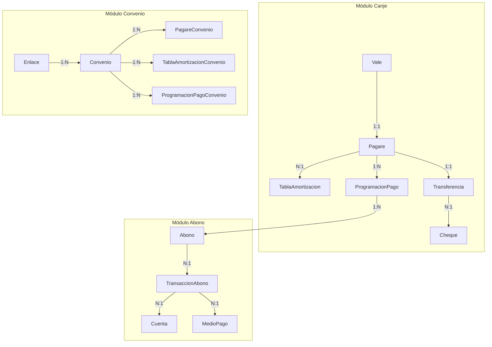
```mermaid
graph TB
    subgraph "Módulo Canje"
        V[Vale]
        P[Pagare]
        TA[TablaAmortizacion]
        PP[ProgramacionPago]
        T[Transferencia]
        C[Cheque]
        
        V -->|1:1| P
        P -->|N:1| TA
        P -->|1:N| PP
        P -->|1:1| T
        T -->|N:1| C
    end
    
    subgraph "Módulo Abono"
        AB[Abono]
        TX[TransaccionAbono]
        CU[Cuenta]
        MP[MedioPago]
        
        PP -->|1:N| AB
        AB -->|N:1| TX
        TX -->|N:1| CU
        TX -->|N:1| MP
    end
    
    subgraph "Módulo Convenio"
        CV[Convenio]
        PC[PagareConvenio]
        TAC[TablaAmortizacionConvenio]
        PPC[ProgramacionPagoConvenio]
        
        EN[Enlace] -->|1:N| CV
        CV -->|1:N| PC
        CV -->|1:N| TAC
        CV -->|1:N| PPC
    end
```

### 3.3 Distribución de entidades por BD

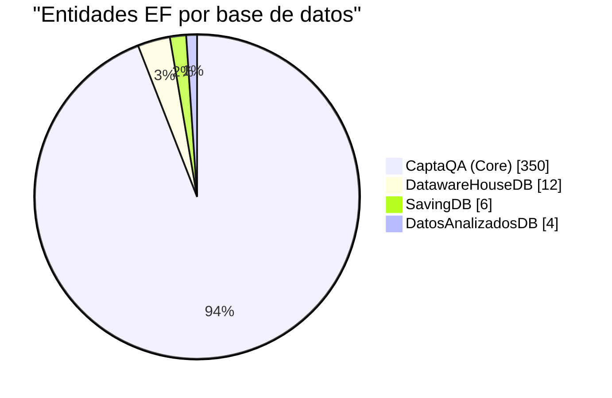
```mermaid
pie showData
    title "Entidades EF por base de datos"
    "CaptaQA (Core)" : 350
    "DatawareHouseDB" : 12
    "SavingDB" : 6
    "DatosAnalizadosDB" : 4
```

### 3.4 Conexión de las 4 BD

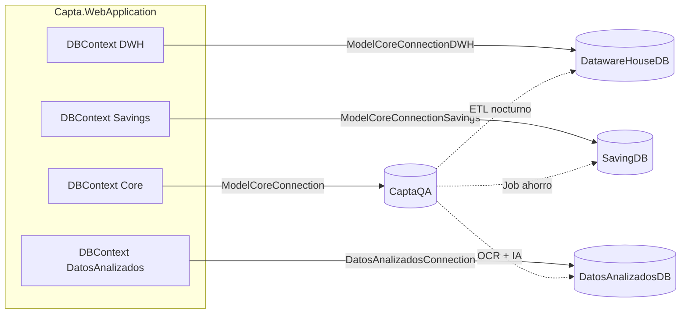
```mermaid
graph LR
    subgraph WebApp["Capta.WebApplication"]
        Ctx1[DBContext Core]
        Ctx2[DBContext DWH]
        Ctx3[DBContext Savings]
        Ctx4[DBContext DatosAnalizados]
    end
    
    Ctx1 -->|ModelCoreConnection| Core[(CaptaQA)]
    Ctx2 -->|ModelCoreConnectionDWH| DWH[(DatawareHouseDB)]
    Ctx3 -->|ModelCoreConnectionSavings| Savings[(SavingDB)]
    Ctx4 -->|DatosAnalizadosConnection| Datos[(DatosAnalizadosDB)]
    
    Core -.->|ETL nocturno| DWH
    Core -.->|Job ahorro| Savings
    Core -.->|OCR + IA| Datos
```

---

## 4. Flujos de negocio

### 4.1 Canje de vale

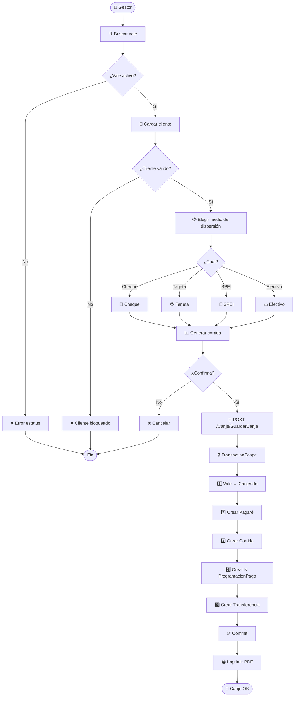
```mermaid
flowchart TD
    Start([🎫 Gestor]) --> Buscar[🔍 Buscar vale]
    Buscar --> Valida1{¿Vale activo?}
    Valida1 -->|No| Err1[❌ Error estatus]
    Err1 --> End1([Fin])
    
    Valida1 -->|Sí| CargarCliente[👤 Cargar cliente]
    CargarCliente --> Valida2{¿Cliente válido?}
    Valida2 -->|No| Err2[❌ Cliente bloqueado]
    Err2 --> End1
    
    Valida2 -->|Sí| ElegirMedio[💳 Elegir medio de dispersión]
    ElegirMedio --> TipoMedio{¿Cuál?}
    
    TipoMedio -->|Cheque| Cheque[📝 Cheque]
    TipoMedio -->|Tarjeta| Tarjeta[💳 Tarjeta]
    TipoMedio -->|SPEI| SPEI[🏦 SPEI]
    TipoMedio -->|Efectivo| Efectivo[💵 Efectivo]
    
    Cheque --> Corrida
    Tarjeta --> Corrida
    SPEI --> Corrida
    Efectivo --> Corrida
    
    Corrida[📊 Generar corrida] --> Confirma{¿Confirma?}
    Confirma -->|No| Cancelar[❌ Cancelar]
    Cancelar --> End1
    
    Confirma -->|Sí| Guardar[💾 POST /Canje/GuardarCanje]
    
    Guardar --> TS[🔒 TransactionScope]
    TS --> S1[1️⃣ Vale → Canjeado]
    S1 --> S2[2️⃣ Crear Pagaré]
    S2 --> S3[3️⃣ Crear Corrida]
    S3 --> S4[4️⃣ Crear N ProgramacionPago]
    S4 --> S5[5️⃣ Crear Transferencia]
    S5 --> Commit[✅ Commit]
    
    Commit --> Print[🖨️ Imprimir PDF]
    Print --> End2([🎉 Canje OK])
```

### 4.2 Captura de abono

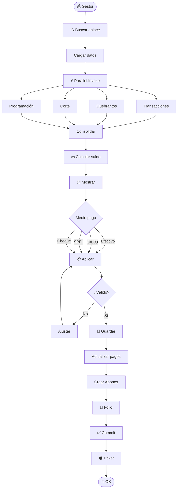
```mermaid
flowchart TD
    Start([💰 Gestor]) --> Buscar[🔍 Buscar enlace]
    Buscar --> Cargar[Cargar datos]
    Cargar --> Par[⚡ Parallel.Invoke]
    
    Par --> P1[Transacciones]
    Par --> P2[Quebrantos]
    Par --> P3[Corte]
    Par --> P4[Programación]
    
    P1 --> Cons[Consolidar]
    P2 --> Cons
    P3 --> Cons
    P4 --> Cons
    
    Cons --> Calc[💵 Calcular saldo]
    Calc --> Mostrar[📺 Mostrar]
    
    Mostrar --> Elegir{Medio pago}
    Elegir -->|Efectivo| Aplicar
    Elegir -->|OXXO| Aplicar
    Elegir -->|SPEI| Aplicar
    Elegir -->|Cheque| Aplicar
    
    Aplicar[💳 Aplicar] --> Valida{¿Válido?}
    Valida -->|No| Ajustar[Ajustar]
    Ajustar --> Aplicar
    
    Valida -->|Sí| Guardar[💾 Guardar]
    Guardar --> Actualizar[Actualizar pagos]
    Actualizar --> CrearAb[Crear Abonos]
    CrearAb --> Folio[🔢 Folio]
    Folio --> Commit[✅ Commit]
    Commit --> Print[🖨️ Ticket]
    Print --> End([🎉 OK])
```

### 4.3 Corte quincenal

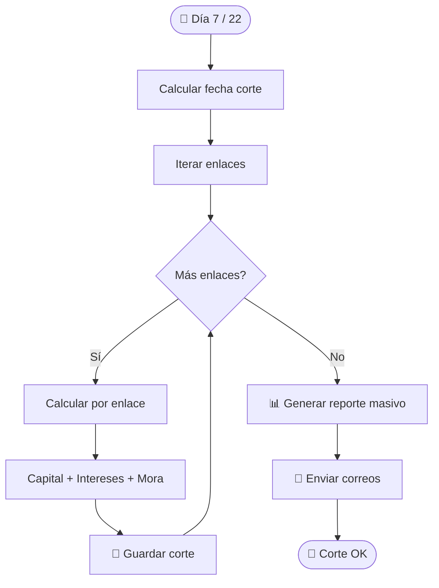
```mermaid
flowchart TD
    Start([📅 Día 7 / 22]) --> CalcCorte[Calcular fecha corte]
    CalcCorte --> Iterar[Iterar enlaces]
    
    Iterar --> LoopEnlace{Más enlaces?}
    LoopEnlace -->|Sí| Calc[Calcular por enlace]
    Calc --> CalcularCorte[Capital + Intereses + Mora]
    CalcularCorte --> Guardar[💾 Guardar corte]
    Guardar --> LoopEnlace
    
    LoopEnlace -->|No| Reporte[📊 Generar reporte masivo]
    Reporte --> EnviarCorreo[📧 Enviar correos]
    EnviarCorreo --> End([🎉 Corte OK])
```

### 4.4 Convenio

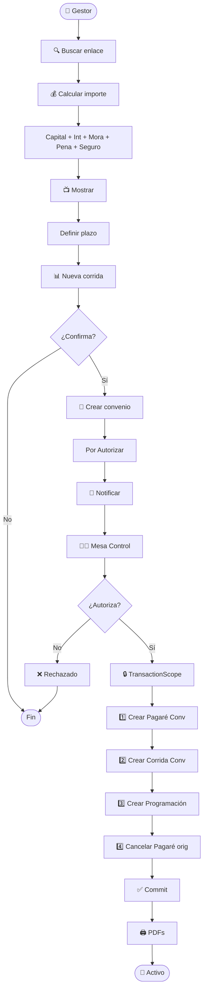
```mermaid
flowchart TD
    Start([📄 Gestor]) --> Buscar[🔍 Buscar enlace]
    Buscar --> Calc[💰 Calcular importe]
    Calc --> Desglosar[Capital + Int + Mora + Pena + Seguro]
    Desglosar --> Mostrar[📺 Mostrar]
    
    Mostrar --> Plazo[Definir plazo]
    Plazo --> Corrida[📊 Nueva corrida]
    Corrida --> Confirma{¿Confirma?}
    Confirma -->|No| End1([Fin])
    
    Confirma -->|Sí| Crear[💾 Crear convenio]
    Crear --> Estatus1[Por Autorizar]
    Estatus1 --> Notificar[📧 Notificar]
    
    Notificar --> Authorize[👨‍💼 Mesa Control]
    Authorize --> Autoriza{¿Autoriza?}
    Autoriza -->|No| Rechazar[❌ Rechazado]
    Rechazar --> End1
    
    Autoriza -->|Sí| TS[🔒 TransactionScope]
    TS --> S1[1️⃣ Crear Pagaré Conv]
    S1 --> S2[2️⃣ Crear Corrida Conv]
    S2 --> S3[3️⃣ Crear Programación]
    S3 --> S4[4️⃣ Cancelar Pagaré orig]
    S4 --> Commit[✅ Commit]
    Commit --> Print[🖨️ PDFs]
    Print --> End2([🎉 Activo])
```

### 4.5 Condonación

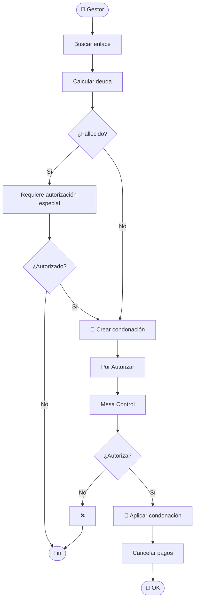
```mermaid
flowchart TD
    Start([📝 Gestor]) --> Buscar[Buscar enlace]
    Buscar --> Calc[Calcular deuda]
    Calc --> ValidaFallecido{¿Fallecido?}
    
    ValidaFallecido -->|Sí| RequiereAuth[Requiere autorización especial]
    ValidaFallecido -->|No| Crear
    
    RequiereAuth --> Auth1{¿Autorizado?}
    Auth1 -->|No| End1([Fin])
    Auth1 -->|Sí| Crear
    
    Crear[💾 Crear condonación] --> Estatus1[Por Autorizar]
    Estatus1 --> Auth2[Mesa Control]
    Auth2 --> Auth3{¿Autoriza?}
    Auth3 -->|No| Rechazar[❌]
    Rechazar --> End1
    
    Auth3 -->|Sí| Aplicar[💾 Aplicar condonación]
    Aplicar --> Cancelar[Cancelar pagos]
    Cancelar --> End2([🎉 OK])
```

### 4.6 Transferencia / Dispersión (STP)

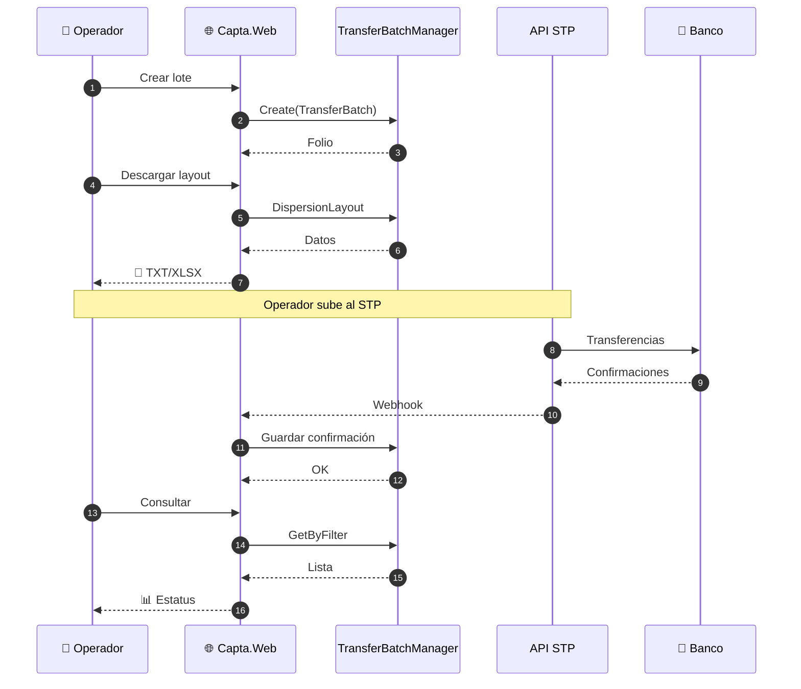
```mermaid
sequenceDiagram
    autonumber
    participant Op as 👤 Operador
    participant Web as 🌐 Capta.Web
    participant Man as TransferBatchManager
    participant STP as API STP
    participant Bank as 🏦 Banco

    Op->>Web: Crear lote
    Web->>Man: Create(TransferBatch)
    Man-->>Web: Folio
    
    Op->>Web: Descargar layout
    Web->>Man: DispersionLayout
    Man-->>Web: Datos
    Web-->>Op: 📄 TXT/XLSX
    
    Note over Op,STP: Operador sube al STP
    
    STP->>Bank: Transferencias
    Bank-->>STP: Confirmaciones
    
    STP-->>Web: Webhook
    Web->>Man: Guardar confirmación
    Man-->>Web: OK
    
    Op->>Web: Consultar
    Web->>Man: GetByFilter
    Man-->>Web: Lista
    Web-->>Op: 📊 Estatus
```

### 4.7 Cierre de Tape de Cartera

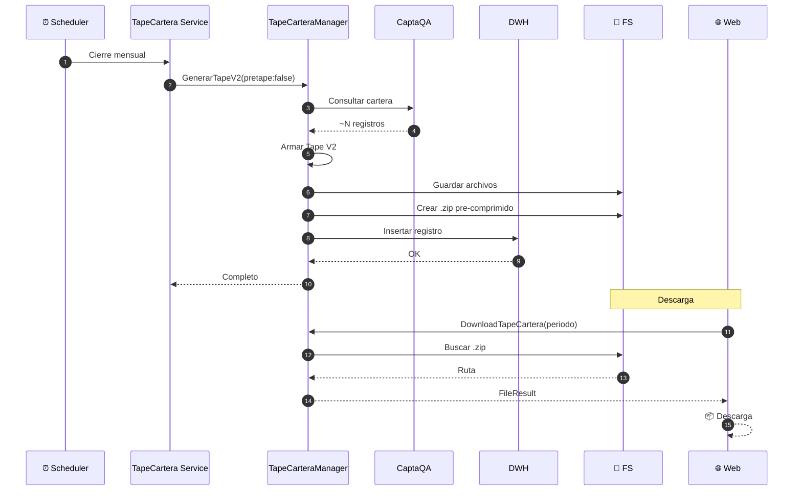
```mermaid
sequenceDiagram
    autonumber
    participant Job as ⏰ Scheduler
    participant Svc as TapeCartera Service
    participant Man as TapeCarteraManager
    participant DB as CaptaQA
    participant DWH as DWH
    participant FS as 📁 FS
    participant Web as 🌐 Web

    Job->>Svc: Cierre mensual
    Svc->>Man: GenerarTapeV2(pretape:false)
    Man->>DB: Consultar cartera
    DB-->>Man: ~N registros
    Man->>Man: Armar Tape V2
    Man->>FS: Guardar archivos
    Man->>FS: Crear .zip pre-comprimido
    Man->>DWH: Insertar registro
    DWH-->>Man: OK
    Man-->>Svc: Completo
    
    Note over Web,FS: Descarga
    Web->>Man: DownloadTapeCartera(periodo)
    Man->>FS: Buscar .zip
    FS-->>Man: Ruta
    Man-->>Web: FileResult
    Web-->>Web: 📦 Descarga
```

### 4.8 Prospecto → Enlace

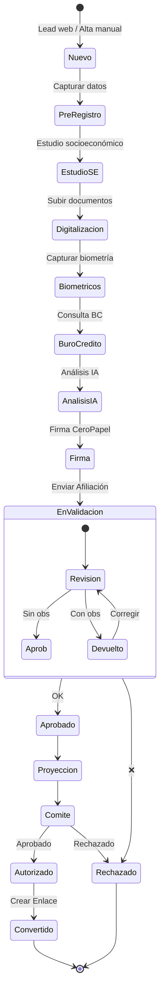
```mermaid
stateDiagram-v2
    [*] --> Nuevo: Lead web / Alta manual
    Nuevo --> PreRegistro: Capturar datos
    PreRegistro --> EstudioSE: Estudio socioeconómico
    EstudioSE --> Digitalizacion: Subir documentos
    Digitalizacion --> Biometricos: Capturar biometría
    Biometricos --> BuroCredito: Consulta BC
    BuroCredito --> AnalisisIA: Análisis IA
    AnalisisIA --> Firma: Firma CeroPapel
    Firma --> EnValidacion: Enviar Afiliación
    
    state EnValidacion {
        [*] --> Revision
        Revision --> Aprob: Sin obs
        Revision --> Devuelto: Con obs
        Devuelto --> Revision: Corregir
    }
    
    EnValidacion --> Aprobado: OK
    EnValidacion --> Rechazado: ❌
    
    Aprobado --> Proyeccion
    Proyeccion --> Comite
    Comite --> Autorizado: Aprobado
    Comite --> Rechazado: Rechazado
    
    Autorizado --> Convertido: Crear Enlace
    Convertido --> [*]
    Rechazado --> [*]
```

---

## 5. Estados y máquinas de estado

### 5.1 Estados de un Vale

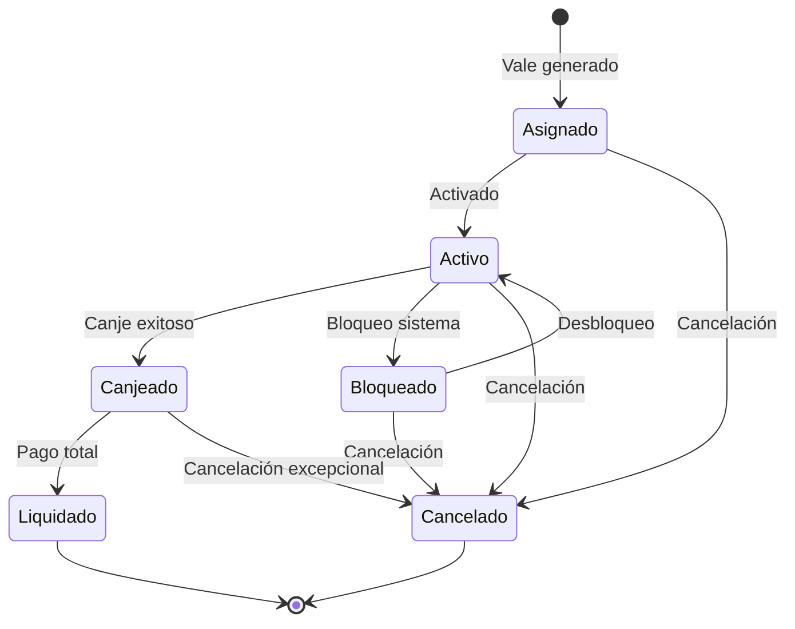
```mermaid
stateDiagram-v2
    [*] --> Asignado: Vale generado
    Asignado --> Activo: Activado
    Asignado --> Cancelado: Cancelación
    
    Activo --> Canjeado: Canje exitoso
    Activo --> Bloqueado: Bloqueo sistema
    Activo --> Cancelado: Cancelación
    
    Bloqueado --> Activo: Desbloqueo
    Bloqueado --> Cancelado: Cancelación
    
    Canjeado --> Liquidado: Pago total
    Canjeado --> Cancelado: Cancelación excepcional
    
    Liquidado --> [*]
    Cancelado --> [*]
```

### 5.2 Estados de un Pagaré

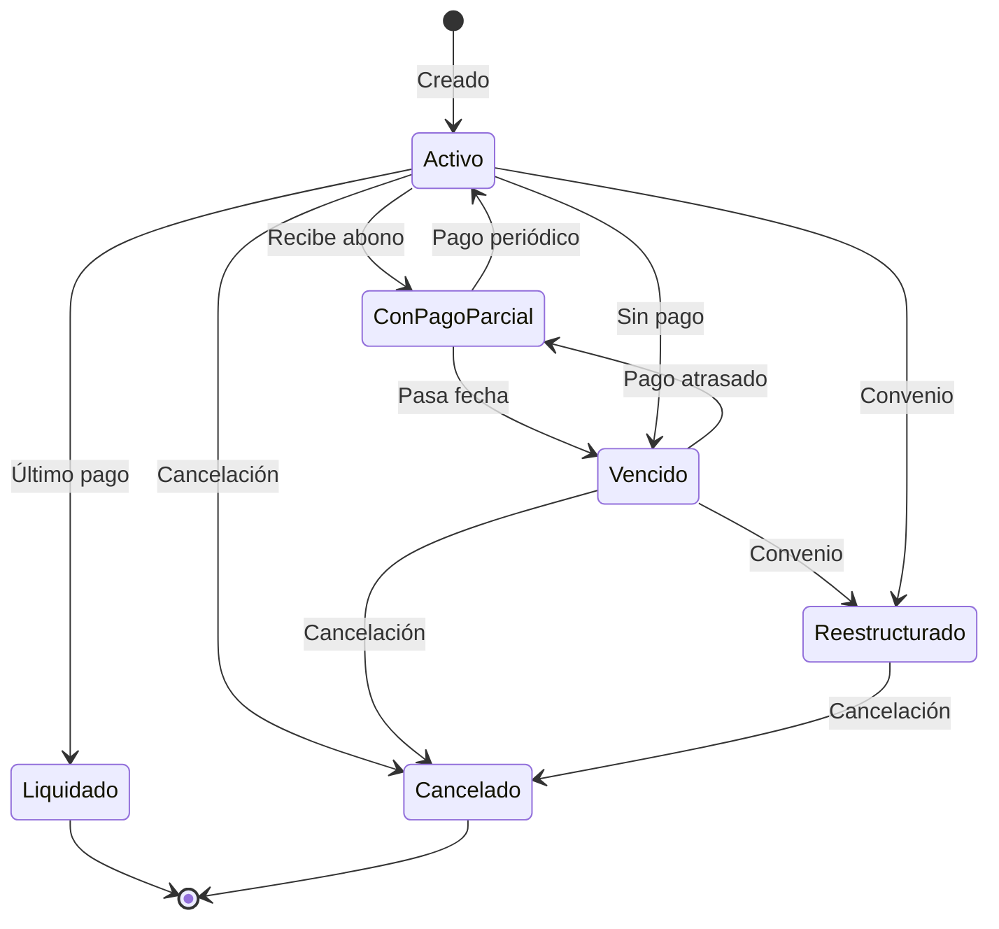
```mermaid
stateDiagram-v2
    [*] --> Activo: Creado
    Activo --> ConPagoParcial: Recibe abono
    ConPagoParcial --> Activo: Pago periódico
    ConPagoParcial --> Vencido: Pasa fecha
    Activo --> Vencido: Sin pago
    Vencido --> ConPagoParcial: Pago atrasado
    Vencido --> Reestructurado: Convenio
    Activo --> Reestructurado: Convenio
    Activo --> Cancelado: Cancelación
    Vencido --> Cancelado: Cancelación
    Activo --> Liquidado: Último pago
    Reestructurado --> Cancelado: Cancelación
    Liquidado --> [*]
    Cancelado --> [*]
```

### 5.3 Estados de una Transferencia

```mermaid
stateDiagram-v2
    [*] --> Pendiente: Creada
    Pendiente --> Proceso: Enviada a STP
    Proceso --> Cobrada: Confirmada
    Proceso --> Rechazada: Rechazo STP
    Proceso --> Cancelada: Cancelación
    Cobrada --> Devolucion: Devolución
    Rechazada --> Sustituida: Sustitución
    Devolucion --> Sustitucion: Sustitución
    Cancelada --> [*]
    Cobrada --> [*]
    Sustituida --> [*]
    Sustitucion --> [*]
```

### 5.4 Estados de un Prospecto

```mermaid
stateDiagram-v2
    [*] --> Nuevo
    Nuevo --> PreRegistro
    PreRegistro --> EstudioSocio
    EstudioSocio --> Digitalizacion
    Digitalizacion --> Biometricos
    Biometricos --> BC
    BC --> AnalisisRiesgo
    AnalisisRiesgo --> Firma
    Firma --> EnValidacion
    
    EnValidacion --> Rechazado: Rechaza
    EnValidacion --> Autorizado: Aprueba
    
    Rechazado --> EnValidacion: Corrección
    Autorizado --> Convertido: Crear Enlace
    
    Convertido --> [*]
    Rechazado --> [*]
```

### 5.5 Estados de un Convenio

```mermaid
stateDiagram-v2
    [*] --> PorAutorizar: Creado
    PorAutorizar --> Autorizado: Aprobado
    PorAutorizar --> Rechazado: Rechazado
    PorAutorizar --> Cancelado: Cancelado
    
    Autorizado --> Activo: Vigente
    Activo --> Liquidado: Pagado
    Activo --> Cancelado: Cancelado
    
    Liquidado --> [*]
    Rechazado --> [*]
    Cancelado --> [*]
```

### 5.6 Estados de una Evaluación Financiera

```mermaid
stateDiagram-v2
    [*] --> Inactivo: Creada
    Inactivo --> Activo: Activación Afiliación
    Activo --> Bloqueado: Bloqueo nocturno
    Bloqueado --> Activo: Desbloqueo manual
    Activo --> Extendido: Extensión límite
    Extendido --> Activo: Vence extensión
    Activo --> Inactivo: Desactivación
    Bloqueado --> [*]
```

### 5.7 Estados de un Pre-registro

```mermaid
stateDiagram-v2
    [*] --> Prospeccion: Captura
    Prospeccion --> Documentos: Docs cargados
    Documentos --> EnValidacion: Enviado
    EnValidacion --> Devuelto: Con obs
    Devuelto --> Documentos: Corregido
    EnValidacion --> Autorizado: OK
    Autorizado --> [*]
```

---

## 6. Componentes y dependencias

### 6.1 Dependencias entre proyectos

```mermaid
graph TB
    subgraph "Solución"
        Test[Capta.Test]
        WA[Capta.WebApplication]
        Core[Capta.Core]
        Model[Capta.Model]
        Contracts[Capta.Contracts]
    end
    
    subgraph "Servicios Windows"
        SVC1[Capta.Service.FileWatcher]
        SVC2[Capta.Service.CustomerLock]
        SVC3[Capta.Service.STPEnvio]
        SVC4[Capta.Service.SMS]
        SVC5[Capta.Service.ColaConsulta]
        SVC6[Capta.Service.TapeCartera]
    end
    
    subgraph "Web APIs"
        API1[Capta.Buro.Api]
        API2[Capta.VoucherVerify.Api]
        API3[Capta.FideicomisoCesion.Api]
    end
    
    subgraph "Otros"
        Prospectos[Capta.Services.Prospectos]
    end
    
    Test -.-> WA
    Test -.-> Core
    Test -.-> Contracts
    
    WA --> Core
    WA --> Contracts
    
    Core --> Model
    Core --> Contracts
    
    Model --> Contracts
    
    SVC1 --> Core
    SVC2 --> Core
    SVC3 --> Core
    SVC4 --> Core
    SVC5 --> Core
    SVC6 --> Core
    
    SVC1 --> Contracts
    SVC2 --> Contracts
    SVC3 --> Contracts
    SVC4 --> Contracts
    SVC5 --> Contracts
    SVC6 --> Contracts
    
    API1 --> Core
    API2 --> Core
    API3 --> Core
    
    Prospectos --> Core
```

### 6.2 Componentes de Capta.Core

```mermaid
graph TB
    subgraph "Capta.Core"
        subgraph "Servicios"
            Managers[Managers<br/>~140]
            DomainObjects[DomainObjects<br/>~150]
            UseCases[UseCases<br/>2]
            ServiceImpl[Servicios Impl<br/>2]
            Accessors[Accessors<br/>11]
        end
        
        subgraph "Integration"
            DAOs[DAOs<br/>~150]
            BaseClassDAO[BaseClassDAO]
            DapperDAO[BaseClassDapperDAO]
        end
        
        subgraph "Soporte"
            Helper[Helper<br/>~25]
            Logger[Logger]
            Utilerias[Utilerias]
            Interfaces[Interfaces<br/>12]
        end
    end
    
    Managers --> DomainObjects
    Managers --> UseCases
    Managers --> Accessors
    Managers --> DAOs
    DomainObjects --> DAOs
    DomainObjects --> Helper
    DAOs --> BaseClassDAO
    DAOs --> DapperDAO
    Managers -.-> Logger
    DomainObjects -.-> Logger
```

### 6.3 Componentes de Capta.WebApplication

```mermaid
graph TB
    subgraph "Capta.WebApplication"
        Controllers[Controllers<br/>~180]
        Views[Views<br/>~700 .cshtml]
        Filters[Filters]
        Security[Securirty<br/>Azman]
        AppStart[App_Start]
        Helpers[Helpers]
        Middleware[Middleware]
        Models[Models Identity]
    end
    
    subgraph "App_Start"
        Ninject[NinjectWebCommon]
        Route[RouteConfig]
        Bundle[BundleConfig]
        StartupAuth[Startup.Auth]
        FilterConfig[FilterConfig]
    end
    
    subgraph "Securirty"
        Access[Access]
        CheckAccess[CheckAccess]
        CheckSession[CheckSession]
        CustomAuth[CustomAuthorizationFilter]
    end
    
    AppStart --> Ninject
    AppStart --> Route
    AppStart --> Bundle
    AppStart --> StartupAuth
    AppStart --> FilterConfig
    
    Controllers --> Filters
    Controllers --> Security
    Controllers --> Helpers
    Security --> Access
    Security --> CheckAccess
    Security --> CheckSession
    Security --> CustomAuth
    Controllers --> Models
    Middleware -.-> Controllers
```

### 6.4 Árbol de dependencias de un Controller típico

```mermaid
graph TB
    AbonoController[AbonoController] --> PPMan[ProgramacionPagoManager]
    AbonoController --> AbMan[AbonoManager]
    AbonoController --> AntMan[AnticipoManager]
    AbonoController --> CatMan[CatalogoManager]
    AbonoController --> CobMan[CobranzaManager]
    AbonoController --> RepMan[ReporteManager]
    AbonoController --> TAMan[TransaccionAbonoManager]
    AbonoController --> UsuMan[UsuarioManager]
    AbonoController --> CliMan[ClienteManager]
    AbonoController --> SucMan[SucursalManager]
    AbonoController --> CueMan[CuentaManager]
    AbonoController --> TAQMan[TransaccionAbonoQuebrantosManager]
    AbonoController --> LogMan[LogErrorManager]
    
    PPMan --> PPDAO[ProgramacionPagoDAO]
    AbMan --> AbDAO[AbonoDAO]
    TAMan --> TADAO[TransaccionAbonoDAO]
    
    PPDAO --> DB[(SQL Server)]
    AbDAO --> DB
    TADAO --> DB
    
    RepMan --> RepDAO[ReporteDAO]
    RepDAO --> RDLC[Reports RDLC]
```

---

## 7. Seguridad

### 7.1 Flujo de autenticación y autorización (Azman)

```mermaid
flowchart TD
    Start([👤 Usuario]) --> Login[🔐 POST /Account/Login]
    Login --> Val[ASP.NET Identity]
    Val -->|Falla| Err[❌ Inválido]
    Err --> Start
    
    Val -->|OK| Cookie[🍪 Cookie OWIN]
    Cookie --> Session[📦 Session UserLoggedIn]
    Session --> Home[🏠 /Home/Index]
    
    Home --> Menu[🍔 HomeController.Menu]
    Menu --> LeerAzman[📋 PermisoRolControlador]
    LeerAzman --> Filtrar[🔍 Filtrar]
    Filtrar --> Render[✅ Menú]
    
    Render --> Click[🖱️ Click usuario]
    Click --> F1{[Authorize]}
    F1 -->|No auth| Login
    F1 -->|OK| F2{[ControladorConPermisos]}
    F2 -->|No| SP[⛔ SinPermisos]
    F2 -->|OK| F3{[CustomAuthorizationFilter]}
    F3 -->|No| SP
    F3 -->|OK| F4{[CheckSession]}
    F4 -->|No| Login
    F4 -->|OK| F5{[CheckAccess]}
    F5 -->|No| SP
    F5 -->|OK| Run[✅ Ejecutar]
    Run --> Fin([🎉])
    SP --> Fin
```

### 7.2 Jerarquía de roles

```mermaid
graph TB
    Admin[👑 Administrador]
    Admin --> Sup[📊 Supervisor]
    Admin --> Aud[🔍 Auditoría Interna]
    Admin --> Fin[💰 Finanzas]
    
    Sup --> Coord[👥 Coordinador]
    Sup --> Mesa[⚖️ Mesa de Control]
    
    Coord --> Gest[💼 Gestor]
    Coord --> Prom[🎯 Promotor]
    
    Gest --> CC[📞 Call Center]
    Prom --> Afil[✍️ Afiliación]
    
    Admin --> Cob[💰 Cobranza]
    Admin --> Ops[⚙️ Operaciones]
    
    style Admin fill:#f5a623,stroke:#8a5a10,color:#fff
    style Sup fill:#7b68ee,stroke:#3e2f9e,color:#fff
    style Aud fill:#52c41a,stroke:#2a6e10,color:#fff
```

### 7.3 Flujo de permisos por operación

```mermaid
sequenceDiagram
    participant U as Usuario
    participant A as Access
    participant DB as PermisoRolControlador
    participant Op as AzmanOperation

    U->>A: HasAccess(OperationX)
    A->>A: Obtener rol del usuario
    A->>DB: SELECT Controlador, Operacion
    DB-->>A: Lista de operaciones
    A->>A: Check si OperationX está
    A-->>U: true/false
    
    U->>A: HasAdministrator(user)
    A->>A: Verificar rol Administrador
    A-->>U: true/false
```

### 7.4 Flujo de CeroPapel (firma digital)

```mermaid
sequenceDiagram
    autonumber
    participant Web as 🌐 Capta.Web
    participant Man as CeroPapelManager
    participant API as ✍️ CeroPapel API
    participant Cli as 👤 Cliente
    participant DB as CaptaQA

    Web->>Man: IniciarFirma(prospectoId)
    Man->>API: POST /external-document
    API-->>Man: { uuid, linkAliada, linkAval }
    Man->>DB: Guardar enlace
    Man-->>Web: Enlaces
    
    Web->>Cli: 📧 Enviar SMS + link
    Cli->>API: Firma digital
    API-->>API: Procesa firma
    
    Web->>Man: ConsultarDocumento(uuid)
    Man->>API: GET /document/{uuid}
    API-->>Man: { status, documentUrl }
    Man->>DB: Actualizar estatus
    Man-->>Web: Estatus
    
    Web->>Man: GuardarContrato(prospectoId, uuid, url)
    Man->>API: Descargar PDF
    API-->>Man: PDF bytes
    Man->>DB: Guardar URL
    Man-->>Web: OK
```

---

## 8. Infraestructura y despliegue

### 8.1 Topología de despliegue

```mermaid
graph TB
    subgraph Internet["🌐 Internet"]
        Users[👥 Usuarios]
        ExtAPI[🔌 APIs externas]
    end
    
    subgraph DMZ["DMZ"]
        WAF[🔥 WAF/Firewall]
        LB[⚖️ Load Balancer]
    end
    
    subgraph AppTier["Capa de Aplicación"]
        IIS1[IIS Server 1]
        IIS2[IIS Server 2]
        Svc1[⚙️ Windows Services]
    end
    
    subgraph DataTier["Capa de Datos"]
        SQL1[(🗄️ SQL Server<br/>CaptaQA)]
        SQL2[(📊 SQL Server DWH)]
        SQL3[(💵 SQL Server Savings)]
        FS[📁 File Server<br/>Uploads/Expedientes]
        NAS[💾 NAS<br/>Backups]
    end
    
    subgraph Monitoring["Monitoreo"]
        Log[📝 log4net]
        Event[📋 Event Viewer]
        APM[📊 APM/Monitoring]
    end
    
    Users --> WAF
    ExtAPI --> WAF
    WAF --> LB
    LB --> IIS1
    LB --> IIS2
    IIS1 --> Svc1
    IIS2 --> Svc1
    IIS1 --> SQL1
    IIS2 --> SQL1
    Svc1 --> SQL1
    IIS1 --> SQL2
    IIS2 --> SQL3
    Svc1 --> SQL2
    IIS1 --> FS
    Svc1 --> FS
    SQL1 --> NAS
    IIS1 -.-> Log
    IIS2 -.-> Log
    Svc1 -.-> Log
    Log -.-> APM
```

### 8.2 Pipeline de despliegue

```mermaid
flowchart LR
    Dev[👨‍💻 Developer] --> Git[📦 Git Repo]
    Git --> Build[🔨 MSBuild]
    Build --> Tests{🧪 Tests}
    Tests -->|Falla| Notify[📧 Notificar]
    Notify --> Dev
    Tests -->|OK| QA[🚀 Deploy QA]
    QA --> Smoke[🔥 Smoke Test]
    Smoke --> Approve{👀 Aprobación}
    Approve -->|No| Fix[🔧 Fix]
    Fix --> Dev
    Approve -->|Sí| PROD[🚀 Deploy PROD]
    PROD --> Monitor[📊 Monitoring]
    Monitor --> Rollback{🔙 Rollback?}
    Rollback -->|Sí| RollbackOp[↩️ Rollback]
    RollbackOp --> QA
    Rollback -->|No| Done[✅ Producción]
```

### 8.3 Estructura de deploy

```mermaid
graph TB
    subgraph Server["🖥️ Servidor Producción"]
        subgraph IIS["IIS"]
            AppPool[🔧 App Pool]
            Site1[🌐 capta-web]
            Site2[🌐 capta-buro-api]
            Site3[🌐 capta-voucher-api]
        end
        
        subgraph Services["⚙️ Windows Services"]
            S1[Capta.Service.FileWatcher]
            S2[Capta.Service.CustomerLock]
            S3[Capta.Service.STPEnvio]
            S4[Capta.Service.SMS]
            S5[Capta.Service.ColaConsulta]
            S6[Capta.Service.TapeCartera]
        end
        
        subgraph Files["📁 Sistema de Archivos"]
            Config[C:\Capta\Config]
            Uploads[C:\Capta\Uploads]
            Expedientes[C:\Capta\ExpedienteDigital]
            Prospectos[C:\Capta\Prospecto]
            Contract[C:\Contratos\CeroPapel]
            Reports[C:\Capta\Reports]
        end
        
        subgraph Logs["📝 Logs"]
            AppLog[log4net logs]
            IISLog[IIS logs]
        end
    end
    
    subgraph Data["🗄️ Data Tier"]
        SQL[(SQL Server)]
        NAS[💾 NAS Backups]
    end
    
    IIS --> Data
    Services --> Data
    IIS --> Files
    Services --> Files
    IIS --> Logs
    Services --> Logs
```

---

## 9. Diagramas de clases

### 9.1 Modelo de capas (patrón del proyecto)

```mermaid
classDiagram
    class BaseController {
        +UserManager~ApplicationUser~
        +AuthenticationManager
        +Session
        +GetSucursalSeleccionada() int
        +GetCajaSeleccionada() int
        +ArmarEnlace() string
        +File() FileResult
        +Json() JsonResult
    }
    
    class AbonoController {
        -ProgramacionPagoManager _programacionPagoManager
        -AbonoManager _manager
        -AnticipoManager _anticipoManager
        -CatalogoManager _catalogoManager
        -CobranzaManager _cobranzaManager
        -ReporteManager _reporteManager
        -TransaccionAbonoManager _transaccionAbonoManager
        +Index() ActionResult
        +ListadoQuincenalInfo() JsonResult
        +Create() JsonResult
        +CreateOtrosIngresos() JsonResult
        +CancelarTransaccionAbono() JsonResult
        +ListaAbonoDesglosado() JsonResult
        +ExportExcel() JsonResult
        +DownloadFile() FileContentResult
    }
    
    class AbonoManager {
        +GetListaTransaccionAbonoPorEnlaceId() List
        +GetAbonosPorProgramacionPago() List
        +GuardarListaAbonos() void
        +CancelarTransaccionAbono() void
        +GetAbonoDesglosados() List
        +ExportExcel() MemoryStream
        +CsvExport() byte[]
        +ReportReceiptMoneyPdf() byte[]
    }
    
    class AbonoDomainObjects {
        +Procesar() void
        +Validar() bool
    }
    
    class AbonoDAO {
        +GetByFilter() List~AbonoInfo~
        +GetByProgramacionPagoId() List
        +Save() int
    }
    
    BaseController <|-- AbonoController
    AbonoController --> AbonoManager
    AbonoManager --> AbonoDomainObjects
    AbonoDomainObjects --> AbonoDAO
```

### 9.2 Modelo de Managers más usados

```mermaid
classDiagram
    class ProgramacionPagoManager {
        +GetListaProgramacionPago() List
        +GetByPagareId() List
        +GetPostergationDate() List
        +GenerarSaldosInsolutos() Task
        +ExistePago() bool
    }
    
    class AbonoManager {
        +GetAbonosPorProgramacionPago() List
        +GuardarListaAbonos() void
        +CancelarTransaccionAbono() void
        +GetAbonoDesglosados() List
    }
    
    class CobranzaManager {
        +GetCorte() CorteInfo
        +GetSaldoDistribuidor() SaldoDistribuidorInfo
        +GuardarCorte() void
        +ObtenerCargosPorCobrarPorFiltro() List
        +ObtenerCobranzaPorFiltro() List
    }
    
    class TransaccionAbonoManager {
        +GetById() TransaccionAbonoInfo
        +GuardarConTransaccion() int
        +AplicarPagosClientes() Tuple
        +UpdateTransaccionAbono() void
    }
    
    class ClienteManager {
        +GetById() ClienteInfo
        +GetPager() Pager~ClienteInfo~
        +Create() int
        +Update() void
        +SustituirEnlace() int
    }
    
    ProgramacionPagoManager --> AbonoManager : AbonoController inyecta ambos
    CobranzaManager --> ProgramacionPagoManager : comparte
    TransaccionAbonoManager --> AbonoManager : aplica sobre
```

### 9.3 Modelo de entidades principales

```mermaid
classDiagram
    class Cliente {
        +int Id
        +int EnlaceId
        +int SucursalId
        +string NombreCompleto
        +string RFC
        +string CURP
        +DateTime FechaNacimiento
        +Estatus Estatus
        +DateTime FechaRegistro
    }
    
    class Enlace {
        +int Id
        +int Codigo
        +string NombreCompleto
        +TipoEnlace Tipo
        +Nivel Nivel
        +int SucursalId
        +Estatus Estatus
    }
    
    class Vale {
        +int Id
        +int NumeroVale
        +int EnlaceId
        +int ClienteId
        +EstatusVale Estatus
        +DateTime FechaAsignacion
    }
    
    class Pagare {
        +int Id
        +int Folio
        +int ValeId
        +int ClienteId
        +int CorridaId
        +decimal ImportePagare
        +DateTime FechaRegistro
        +EstatusPagare Estatus
    }
    
    class TablaAmortizacion {
        +int Id
        +decimal Capital
        +decimal Intereses
        +int PlazoPrestamo
        +decimal PagoProgramado
        +FrecuenciaPago Frecuencia
        +DateTime FechaInicioPago
    }
    
    class ProgramacionPago {
        +int Id
        +int PagareId
        +int NumeroPago
        +DateTime FechaPagoProgramado
        +decimal PagoProgramado
        +EstatusPagoProgramado Estatus
        +TipoAbono TipoAbono
    }
    
    class Abono {
        +int Id
        +int ProgramacionPagoId
        +int TransaccionAbonoId
        +decimal Pago
        +decimal SaldoPago
        +DateTime FechaRegistro
        +bool Activo
    }
    
    class TransaccionAbono {
        +int Id
        +int SucursalId
        +int EnlaceId
        +int ClienteId
        +decimal Importe
        +int MedioPagoId
        +DateTime FechaOperacion
        +int Folio
    }
    
    Cliente "1" --> "N" Vale
    Enlace "1" --> "N" Cliente
    Enlace "1" --> "N" Vale
    Vale "1" --> "1" Pagare
    Pagare "1" --> "1" TablaAmortizacion
    Pagare "1" --> "N" ProgramacionPago
    ProgramacionPago "1" --> "N" Abono
    Abono "N" --> "1" TransaccionAbono
```

### 9.4 Modelo de Filters (contratos)

```mermaid
classDiagram
    class BaseFilter {
        +int Page
        +int Rows
        +string SortBy
        +bool IsAsc
        +string IdentityName
        +int TotalCount
        +int TotalPages
        +int CurrentPage
    }
    
    class ClienteFilter {
        +int Id
        +string Descripcion
        +int SucursalId
        +int EnlaceId
        +Estatus Estatus
        +DateTime FechaCorte
    }
    
    class CobranzaFilter {
        +int SucursalId
        +int EnlaceId
        +int SolicitudId
        +DateTime FechaCorte
        +DateTime FechaPago
        +DateTime FechaIni
        +DateTime FechaFin
    }
    
    class AbonoFilter {
        +int SucursalId
        +int EnlaceId
        +int ClienteId
        +DateTime FechaIni
        +DateTime FechaFin
        +EstatusRegistro Estatus
    }
    
    class PagareFilter {
        +int Id
        +string Descripcion
        +int SucursalId
        +int SolicitudId
        +int ValeId
        +TipoAbono TipoAbono
        +TipoEnlace TipoEnlace
    }
    
    class CanjeFilter {
        +int SucursalId
        +EstatusVale Estatus
        +TipoOrigen TipoOrigen
        +DateTime FechaIni
        +DateTime FechaFin
        +bool Pendientes
    }
    
    BaseFilter <|-- ClienteFilter
    BaseFilter <|-- CobranzaFilter
    BaseFilter <|-- AbonoFilter
    BaseFilter <|-- PagareFilter
    BaseFilter <|-- CanjeFilter
```

### 9.5 Modelo de Info (DTOs)

```mermaid
classDiagram
    class BaseInfo {
        +int Id
        +DateTime FechaRegistro
        +string UsuarioRegistro
        +Estatus Estatus
    }
    
    class ClienteInfo {
        +string Nombre
        +string ApellidoP
        +string ApellidoM
        +string RFC
        +string CURP
        +DateTime FechaNacimiento
        +string Calle
        +string Colonia
        +List~ReferenciaClienteInfo~ ReferenciaClienteList
        +EnlaceInfo Enlace
    }
    
    class AbonoInfo {
        +decimal Pago
        +decimal SaldoPago
        +decimal PagoProgramado
        +decimal PagoMinimo
        +DateTime FechaPago
        +DateTime FechaRegistro
        +EstatusPagoProgramado Estatus
        +TipoAbono TipoAbono
    }
    
    class TransaccionAbonoInfo {
        +int Folio
        +decimal Importe
        +DateTime FechaOperacion
        +string NumeroCuenta
        +MedioPagoInfo MedioPago
        +CuentaInfo Cuenta
    }
    
    class PagareInfo {
        +int Folio
        +decimal ImportePagare
        +DateTime FechaRegistro
        +DateTime FechaVencimiento
        +EstatusPagare Estatus
        +List~PagareEventoInfo~ Eventos
        +List~BeneficiarioPagareInfo~ BeneficiarioPagareList
    }
    
    BaseInfo <|-- ClienteInfo
    BaseInfo <|-- AbonoInfo
    BaseInfo <|-- TransaccionAbonoInfo
    BaseInfo <|-- PagareInfo
```

### 9.6 Patrón de un DAO típico

```mermaid
classDiagram
    class BaseClassDAO {
        <<abstract>>
        +DBContext _context
        +GetConnection() SqlConnection
        +SetCommandTimeout() void
    }
    
    class BaseClassDapperDAO {
        <<abstract>>
        +GetConnection() SqlConnection
        +Query~T~() List~T~
        +Execute() int
    }
    
    class AbonoDAO {
        +GetByFilter() List~AbonoInfo~
        +GetByProgramacionPagoId() List~AbonoInfo~
        +Save() int
        +Update() void
        +Delete() void
    }
    
    class ClienteDAO {
        +GetById() ClienteInfo
        +GetPager() Pager~ClienteInfo~
        +GetByFilter() List~ClienteInfo~
        +Save() int
        +Update() void
    }
    
    class ProgramacionPagoDAO {
        +GetListaProgramacionPago() List
        +GetByPagareId() List
        +Update() void
        +GenerarSaldosInsolutos() void
    }
    
    BaseClassDAO <|-- AbonoDAO
    BaseClassDAO <|-- ClienteDAO
    BaseClassDAO <|-- ProgramacionPagoDAO
    BaseClassDapperDAO <|-- AbonoDAO
    BaseClassDapperDAO <|-- ClienteDAO
```

### 9.7 Modelo del esquema Azman

```mermaid
classDiagram
    class AspNetUsers {
        +string Id
        +string UserName
        +string Nombre
        +string ApellidoPaterno
        +string ApellidoMaterno
        +string Compañia
        +Estatus Estatus
        +DateTime FechaRegistro
    }
    
    class AspNetRoles {
        +string Id
        +string Name
    }
    
    class AspNetUserRoles {
        +string UserId
        +string RoleId
    }
    
    class Rol {
        +int Id
        +string Descripcion
        +int Nivel
    }
    
    class PermisoRolControlador {
        +int Id
        +int RolId
        +string Controlador
        +int OperationId
    }
    
    class PermisoRolOperation {
        +int Id
        +int RolId
        +int OperationId
    }
    
    class Operation {
        +int Id
        +string Codigo
        +string Descripcion
    }
    
    class PermisoUsuarioSucursal {
        +int Id
        +string UserName
        +int SucursalId
    }
    
    AspNetUsers "1" --> "N" AspNetUserRoles
    AspNetRoles "1" --> "N" AspNetUserRoles
    AspNetRoles "1" --> "N" PermisoRolControlador
    AspNetRoles "1" --> "N" PermisoRolOperation
    Operation "1" --> "N" PermisoRolOperation
    Operation "1" --> "N" PermisoRolControlador
    AspNetUsers "1" --> "N" PermisoUsuarioSucursal
```

---

## 10. Diagramas adicionales

### 10.1 Pipeline de build y deploy

```mermaid
flowchart LR
    subgraph Dev["👨‍💻 Desarrollo"]
        Code[Código fuente]
        Commit[Git commit]
        Push[Git push]
    end
    
    subgraph Build["🔨 Build"]
        Restore[Restore NuGet]
        Compile[MSBuild]
        T4[Ejecutar T4]
        Publish[Web Deploy]
    end
    
    subgraph QA["🧪 QA"]
        DeployQA[Deploy QA]
        Tests[Smoke Test]
    end
    
    subgraph Prod["🚀 Prod"]
        Approve[👀 Aprobación]
        DeployProd[Deploy]
        Monitor[📊 Monitoring]
    end
    
    Code --> Commit
    Commit --> Push
    Push --> Restore
    Restore --> Compile
    Compile --> T4
    T4 --> Publish
    Publish --> DeployQA
    DeployQA --> Tests
    Tests --> Approve
    Approve --> DeployProd
    DeployProd --> Monitor
```

### 10.2 Arquitectura de las 4 BD

```mermaid
graph TB
    subgraph Core["🗄️ CaptaQA"]
        C1[Clientes, Enlaces]
        C2[Vales, Pagarés]
        C3[Pagos, Abonos]
        C4[Convenios, Condonaciones]
        C5[Prospectos, Pre-registro]
        C6[Fideicomiso, Cesiones]
    end
    
    subgraph DWH["📊 DatawareHouseDB"]
        D1[TapeCartera V1/V2]
        D2[CarteraCorte]
        D3[CreditosActivos]
        D4[CreditosQuebrantados]
        D5[AbonoDesglosado]
    end
    
    subgraph Sav["💵 SavingDB"]
        S1[Investment]
        S2[Partner]
        S3[Withdrawal]
        S4[Payment]
    end
    
    subgraph DA["🤖 DatosAnalizadosDB"]
        A1[AnalisisDocumento]
        A2[AnalisisEstadoCuenta]
        A3[ProyeccionSugerida]
    end
    
    C2 -.->|ETL| D1
    C3 -.->|ETL| D5
    C1 -.->|OCR + IA| A1
    C1 -.->|Job| S1
```

### 10.3 Mapa de integraciones externas

```mermaid
graph TB
    Capta[🌐 Capta.Credivoucher]
    
    subgraph Firma["✍️ Firma Digital"]
        CeroPapel[api.ceropapel.mx]
    end
    
    subgraph IA["🤖 IA / Análisis"]
        AnalisisRiesgo[bts-captasoluciones.site/analizar-riesgo]
        VerificarDoc[bts-captasoluciones.site/verificar-documento]
    end
    
    subgraph Financiero["💰 Financiero"]
        STP[STP - api.stp.mx]
        Nubarium[api-nubarium.captavale.com]
        Quash[api.quash.ai]
    end
    
    subgraph Comunicacion["📧 Comunicación"]
        SMTP[SMTP]
        SMS[Proveedor SMS]
        WhatsApp[WhatsApp]
    end
    
    subgraph CRM["📋 CRM"]
        MakeWebhook[hook.us2.make.com]
        Oxxo[OXXO]
    end
    
    Capta --> Firma
    Capta --> IA
    Capta --> Financiero
    Capta --> Comunicacion
    Capta --> CRM
```

### 10.4 Distribución de componentes por proyecto

```mermaid
pie showData
    title "Componentes por proyecto"
    "Views (.cshtml)" : 700
    "Infos (DTOs)" : 500
    "Entidades EF" : 350
    "Enums" : 200
    "Filters" : 180
    "Controllers" : 180
    "DomainObjects" : 150
    "DAOs" : 150
    "Managers" : 140
    "Exports" : 90
    "Stored Procedures" : 70
    "Reportes" : 40
    "Constants" : 34
    "Helpers" : 25
    "Accessors" : 11
```

---
---

## 11. Diagramas de secuencia detallados

### 11.1 Cobranza — Corte quincenal completo

```mermaid
sequenceDiagram
    autonumber
    actor U as 👤 Operador
    participant W as 🌐 Web
    participant CC as CobranzaController
    participant CM as CobranzaManager
    participant PM as ProgramacionPagoManager
    participant EDM as EnlaceDomainObjects
    participant EDAO as EnlaceDAO
    participant CDAO as CorteDAO
    participant DB as SQL Server
    participant RPT as ReporteManager

    U->>W: Clic "Cobranza"
    W->>CC: GET /Cobranza/Cobranza
    CC->>CM: GetConfiguracionEmpresa()
    CM->>DB: SELECT ConfiguracionEmpresa
    DB-->>CM: Empresa
    CC->>CC: Calcular fecha corte (día 7/22)
    CC->>CM: GetDayOff()
    CM->>DB: SELECT DayOff
    DB-->>CM: List<DayOff>
    CC->>CC: Ajustar fecha por días inhábiles
    CC-->>W: View(CorteInfo)
    
    U->>W: Buscar enlace
    W->>CC: POST GetCorte(sucursalId, solicitudId, fechaCorte)
    CC->>CM: GetCorte(filter)
    CM->>EDM: Procesar corte
    EDM->>EDAO: GetById(enlaceId)
    EDAO->>DB: SELECT Enlace
    DB-->>EDAO: Enlace
    EDM->>CDAO: GetCorte(filter)
    CDAO->>DB: EXEC sp_GetCollectionByCutDate
    DB-->>CDAO: Corte + Pagos
    CDAO-->>EDM: CorteInfo
    EDM-->>CM: CorteInfo
    CM-->>CC: CorteInfo
    CC-->>W: JSON { corte, pagos }
    
    U->>W: Confirmar corte
    W->>CC: POST GuardarCorte(corte)
    CC->>CM: GuardarCorte(corte)
    CM->>CDAO: Insert(corte)
    CDAO->>DB: INSERT Corte + CorteMovimiento
    DB-->>CDAO: OK
    CM->>CM: Marcar pagos como InProcess
    CM->>PM: UpdateProgramacionPago
    PM->>DB: UPDATE ProgramacionPago
    DB-->>PM: OK
    CM-->>CC: OK
    CC-->>W: { Mensaje: "Corte guardado", Id }
    
    U->>W: Imprimir corte
    W->>CC: GET CorteMasivo(key)
    CC->>RPT: GeneraReporteCorte(filter)
    RPT->>DB: SP de reporte
    DB-->>RPT: DataTable
    RPT->>RPT: Render RDLC → PDF
    RPT-->>CC: FileStream
    CC-->>W: 📄 PDF
    W-->>U: 🎉 Descarga
```

### 11.2 Buró de Crédito — Consulta completa

```mermaid
sequenceDiagram
    autonumber
    actor U as 👤 Operador
    participant W as 🌐 Web
    participant BC as BuroCreditoController
    participant BM as BuroCreditoManager
    participant PM as ProspectoManager
    participant PROSP as ProspectoDomainObjects
    participant API as 🏦 Buró de Crédito API
    participant DB as SQL Server
    participant FS as 📁 Filesystem

    U->>W: Consultar BC de prospecto
    W->>BC: POST ScoreBuro(prospectoId)
    BC->>PM: Modeloburoreporte(id, user)
    PM->>DB: SELECT Prospecto + datos
    DB-->>PM: ProspectosInfo
    
    PM->>PROSP: Preparar request BC
    PROSP->>PROSP: Armar XML de consulta
    PROSP->>DB: SELECT Credenciales activas
    DB-->>PROSP: CredencialesInfo
    
    PROSP->>API: POST ConsultaBC (XML + credenciales)
    API-->>PROSP: XML con score + reportes
    
    PROSP->>PROSP: Parsear XML
    PROSP->>DB: INSERT BuroCredito (reporte)
    PROSP->>DB: UPDATE Prospecto.Score
    PROSP->>FS: Guardar XML en carpeta
    FS-->>PROSP: OK
    
    PROSP-->>BM: Score + reporteId
    BM-->>BC: Score
    BC-->>W: JSON { Score, reporteId }
    
    U->>W: Ver reporte detallado
    W->>BC: GET ReporteRevolvente(filter)
    BC->>BM: ReporteBuroCredito(filter)
    BM->>DB: SELECT BuroCredito detalle
    DB-->>BM: Datos
    BM-->>BC: Lista
    BC-->>W: JSON
    
    U->>W: Descargar XML original
    W->>BC: POST SendFilter(filter)
    BC->>BC: Guardar filter en Session
    BC-->>W: { fileName: guid }
    
    W->>BC: GET DownloadFilePdf(key)
    BC->>BM: Obtener XML
    BM->>FS: Leer archivo XML
    FS-->>BM: bytes
    BM-->>BC: FileStream
    BC-->>W: 📄 XML
    W-->>U: 🎉 Descarga
```

### 11.3 Tape de Cartera — Generación

```mermaid
sequenceDiagram
    autonumber
    participant Job as ⏰ Scheduler
    participant Svc as Capta.Service.TapeCartera
    participant TCM as TapeCarteraManager
    participant TDOM as TapeCarteraDomainObjects
    participant CDWH as CoreDatawareHouse.DbContext
    participant TCORE as Core.DbContext
    participant DB as SQL Server (DWH)
    participant DB2 as SQL Server (Core)
    participant FS as 📁 Filesystem

    Note over Job: Cierre mensual día 1
    Job->>Svc: EjecutarGeneracion()
    Svc->>TCM: GenerarTapeV2(pretape: false)
    
    TCM->>TCORE: ConsultarCartera(periodo)
    TCORE->>DB2: SELECT cartera del período
    DB2-->>TCORE: ~N registros
    TCORE-->>TCM: List<Cartera>
    
    TCM->>TCM: Detectar período (año/mes)
    TCM->>TDOM: ProcesarTape(cartera)
    TDOM->>TDOM: Agrupar por crédito
    TDOM->>TDOM: Calcular saldos
    TDOM->>TDOM: Armar estructura V2
    TDOM-->>TCM: TapeV2Info
    
    TCM->>CDWH: Insertar TapeCarteraV2
    CDWH->>DB: INSERT TapeCarteraV2
    DB-->>CDWH: OK
    TCM->>CDWH: Insertar TapeCarteraDetalleV2 (bulk)
    CDWH->>DB: INSERT bulk via TVP
    DB-->>CDWH: OK
    
    TCM->>FS: Crear carpeta periodo
    FS-->>TCM: C:\Capta\TapeCartera\202410\
    
    TCM->>TCM: Generar archivos:
    Note right of TCM: - Tape principal<br/>- Desglose<br/>- Abono desglosado<br/>- Canje/Convenio<br/>- Vales cancelados<br/>- Créditos fuera<br/>- Condonaciones<br/>- Excel final
    TCM->>FS: Escribir cada archivo
    FS-->>TCM: OK
    
    TCM->>TCM: Crear .zip pre-comprimido
    TCM->>FS: Guardar tape_202410.zip
    FS-->>TCM: OK
    
    TCM-->>Svc: Éxito
    Svc-->>Job: Completo
    
    Note over Job,FS: Usuario descarga desde Web
```

### 11.4 CeroPapel — Firma digital completa

```mermaid
sequenceDiagram
    autonumber
    actor U as 👤 Afiliación
    participant W as 🌐 Web
    participant C as CeroPapelController
    participant CM as CeroPapelManager
    participant API as ✍️ CeroPapel API
    participant DB as SQL Server
    actor Cli as 👤 Cliente
    participant FS as 📁 Filesystem

    U->>W: Iniciar firma
    W->>C: POST IniciarFirma(prospectoId)
    C->>CM: IniciarFlujoFirma(prospectoId, user)
    
    CM->>DB: Verificar si ya existe enlace
    DB-->>CM: null
    
    CM->>API: POST /external-document
    Note right of CM: Envía: RFC, nombre,<br/>tipo doc, datos cliente
    API-->>CM: { uuid, linkAliada, linkAval }
    
    CM->>DB: INSERT ProspectoEnlaceCeroPapel
    CM->>DB: INSERT LogPeticionesCeroPapel
    DB-->>CM: OK
    CM-->>C: { uuid, enlaces }
    C-->>W: JSON
    
    U->>Cli: 📧 Enviar SMS con link
    Cli->>API: Accede al link
    Cli->>API: Firma digital
    API-->>API: Procesa firma
    
    Note over U,API: Polling para verificar
    U->>W: Consultar estado
    W->>C: GET ConsultarDocumento(uuid)
    C->>CM: ConsultarYSincronizar(uuid, user)
    CM->>API: GET /document/{uuid}
    API-->>CM: { status, documentUrl }
    CM->>DB: UPDATE enlace.Estatus
    DB-->>CM: OK
    CM-->>C: { status }
    C-->>W: JSON
    
    alt Firma completada
        U->>W: Guardar contrato
        W->>C: POST GuardarContrato(prospectoId, uuid, url)
        C->>CM: GuardarDocumentUrl(...)
        CM->>API: Descargar PDF
        API-->>CM: PDF bytes
        CM->>FS: Guardar contrato PDF
        FS-->>CM: OK
        CM->>DB: UPDATE ProspectoEnlaceCeroPapel.DocumentUrl
        DB-->>CM: OK
        CM-->>C: OK
        C-->>W: { Error: 0 }
    end
```

### 11.5 Análisis de Riesgo (IA)

```mermaid
sequenceDiagram
    autonumber
    actor U as 👤 Afiliación
    participant W as 🌐 Web
    participant AR as AnalisisRiesgoController
    participant AM as AnalisisRiesgoManager
    participant API as 🤖 Webhook IA
    participant DB as SQL Server
    participant FS as 📁 Filesystem

    U->>W: Analizar prospecto
    W->>AR: POST Recalcular(prospectoId)
    AR->>AM: RecalcularAnalisis(prospectoId, user)
    
    AM->>DB: SELECT Prospecto + documentos
    DB-->>AM: Datos
    AM->>FS: Leer documentos adjuntos
    FS-->>AM: bytes
    
    AM->>API: POST /analizar-riesgo
    Note right of AM: Envía: prospectoId,<br/>documentos, datos financieros
    API-->>API: Procesa con IA
    API-->>AM: { score, categoría, factores }
    
    AM->>DB: INSERT AnalisisRiesgo
    AM->>DB: UPDATE Prospecto.Riesgo
    DB-->>AM: OK
    AM-->>AR: Resultado
    AR-->>W: JSON
    
    U->>W: Subir documento adicional
    W->>AR: POST CargarArchivo(prospectoId, archivo)
    AR->>AM: AgregarArchivo(...)
    AM->>FS: Guardar archivo
    FS-->>AM: ruta
    AM->>DB: INSERT AnalisisRiesgoArchivos
    DB-->>AM: id
    AM-->>AR: { analisisId }
    AR-->>W: JSON
    
    U->>W: Eliminar documento
    W->>AR: POST EliminarArchivo(archivoId)
    AR->>AM: EliminarArchivo(id, user)
    AM->>DB: SELECT ruta
    AM->>FS: Eliminar archivo
    FS-->>AM: OK
    AM->>DB: DELETE AnalisisRiesgoArchivos
    DB-->>AM: OK
    AM-->>AR: OK
    AR-->>W: JSON
```

### 11.6 Evaluación Financiera — Flujo completo con IA

```mermaid
sequenceDiagram
    autonumber
    actor U as 👤 Afiliación
    participant W as 🌐 Web
    participant EFC as EvaluacionFinancieraController
    participant EFM as EvaluacionFinancieraManager
    participant PagM as EvaluacionFinancieraPagareManager
    participant IM as IneManager
    participant OCR as 🔍 Tesseract
    participant DB as SQL Server
    participant FS as 📁 Filesystem

    U->>W: Nueva evaluación
    W->>EFC: GET /EvaluacionFinanciera/Create
    EFC->>EFM: GetMontosPagare(tabulador)
    EFM->>DB: SELECT MontosPagare
    DB-->>EFM: Lista
    EFC-->>W: View(EvaluacionFinancieraInfo)
    
    U->>W: Llenar y guardar
    W->>EFC: POST Guardar(evaluacion)
    EFC->>EFM: Guardar(evaluacion, user)
    EFM->>DB: Verificar duplicado
    EFM->>DB: INSERT EvaluacionFinanciera
    DB-->>EFM: id
    EFM->>DB: INSERT EvaluacionFinancieraBitacora
    DB-->>EFM: OK
    EFM-->>EFC: OK
    EFC-->>W: JSON
    
    U->>W: Cargar pagaré firmado
    W->>EFC: POST CargarPagare(archivo, tipoDoc)
    EFC->>PagM: CargarPagare(...)
    PagM->>FS: Guardar archivo
    FS-->>PagM: ruta
    PagM->>DB: INSERT EvaluacionFinancieraPagareDocumento
    DB-->>PagM: idDocumento
    
    alt Tipo INE
        PagM->>IM: ExtraerFechasIne(ruta, tessData)
        IM->>OCR: Procesar imagen
        OCR-->>IM: { fechas, anioEmision, anioVigencia }
        IM-->>PagM: IneOcrViewModel
        alt INE vencida o no válida
            PagM->>DB: RegistrarResultadoOcrIne
        end
    end
    
    PagM-->>EFC: { idDocumento, IneOcr }
    EFC-->>W: JSON
    
    U->>W: Validar pagaré
    W->>EFC: POST ValidarPagare(aprobado, comentarios)
    EFC->>EFM: Verificar permiso
    EFM->>PagM: ValidarPagare(id, aprobado, comentarios)
    PagM->>DB: UPDATE EvaluacionFinancieraPagare
    DB-->>PagM: OK
    
    alt Aprobado
        PagM->>PagM: DesbloquearCuenta(id)
        PagM->>DB: UPDATE EvaluacionFinanciera.Estatus
    end
    
    PagM->>DB: INSERT EvaluacionFinancieraPagareAuditoria
    DB-->>PagM: OK
    PagM-->>EFM: OK
    EFM-->>EFC: OK
    EFC-->>W: JSON
```

### 11.7 Cierre nocturno (CustomerLock Service)

```mermaid
sequenceDiagram
    autonumber
    participant Sched as ⏰ Scheduler
    participant Svc as Capta.Service.CustomerLock
    participant EFM as EvaluacionFinancieraManager
    participant PagM as EvaluacionFinancieraPagareManager
    participant DB as SQL Server
    participant Log as 📝 log4net

    Note over Sched: Ejecuta cada noche 02:00 AM
    Sched->>Svc: EjecutarBloqueo()
    Svc->>EFM: ValidarYBloquearCuentasNocturno()
    
    EFM->>DB: SELECT Evaluaciones activas
    DB-->>EFM: Lista de evaluaciones
    
    loop Por cada evaluación
        EFM->>DB: SELECT pagarés pendientes
        DB-->>EFM: pagarés
        
        alt Tiene pagarés vencidos > N días
            EFM->>DB: UPDATE EvaluacionFinanciera.Estatus = Bloqueado
            EFM->>DB: INSERT BitacoraProyeccionesAutorizaciones
            DB-->>EFM: OK
            EFM->>Log: Log.Info("Cuenta bloqueada", id)
        else Sin pagarés vencidos
            Note over EFM: No se bloquea
        end
    end
    
    EFM-->>Svc: BloqueoNocturnoResultado
    Svc->>Log: Log.Info("Proceso completado", total)
    Svc-->>Sched: OK
```

---

## 12. Diagramas de clases adicionales

### 12.1 Clases del módulo Cobranza

```mermaid
classDiagram
    class CobranzaManager {
        +GetCorte(filter) CorteInfo
        +GetSaldoDistribuidor(enlaceId) SaldoDistribuidorInfo
        +GuardarCorte(corte) void
        +ObtenerCargosPorCobrarPorFiltro(filter) List
        +ObtenerCobranzaPorFiltro(filter) List
        +GetCollectionByCutDate(filter) List
        +GetLineaDeCreditoDistribuidor(filter) List
    }
    
    class CorteDomainObject {
        +Procesar() CorteInfo
        +CalcularSaldoVencido() decimal
        +CalcularIntereses() decimal
    }
    
    class CorteDAO {
        +GetByFilter(filter) List~CorteInfo~
        +Insert(corte) int
        +Update(corte) void
        +GetCorteDetalle() List
    }
    
    class ProgramacionPagoManager {
        +GetListaProgramacionPago(filter) List
        +GetByPagareId(id) List
        +GetPostergationDate(filter) List
        +GenerarSaldosInsolutos(filter) Task
        +UpdateProgrammingPercentagePaymentByEnlaceId() void
    }
    
    class CargoPorCobrarManager {
        +ObtenerCargosPorCobrarPorFiltro(filter) List
        +ObtenerCargosPorCobrarPorFiltroNew(filter) List
        +TransformCargosPorCobrar(data) MemoryStream
        +ExportExcel(sheet, data) MemoryStream
    }
    
    class IndicadorCobranzaManager {
        +ComportamientoPago(filter) List
        +ComportamientoPagoUltimas12Quincenas(enlaceId) List
        +RankingAliada(enlaceId) RankingInfo
    }
    
    CobranzaManager --> CorteDomainObject
    CobranzaManager --> CorteDAO
    CobranzaManager --> ProgramacionPagoManager
    CobranzaManager --> CargoPorCobrarManager
    CobranzaManager --> IndicadorCobranzaManager
```

### 12.2 Clases del módulo Buró de Crédito

```mermaid
classDiagram
    class BuroCreditoManager {
        +ConsultaBuro(filter, prospectoId) int
        +ConsultaBuroSinActualizarProspecto(filter, id) int
        +ReporteBuroCredito(filter) List
        +ListaClientes(filter) List
        +GuardarListaClientes(filter) List
        +GenerarFileIntf(sucursalId, year, mes, tipo) string
        +ValidarFormato(filter) FormatoResult
        +GuardarCreditoOmitido(filter) void
        +GetValesByFilter(filter) List
        +Importar(folder, path, user) List
        +Guardar(data) void
        +CredencialActual() CredencialesInfo
        +Create(credencial, user) void
        +ParseTxtFile(folder, path, user) List
    }
    
    class BuroCreditoDomainObject {
        +ProcesarRespuestaBC(xml) BuroCreditoInfo
        +ParsearXML(xml) void
        +CalcularScore() int
    }
    
    class BuroCreditoDAO {
        +GetByFilter(filter) List
        +Insert(reporte) int
        +GetClientesByFilter(filter) List
        +SaveClientes(lista) void
        +ActualizaBuro(lista) void
        +GetByReportesBuroAutomatizados(fecha) List
    }
    
    class ProspectoManager {
        +Modeloburoreporte(id, user) Filter
        +EnviarSms(prospecto, user) void
        +GuardarEstudioSocioeconomico(estudio) void
        +Update(prospecto, user) void
        +Create(prospecto, user, ref msg) ProspectosInfo
    }
    
    BuroCreditoManager --> BuroCreditoDomainObject
    BuroCreditoManager --> BuroCreditoDAO
    BuroCreditoManager --> ProspectoManager
```

### 12.3 Clases del módulo TapeCartera

```mermaid
classDiagram
    class TapeCarteraManager {
        +GenerarTapeV2(pretape) void
        +GetTapeV2PorPeriodo(periodo, pretape) List
        +GetTapeV2PorId(id) List
        +GetTapeV1PorMes(fecha) List
        +AgruparTapePorCredito(data) List
        +ExportarTapeExcel(sheet, data) MemoryStream
        +ExisteTapeV2Cierre(periodo) bool
        +ObtenerDirectorioTapePeriodo(periodo, pretape) string
        +NombreZipTape(periodo, fecha) string
        +GetPretapesRegistrados() List
        +GetPeriodoPretape() int
        +GetUltimaFechaGeneracionTape() DateTime
    }
    
    class TapeCarteraDomainObjects {
        +ProcesarTape(cartera) TapeV2Info
        +AgruparPorCredito() void
        +CalcularSaldos() void
        +ArmarEstructura() void
        +GenerarArchivosComplementarios() void
        +CrearZip() void
    }
    
    class TapeCarteraDAO {
        +GetCarteraCorte(periodo) List
        +InsertTapeV2(data) int
        +InsertTapeV2Detalle(data) void
        +GetTapeV1PorMes(fecha) List
        +ExisteTapeV2Cierre(periodo) bool
    }
    
    class CoreDatawareHouseDAO {
        +TapeCartera
        +TapeCarteraDetalle
        +TapeCarteraV2
        +TapeCarteraDetalleV2
    }
    
    class ReporteDAO {
        +GetExcelByFilter(filter) List
        +ExportExcel(sheet, data) MemoryStream
    }
    
    TapeCarteraManager --> TapeCarteraDomainObjects
    TapeCarteraManager --> TapeCarteraDAO
    TapeCarteraManager --> CoreDataWarehouseDAO
    TapeCarteraManager --> ReporteDAO
```

### 12.4 Clases del módulo Prospecto

```mermaid
classDiagram
    class ProspectoManager {
        +GetById(id) ProspectosInfo
        +GetByRfc(rfc) ProspectosInfo
        +Create(prospecto, user, ref msg) ProspectosInfo
        +Update(prospecto, user) void
        +GetPager(filter) Pager
        +GetEstudioSocioeconomico(id) Estudio
        +GetEstudioSocioeconomicoAval(id) Estudio
        +GuardarEstudioSocioeconomico(estudio) void
        +AutorizarEnlace(info, user) void
        +RevisarEnlace(info, user) void
        +Modeloburoreporte(id, user) Filter
        +EnviarSms(prospecto, user) void
        +EnviarCorreoAnalisis(model) bool
        +ObtenerDestinatariosCorreo(sucursalId) List
        +GuardarEtiqueta(prospectoId, etiqueta, com) void
        +GetProspectoInfoForPDF(id) ReportInfo
        +GetProspectoInfoEstudioSocioeconomicoForPDF(id) ReportInfo
        +GetProspectoInfoSolicitudCreditoForPDF(id) ReportInfo
        +GetReporteProspecto(filter) ReportInfo
    }
    
    class ProspectoDomainObjects {
        +Procesar() void
        +Validar() bool
        +EnviarACeroPapel() void
        +ProcesarDocumentos() void
        +CalcularScore() int
    }
    
    class ProspectoDAO {
        +GetById(id) ProspectosInfo
        +GetByFilter(filter) List
        +GetPager(filter) Pager
        +Insert(prospecto) int
        +Update(prospecto) void
        +GetDocumentos(prospectoId) List
        +SaveDocumento(doc) void
    }
    
    class ProspectoProyeccionManager {
        +GuardarProyeccion(info, user, permiso) Result
        +ObtenerUltimaProyeccion(prospectoId) ProyeccionInfo
        +ObtenerProyeccionSugerida(prospectoId) ProyeccionInfo
        +ObtenerHistorial(prospectoId) List
    }
    
    class PreRegistroValidacionManager {
        +Enviar(id, docsCompletos, user) Result
        +Aprobar(solicitud, user) Result
        +Rechazar(solicitud, user, enlace) Result
        +GetBandeja(filter) List
        +GetContexto(prospectoId) ContextoInfo
    }
    
    ProspectoManager --> ProspectoDomainObjects
    ProspectoManager --> ProspectoDAO
    ProspectoManager --> ProspectoProyeccionManager
    ProspectoManager --> PreRegistroValidacionManager
```

### 12.5 Clases del módulo Canje

```mermaid
classDiagram
    class CanjeManager {
        +Save(amortizacion, pagare, transferencia, user, cajaId, validarCelular, paqueteId, pagoRecurrenteId) void
        +GetCanjeRecurrenteByFilter(filter) List
        +GetCanjeNuevoByFilter(filter) List
        +ObtenerColocacionPorFiltro(filter) List
        +GetExportByFilterList(filter) List
        +GetPlacementVouchers(filter) Task
        +GetSwitchCaratulaCanje(sucursalId) bool
        +ReportCanjeImpresionFlujoNormal(filter) byte[]
        +ReportCanjeImpresionFisico(filter) byte[]
        +ReportePagareEnlace(filter) byte[]
        +RechazarVale(filter) void
        +CorregirFechaPrimerPago(pagareIds, user) void
        +CambioCheque(info) void
    }
    
    class CambioDispersionManager {
        +CambioDispersion(info) void
    }
    
    class ValeManager {
        +GetById(id) ValeInfo
        +GetPager(filter) Pager
        +GetPagerIndexByFilter(filter) Pager
        +GuardarValesAsignados(enlaceId, inicio, fin, user, sucursalId) void
        +CancelarVale(vale) void
        +ActivarVale(vale) void
        +TraerValeParaValidacion(id, clienteId, user) ValeIndexInfo
        +ValesActivos(filter) List
        +ValesLiquidados(filter) List
        +InformacionValeApp(filter) List
        +CambiarEstatusRecurrente(datos, user) void
        +GetCreditConfig(enlaceConfigId) Config
    }
    
    class PagareManager {
        +Create(pagare) int
        +GetById(id, tipo) PagareInfo
        +Cancelar(pagare, user, tipo) void
        +GuardarReestructurado(pagare, ids, importe, user) void
        +GetPagaresList(ids, tipo) List
        +GetPager(filter) Pager
        +GetPagerCancelado(filter) Pager
    }
    
    class CanjeDomainObject {
        +ProcesarCanje() void
        +Validar() bool
        +GenerarCorrida() TablaAmortizacion
        +CrearTransferencia() Transferencia
    }
    
    CanjeManager --> ValeManager
    CanjeManager --> PagareManager
    CanjeManager --> CambioDispersionManager
    CanjeManager --> CanjeDomainObject
```

---

## 13. Infraestructura y red

### 13.1 Topología de red con IPs

```mermaid
graph TB
    subgraph Internet["🌐 Internet"]
        User[👤 Usuarios<br/>IPs dinámicas]
        ClienteAPI[🔌 APIs externas]
    end
    
    subgraph DMZ["DMZ 10.0.100.0/24"]
        WAF[🔥 WAF<br/>10.0.100.10]
        LB[⚖️ Load Balancer<br/>10.0.100.20]
    end
    
    subgraph AppNet["Red Aplicación 10.0.10.0/24"]
        IIS1[🖥️ IIS01<br/>10.0.10.11]
        IIS2[🖥️ IIS02<br/>10.0.10.12]
        API1[🖥️ API01<br/>10.0.10.21]
        SVC1[⚙️ SVC01<br/>10.0.10.31]
    end
    
    subgraph DataNet["Red Datos 10.0.20.0/24"]
        SQL1[(🗄️ SQL01<br/>10.0.20.11<br/>CaptaQA)]
        SQL2[(📊 SQL02<br/>10.0.20.12<br/>DWH)]
        SQL3[(💵 SQL03<br/>10.0.20.13<br/>Savings)]
        FS[📁 FS01<br/>10.0.20.21<br/>Filesystem]
    end
    
    subgraph Backup["Backup 10.0.30.0/24"]
        NAS[💾 NAS01<br/>10.0.30.11]
    end
    
    subgraph Monitoring["Monitoring 10.0.40.0/24"]
        APM[📊 APM<br/>10.0.40.11]
        LOG[📝 LogServer<br/>10.0.40.12]
    end
    
    User --> WAF
    ClienteAPI --> WAF
    WAF --> LB
    LB --> IIS1
    LB --> IIS2
    LB --> API1
    IIS1 --> SVC1
    IIS2 --> SVC1
    IIS1 --> SQL1
    IIS2 --> SQL1
    API1 --> SQL1
    SVC1 --> SQL1
    IIS1 --> SQL2
    IIS2 --> SQL2
    SVC1 --> SQL2
    IIS1 --> SQL3
    SVC1 --> FS
    SQL1 --> NAS
    SQL2 --> NAS
    IIS1 -.-> APM
    IIS2 -.-> APM
    SVC1 -.-> LOG
    IIS1 -.-> LOG
```

### 13.2 Puertos y servicios expuestos

```mermaid
graph LR
    subgraph "DMZ"
        FW[🔥 Firewall]
    end
    
    subgraph "Servicios Web"
        IIS[IIS]
        HTTPS[🔒 HTTPS:443]
        HTTP[🌐 HTTP:80]
        WS[🔄 WebSocket:8080]
    end
    
    subgraph "Base de Datos"
        SQL[SQL Server]
        SQLPort[🗄️ TCP:1433]
        SQLRepl[🔄 Replication:1434]
    end
    
    subgraph "Servicios Internos"
        SVC[Windows Services]
        SVC1[TCP:8081 - Cola]
        SVC2[TCP:8082 - STP]
        SVC3[TCP:8083 - Watcher]
    end
    
    FW --> HTTPS
    FW --> HTTP
    IIS --> HTTPS
    IIS --> HTTP
    IIS --> WS
    IIS --> SQLPort
    SVC --> SVC1
    SVC --> SVC2
    SVC --> SVC3
    SVC --> SQLPort
```

### 13.3 Flujo de datos entre servidores

```mermaid
flowchart LR
    subgraph "Cliente"
        Browser[🌐 Navegador]
        Mobile[📱 App Móvil]
    end
    
    subgraph "Load Balancer"
        LB[⚖️ HAProxy]
    end
    
    subgraph "App Servers"
        IIS1[IIS01]
        IIS2[IIS02]
    end
    
    subgraph "Data Servers"
        SQL1[(SQL01)]
        SQL2[(SQL02)]
        FS[FS01]
    end
    
    subgraph "Servicios"
        SVC1[Watcher]
        SVC2[CustomerLock]
        SVC3[TapeCartera]
    end
    
    Browser --> LB
    Mobile --> LB
    LB --> IIS1
    LB --> IIS2
    IIS1 --> SQL1
    IIS2 --> SQL1
    IIS1 --> SQL2
    IIS2 --> SQL2
    IIS1 --> FS
    IIS2 --> FS
    SVC1 --> SQL1
    SVC2 --> SQL1
    SVC3 --> SQL1
    SVC3 --> FS
```

---

## 14. Roadmap y planificación

### 14.1 Gantt del roadmap técnico

```mermaid
gantt
    title Roadmap Técnico Capta.Credivoucher 2026
    dateFormat YYYY-MM-DD
    axisFormat %b %Y
    
    section Documentación
    Mapeado completo (6 mapeados)      :done, doc1, 2026-01-01, 2026-01-15
    Diagramas Mermaid                   :done, doc2, 2026-01-16, 2026-01-20
    Publicación en Confluence           :active, doc3, 2026-02-01, 2026-02-15
    Wiki técnica interna                :doc4, 2026-02-16, 2026-03-15
    
    section Calidad
    Tests unitarios Managers (30%)      :q1, 2026-01-15, 2026-04-30
    Tests integración DAOs              :q2, 2026-03-01, 2026-06-30
    Tests E2E Playwright                :q3, 2026-06-01, 2026-09-30
    Cobertura 60% global                :q4, 2026-07-01, 2026-12-31
    
    section Infraestructura
    Migrar secretos a Key Vault         :inf1, 2026-02-01, 2026-03-31
    CI/CD con Azure DevOps              :inf2, 2026-03-01, 2026-05-31
    Docker + Kubernetes                 :inf3, 2026-06-01, 2026-09-30
    Monitoreo con App Insights          :inf4, 2026-04-01, 2026-06-30
    
    section Performance
    Auditar índices SQL                 :perf1, 2026-02-15, 2026-03-31
    Async/await real (eliminar Wait)    :perf2, 2026-03-01, 2026-06-30
    Cache Redis para sesión             :perf3, 2026-05-01, 2026-07-31
    Bundle + minificación total         :perf4, 2026-04-01, 2026-05-31
    
    section Migración
    Contratos a .NET Standard           :mig1, 2026-04-01, 2026-07-31
    Model a EF Core                     :mig2, 2026-06-01, 2026-10-31
    Core a .NET 8                       :mig3, 2026-09-01, 2027-03-31
    Web a ASP.NET Core                  :mig4, 2026-11-01, 2027-06-30
```

### 14.2 Pipeline de despliegue detallado

```mermaid
gantt
    title Pipeline de Despliegue
    dateFormat HH:mm
    axisFormat %H:%M
    
    section Build
    Checkout código           :b1, 00:00, 2m
    Restore NuGet             :b2, after b1, 5m
    Compile Release           :b3, after b2, 8m
    Ejecutar T4               :b4, after b3, 1m
    Empaquetar Web Deploy     :b5, after b4, 2m
    
    section Test
    Tests unitarios           :t1, after b5, 5m
    Tests integración         :t2, after t1, 10m
    Análisis código           :t3, after t2, 3m
    
    section QA
    Deploy a QA               :q1, after t3, 3m
    Smoke tests               :q2, after q1, 5m
    Validación manual         :q3, after q2, 30m
    
    section PROD
    Aprobación                :p1, after q3, 0m
    Backup BD                 :p2, after p1, 10m
    Deploy PROD               :p3, after p2, 5m
    Health check              :p4, after p3, 3m
    Monitoreo 15 min          :p5, after p4, 15m
```

---

## 15. User Journey por módulo

### 15.1 User Journey — Canje

```mermaid
journey
    title 🎫 User Journey: Canje de vale
    section Preparación
      Inicia sesión en Capta: 5: Usuario
      Selecciona sucursal: 5: Usuario
      Abre caja: 4: Usuario
      Accede a módulo Canje: 5: Usuario
    section Búsqueda
      Busca vale por número: 4: Usuario
      Sistema valida estatus: 5: Sistema
      Sistema carga datos: 5: Sistema
    section Configuración
      Selecciona medio dispersión: 4: Usuario
      Ingresa datos bancarios: 3: Usuario
      Sistema genera corrida: 5: Sistema
      Revisa tabla amortización: 4: Usuario
    section Confirmación
      Confirma canje: 5: Usuario
      Sistema crea pagaré: 5: Sistema
      Sistema crea transferencia: 5: Sistema
      Sistema imprime contrato: 4: Sistema
    section Cierre
      Cliente firma contrato: 5: Usuario
      Imprime comprobante: 5: Usuario
      Cierra canje: 5: Usuario
```

### 15.2 User Journey — Cobranza

```mermaid
journey
    title 💰 User Journey: Captura de abono
    section Inicio
      Inicia sesión: 5: Usuario
      Selecciona sucursal: 5: Usuario
      Accede a Captura Abono: 5: Usuario
    section Búsqueda
      Busca enlace: 4: Usuario
      Sistema carga programación: 5: Sistema
      Sistema calcula saldo vencido: 5: Sistema
      Revisa lista de pagos: 4: Usuario
    section Captura
      Selecciona medio de pago: 4: Usuario
      Ingresa monto: 4: Usuario
      Sistema valida límites: 5: Sistema
      Sistema aplica pago: 5: Sistema
    section Confirmación
      Revisa resumen: 5: Usuario
      Confirma transacción: 5: Usuario
      Sistema genera folio: 5: Sistema
      Sistema imprime ticket: 5: Sistema
    section Cierre
      Entrega ticket al cliente: 5: Usuario
      Cliente se retira: 5: Usuario
```

### 15.3 User Journey — Prospecto (Afiliación)

```mermaid
journey
    title 🧑‍💼 User Journey: Prospecto → Enlace
    section Llegada
      Lead llega por web: 5: Sistema
      Sistema asigna a ejecutiva: 4: Sistema
      Ejecutiva notificada: 5: Sistema
    section Captura
      Contacta al prospecto: 4: Ejecutiva
      Captura datos generales: 3: Ejecutiva
      Sube documentación: 3: Ejecutiva
      Sistema valida con OCR: 5: Sistema
    section Análisis
      Sistema consulta BC: 4: Sistema
      Sistema analiza con IA: 5: Sistema
      Sistema calcula score: 4: Sistema
      Sistema envía a firma: 5: Sistema
    section Firma
      Cliente firma digitalmente: 4: Cliente
      Sistema verifica firma: 5: Sistema
      Sistema sube contrato: 5: Sistema
    section Validación
      Afiliación revisa: 4: Afiliación
      Afiliación aprueba: 5: Afiliación
      Sistema envía a comité: 5: Sistema
    section Cierre
      Comité aprueba: 5: Comité
      Sistema convierte en enlace: 5: Sistema
      Enlace activo en sistema: 5: Sistema
```

### 15.4 User Journey — Buró de Crédito

```mermaid
journey
    title 🔍 User Journey: Consulta BC
    section Preparación
      Inicia sesión: 5: Usuario
      Accede a módulo BC: 5: Usuario
      Verifica credenciales: 5: Sistema
    section Consulta
      Busca prospecto: 4: Usuario
      Inicia consulta: 5: Usuario
      Sistema arma XML: 5: Sistema
      Sistema envía a BC: 5: Sistema
      Sistema recibe respuesta: 5: Sistema
    section Análisis
      Sistema parsea XML: 5: Sistema
      Sistema calcula score: 5: Sistema
      Sistema guarda reporte: 5: Sistema
      Usuario revisa: 4: Usuario
    section Reportes
      Usuario genera PDF: 4: Usuario
      Sistema render RDLC: 5: Sistema
      Usuario descarga: 5: Usuario
```

### 15.5 User Journey — Tape de Cartera

```mermaid
journey
    title 📅 User Journey: Cierre mensual
    section Cierre
      Job automático: 5: Sistema
      Sistema genera pretape: 5: Sistema
      Sistema crea archivos: 5: Sistema
      Sistema crea .zip: 5: Sistema
    section Revisión
      Usuario descarga pretape: 4: Usuario
      Usuario revisa archivos: 3: Usuario
      Usuario identifica errores: 2: Usuario
      Usuario solicita corrección: 3: Usuario
    section Corrección
      Sistema reprocesa: 5: Sistema
      Sistema regenera pretape: 5: Sistema
      Usuario re-revisa: 4: Usuario
      Usuario aprueba: 5: Usuario
    section Cierre
      Sistema genera cierre final: 5: Sistema
      Sistema notifica a stakeholders: 5: Sistema
      Usuario descarga tape: 5: Usuario
```

---

## 16. Métricas del proyecto

### 16.1 Distribución de archivos

```mermaid
pie showData
    title "Distribución de archivos por tipo"
    "Views (.cshtml)" : 700
    "Info (DTOs)" : 500
    "Entidades EF" : 350
    "Enums" : 200
    "Filters" : 180
    "Controllers" : 180
    "DomainObjects" : 150
    "DAOs" : 150
    "Managers" : 140
    "Exports" : 90
    "Stored Procedures" : 70
    "Reportes RDLC" : 40
    "Constants" : 34
    "Helpers" : 25
    "Accessors" : 11
```

### 16.2 LOC por capa

```mermaid
pie showData
    title "LOC estimadas por capa"
    "Views" : 150000
    "Controllers" : 50000
    "DAOs" : 40000
    "Managers" : 35000
    "DomainObjects" : 20000
    "DTOs/Filters/Enums" : 20000
    "Entidades" : 15000
```

### 16.3 Cobertura de módulos

```mermaid
pie showData
    title "Módulos por categoría funcional"
    "Clientes / Enlaces" : 55
    "Vales / Pagarés" : 30
    "Pagos / Cobranza" : 35
    "Convenios / Condonaciones" : 20
    "Transferencias" : 20
    "Prospectos" : 25
    "Fideicomiso" : 15
    "Sistema / Seguridad" : 60
    "Otros" : 90
```

### 16.4 Complejidad por proyecto

```mermaid
pie showData
    title "Complejidad (archivos) por proyecto"
    "Capta.WebApplication" : 1200
    "Capta.Core" : 700
    "Capta.Contracts" : 900
    "Capta.Model" : 400
    "Servicios Windows" : 60
    "APIs" : 30
    "Otros" : 50
```

### 16.5 Tipos de endpoints

```mermaid
pie showData
    title "Tipos de endpoints MVC"
    "Json (Ajax)" : 350
    "ActionResult (View)" : 250
    "FileResult (Descarga)" : 120
    "RedirectToAction" : 80
    "PartialView" : 60
```

---

## 17. Git y control de versiones

### 17.1 Git flow del proyecto

```mermaid
gitGraph
    commit id: "Initial"
    branch develop
    checkout develop
    commit id: "Setup"
    
    branch feature/canje-recurrente
    checkout feature/canje-recurrente
    commit id: "Feat: modelo"
    commit id: "Feat: API"
    commit id: "Feat: UI"
    checkout develop
    merge feature/canje-recurrente
    
    branch feature/tape-v2
    checkout feature/tape-v2
    commit id: "Feat: v2 schema"
    commit id: "Feat: migration"
    checkout develop
    merge feature/tape-v2
    
    branch release/2024.10
    checkout release/2024.10
    commit id: "Bump version"
    commit id: "Fix QA issues"
    checkout main
    merge release/2024.10 tag: "v2024.10.0"
    checkout develop
    merge release/2024.10
    
    branch hotfix/login-timeout
    checkout hotfix/login-timeout
    commit id: "Fix: session timeout"
    checkout main
    merge hotfix/login-timeout tag: "v2024.10.1"
    checkout develop
    merge hotfix/login-timeout
```

### 17.2 Ramas activas

```mermaid
graph LR
    Main[main<br/>🏭 Producción]
    Develop[develop<br/>🔨 Integración]
    
    F1[feature/cero-papel-v2]
    F2[feature/analisis-ia]
    F3[feature/tape-v3]
    
    B1[bugfix/canje-mora]
    B2[bugfix/bc-timeout]
    
    R1[release/2024.11]
    H1[hotfix/login-lock]
    
    Main --> R1
    Develop --> F1
    Develop --> F2
    Develop --> F3
    Develop --> B1
    Develop --> B2
    Main --> H1
    R1 --> Main
    
    style Main fill:#52c41a,color:#fff
    style Develop fill:#1890ff,color:#fff
    style R1 fill:#faad14,color:#fff
    style H1 fill:#ff4d4f,color:#fff
```

### 17.3 Ciclo de vida de un PR

```mermaid
flowchart LR
    Start([👨‍💻 Feature listo]) --> Push[Git push]
    Push --> CreatePR[Crear PR]
    CreatePR --> CI{🧪 CI Pasa?}
    CI -->|No| Fix1[Corregir]
    Fix1 --> Push
    CI -->|Sí| Review{👥 Code Review}
    Review -->|Cambios| Fix2[Atender comentarios]
    Fix2 --> Push
    Review -->|Aprobado| Merge[Merge a develop]
    Merge --> Deploy[Deploy a QA]
    Deploy --> QA{QA Aprueba?}
    QA -->|No| Bug[Bug encontrado]
    Bug --> Fix3[Fix]
    Fix3 --> Push
    QA -->|Sí| Done([🎉 En producción])
```

---

## 18. Mindmaps

### 18.1 Mindmap general del sistema

```mermaid
mindmap
  root((Capta.Credivoucher))
    Clientes
      Cliente
      ClienteImagen
      ClienteTarjeta
      Aval
      Beneficiario
      ReferenciaCliente
    Enlaces
      Enlace
      EnlaceConfig
      EnlaceGrupo
      EnlaceNuevo
      Distribuidor
    Vales
      Vale
      Valera
      Pagare
      TablaAmortizacion
      SolicitudCredito
    Cobranza
      Abono
      TransaccionAbono
      ProgramacionPago
      Corte
      ReciboCobranza
    Convenios
      Convenio
      Condonacion
      SeguroNulo
      Seguro
    Transferencias
      Transferencia
      Transfer
      TransferBatch
      WithdrawalBatch
      Cheque
    Prospectos
      Prospectos
      LeadsWeb
      PreRegistro
      SolicitudCredito
      Proyeccion
    Fideicomiso
      Fideicomiso
      FideicomisoDetalle
      SocioFideicomiso
      Aforo
    Seguridad
      Usuario
      Rol
      PermisoRolControlador
      AspNetUsers
    Catalogos
      Estado
      Municipio
      Colonia
      Banco
      MedioPago
```

### 18.2 Mindmap de módulos funcionales

```mermaid
mindmap
  root((Módulos))
    Canje
      Canje
      CanjeRecurrente
      CanjeManto
      CanjeReport
    Cobranza
      Cobranza
      CobranzaImport
      CobranzaReport
      CallCenterCobranza
    Clientes
      Cliente
      ClienteManto
      ClienteResumen
      ClienteTarjeta
    Enlaces
      Enlace
      EnlaceConfig
      EnlaceGrupo
      EnlaceOperacion
    Prospectos
      Prospecto
      PreRegistroProspecto
      PreRegistroReasignacion
      PreRegistroValidacion
    Buró de Crédito
      BuroCredito
      BuroCreditoMostrar
      ReporteBuroCreditoXml
    Fideicomiso
      Fideicomiso
      FideicomisoCovalto
      VentaCarteraVencida
    Reportes
      ReporteLineaCredito
      FinanzasReport
      CobranzaReport
      CarteraReport
    Administración
      Usuario
      Rol
      Sucursal
      Plaza
      Configuracion
```

### 18.3 Mindmap de integraciones externas

```mermaid
mindmap
  root((Integraciones))
    Firma Digital
      CeroPapel
      NOM-151
    IA
      Análisis Riesgo
      Verificación Documento
      OCR Tesseract
    Financiero
      STP
      SPEI
      Nubarium
      Quash
    Comunicación
      SMTP
      SMS
      WhatsApp
    Puntos de Pago
      OXXO
      Terminales
    CRM
      Make Webhooks
      Leads Web
    Reportes Externos
      Buró Crédito
      Covalto
      Monex
```

### 18.4 Mindmap de la base de datos

```mermaid
mindmap
  root((Bases de Datos))
    CaptaQA
      Clientes
      Enlaces
      Vales
      Pagarés
      Pagos
      Convenios
      Prospectos
      Fideicomiso
      Seguridad
      Catálogos
    DatawareHouseDB
      TapeCartera
      TapeCarteraV2
      CarteraCorte
      CreditosActivos
      CreditosQuebrantados
      AbonoDesglosado
    SavingDB
      Investment
      InvestmentProgramming
      Partner
      Withdrawal
      Payment
    DatosAnalizadosDB
      AnalisisDocumento
      AnalisisEstadoCuenta
      ProyeccionSugerida
```

### 18.5 Mindmap del stack tecnológico

```mermaid
mindmap
  root((Stack))
    Backend
      NET Framework 4.8
      ASP.NET MVC 5
      Web API 2
      OWIN
      Ninject
    ORM
      EntityFramework 6
      BLToolkit 4
      Dapper 1.60
    Base de Datos
      SQL Server
      Stored Procedures
      Table-Valued Parameters
      Entity Framework Code First
    Frontend
      KnockoutJS
      Kendo UI
      Bootstrap 3
      jQuery 2.1
      Select2
    Reportes
      RDLC
      iTextSharp
      NPOI
      ClosedXML
      EPPlus
    Servicios
      Windows Services x6
      Web APIs x3
    Librerías
      log4net
      Newtonsoft
      CsvHelper
      Tesseract
      SixLabors
    Herramientas
      Visual Studio 2022
      Git
      NuGet
```

---

## 19. Comparativas y análisis

### 19.1 Comparativa de ORMs usados

```mermaid
graph LR
    subgraph EF6["EntityFramework 6"]
        EF1[Uso: 60%]
        EF2[Entidades]
        EF3[LINQ]
        EF4[Navegación]
    end
    
    subgraph BLTK["BLToolkit 4"]
        B1[Uso: 30%]
        B2[Legacy]
        B3[Rápido]
        B4[SP-heavy]
    end
    
    subgraph DP["Dapper 1.60"]
        D1[Uso: 10%]
        D2[Queries complejas]
        D3[Alto rendimiento]
        D4[POCO]
    end
    
    EF6 --> DP
    BLTK --> DP
    
    style EF6 fill:#e6f7ff
    style BLTK fill:#fff7e6
    style DP fill:#f9f0ff
```

### 19.2 Tamaño de la solución por proyecto

```mermaid
xychart-beta
    title "Tamaño de proyectos (MB)"
    x-axis [Contracts, Model, Core, WebApp, Services, APIs]
    y-axis "MB" 0 --> 15
    bar [3, 5, 15, 10.5, 2, 1]
```

### 19.3 Número de endpoints por tipo

```mermaid
xychart-beta
    title "Endpoints por tipo de retorno"
    x-axis [Json, View, File, Redirect, Partial]
    y-axis "Cantidad" 0 --> 400
    bar [350, 250, 120, 80, 60]
```

### 19.4 Actividad de desarrollo por año

```mermaid
xychart-beta
    title "Commits por año (estimado)"
    x-axis [2016, 2017, 2018, 2019, 2020, 2021, 2022, 2023, 2024, 2025]
    y-axis "Commits" 0 --> 3000
    line [500, 800, 1200, 1500, 1800, 2000, 2200, 2500, 2400, 2000]
```

### 19.5 Distribución de módulos por complejidad

```mermaid
quadrantChart
    title Módulos por complejidad vs criticidad
    x-axis "Baja complejidad" --> "Alta complejidad"
    y-axis "Baja criticidad" --> "Alta criticidad"
    quadrant-1 "Mantener"
    quadrant-2 "Revisar"
    quadrant-3 "OK"
    quadrant-4 "Simplificar"
    "Canje": [0.8, 0.9]
    "Cobranza": [0.85, 0.95]
    "Prospectos": [0.9, 0.8]
    "Buró": [0.7, 0.7]
    "Fideicomiso": [0.6, 0.6]
    "Convenios": [0.5, 0.7]
    "Catálogos": [0.2, 0.3]
    "Login": [0.3, 0.9]
    "Reportes": [0.6, 0.5]
```

---

## 20. Análisis técnico

### 20.1 Deuda técnica (Technical Debt)

```mermaid
mindmap
  root((Deuda Técnica))
    Alto Impacto
      Sin tests automatizados
      Sync-over-async
      Controllers gigantes
      SQL embebido
    Medio Impacto
      Sin migraciones EF
      Secretos en config
      Session para estado
      Sin CORS
    Bajo Impacto
      Nombres inconsistentes
      Comentarios obsoletos
      Código muerto
      Assets sin bundle
```

### 20.2 Matriz de riesgos

```mermaid
quadrantChart
    title Matriz de Riesgos
    x-axis "Baja probabilidad" --> "Alta probabilidad"
    y-axis "Bajo impacto" --> "Alto impacto"
    quadrant-1 "Mitigar urgente"
    quadrant-2 "Monitorear"
    quadrant-3 "Aceptar"
    quadrant-4 "Preparar plan"
    "Pérdida BD": [0.2, 0.95]
    "Caída IIS": [0.3, 0.9]
    "Fallo STP": [0.5, 0.7]
    "Fallo IA": [0.6, 0.4]
    "Bug cálculo": [0.7, 0.8]
    "Fuga secretos": [0.3, 0.85]
    "Vulnerabilidad": [0.5, 0.75]
    "Sin backup": [0.15, 0.95]
```

### 20.3 Roadmap de migración

```mermaid
timeline
    title Roadmap Migración .NET
    2026 Q1 : Documentación
            : Mapeado completo
            : Diagramas
    2026 Q2 : Tests unitarios
            : CI/CD
            : Key Vault
    2026 Q3 : Migrar Contracts
            : Migrar Model
            : Tests E2E
    2026 Q4 : Migrar Core
            : Async/await
            : Docker
    2027 Q1 : Migrar Web a .NET 8
            : Blazor componentes
    2027 Q2 : Migrar servicios
            : Kubernetes
            : Producción .NET 8
```

---

*Fin de los diagramas extendidos*
