# 📊 Diagramas Completos — Capta.Credivoucher

> Colección completa de diagramas Mermaid del sistema Capta.Credivoucher.
> Generados a partir del análisis del código fuente.
> Todos se renderizan automáticamente en MkDocs Material, GitHub y VSCode.

---

## 📑 Índice

1. [Arquitectura](#1-arquitectura)
2. [Flujos de petición](#2-flujos-de-petición)
3. [Base de datos](#3-base-de-datos)
4. [Flujos de negocio](#4-flujos-de-negocio)
5. [Estados y máquinas de estado](#5-estados-y-máquinas-de-estado)
6. [Componentes y dependencias](#6-componentes-y-dependencias)
7. [Seguridad](#7-seguridad)
8. [Infraestructura y despliegue](#8-infraestructura-y-despliegue)
9. [Diagramas de clases](#9-diagramas-de-clases)

---

## 1. Arquitectura

### 1.1 Vista general del sistema

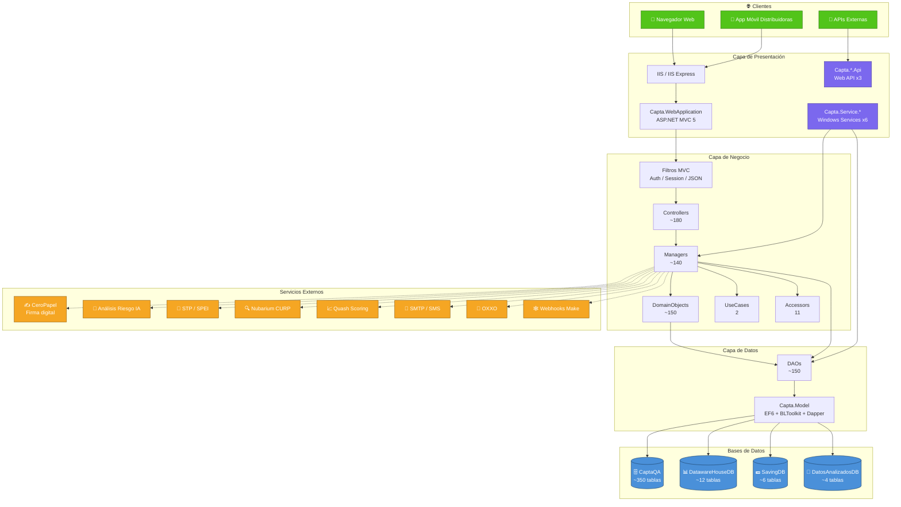
```mermaid
graph TB
    subgraph Clientes["🌐 Clientes"]
        Web[👤 Navegador Web]
        AppMovil[📱 App Móvil Distribuidoras]
        APIExt[🔌 APIs Externas]
    end

    subgraph Presentacion["Capa de Presentación"]
        IIS[IIS / IIS Express]
        MVC[Capta.WebApplication<br/>ASP.NET MVC 5]
        APIs[Capta.*.Api<br/>Web API x3]
        Services[Capta.Service.*<br/>Windows Services x6]
    end

    subgraph Negocio["Capa de Negocio"]
        Controllers[Controllers<br/>~180]
        Filters[Filtros MVC<br/>Auth / Session / JSON]
        Managers[Managers<br/>~140]
        DomainObjects[DomainObjects<br/>~150]
        UseCases[UseCases<br/>2]
        Accessors[Accessors<br/>11]
    end

    subgraph Datos["Capa de Datos"]
        DAOs[DAOs<br/>~150]
        Model[Capta.Model<br/>EF6 + BLToolkit + Dapper]
    end

    subgraph BD["Bases de Datos"]
        Core[(🗄️ CaptaQA<br/>~350 tablas)]
        DWH[(📊 DatawareHouseDB<br/>~12 tablas)]
        Savings[(💵 SavingDB<br/>~6 tablas)]
        DatosDB[(🤖 DatosAnalizadosDB<br/>~4 tablas)]
    end

    subgraph Externos["Servicios Externos"]
        CeroPapel[✍️ CeroPapel<br/>Firma digital]
        IA[🤖 Análisis Riesgo IA]
        STP[🏦 STP / SPEI]
        Nubarium[🔍 Nubarium CURP]
        Quash[📈 Quash Scoring]
        SMTP[📧 SMTP / SMS]
        Oxxo[🏪 OXXO]
        QuashWeb[🕸️ Webhooks Make]
    end

    Web --> IIS
    AppMovil --> IIS
    APIExt --> APIs
    IIS --> MVC
    MVC --> Filters
    Filters --> Controllers
    Controllers --> Managers
    Managers --> DomainObjects
    Managers --> UseCases
    Managers --> Accessors
    DomainObjects --> DAOs
    Managers --> DAOs
    DAOs --> Model
    Model --> Core
    Model --> DWH
    Model --> Savings
    Model --> DatosDB
    Managers -.-> CeroPapel
    Managers -.-> IA
    Managers -.-> STP
    Managers -.-> Nubarium
    Managers -.-> Quash
    Managers -.-> SMTP
    Managers -.-> Oxxo
    Managers -.-> QuashWeb
    Services --> Managers
    Services --> DAOs

    classDef bd fill:#4a90d9,stroke:#1a3a5c,color:#fff
    classDef ext fill:#f5a623,stroke:#8a5a10,color:#fff
    classDef svc fill:#7b68ee,stroke:#3e2f9e,color:#fff
    classDef cliente fill:#52c41a,stroke:#2a6e10,color:#fff
    class Core,DWH,Savings,DatosDB bd
    class CeroPapel,IA,STP,Nubarium,Quash,SMTP,Oxxo,QuashWeb ext
    class Services,APIs svc
    class Web,AppMovil,APIExt cliente
```

### 1.2 Capas de la solución

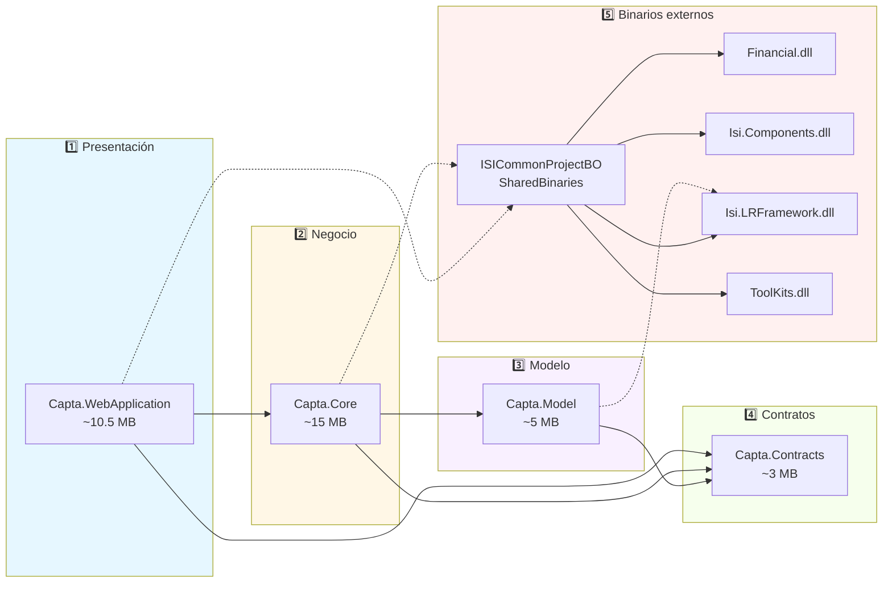
```mermaid
graph LR
    subgraph L1["1️⃣ Presentación"]
        WA[Capta.WebApplication<br/>~10.5 MB]
    end

    subgraph L2["2️⃣ Negocio"]
        Core[Capta.Core<br/>~15 MB]
    end

    subgraph L3["3️⃣ Modelo"]
        Model[Capta.Model<br/>~5 MB]
    end

    subgraph L4["4️⃣ Contratos"]
        Contracts[Capta.Contracts<br/>~3 MB]
    end

    subgraph L5["5️⃣ Binarios externos"]
        Shared[ISICommonProjectBO<br/>SharedBinaries]
        Financial[Financial.dll]
        IsiComp[Isi.Components.dll]
        IsiLR[Isi.LRFramework.dll]
        Tools[ToolKits.dll]
    end

    WA --> Core
    WA --> Contracts
    Core --> Model
    Core --> Contracts
    Model --> Contracts
    Core -.-> Shared
    WA -.-> Shared
    Model -.-> IsiLR
    Shared --> Financial
    Shared --> IsiComp
    Shared --> IsiLR
    Shared --> Tools

    style L1 fill:#e6f7ff
    style L2 fill:#fff7e6
    style L3 fill:#f9f0ff
    style L4 fill:#f6ffed
    style L5 fill:#fff1f0
```

### 1.3 Distribución de proyectos

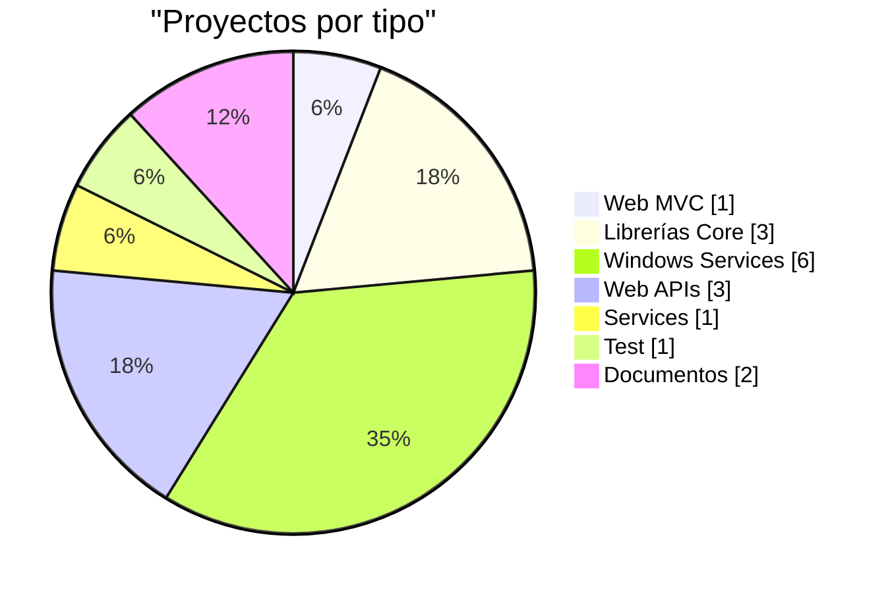
```mermaid
pie showData
    title "Proyectos por tipo"
    "Web MVC" : 1
    "Librerías Core" : 3
    "Windows Services" : 6
    "Web APIs" : 3
    "Services" : 1
    "Test" : 1
    "Documentos" : 2
```

---

## 2. Flujos de petición

### 2.1 Petición HTTP completa (MVC)

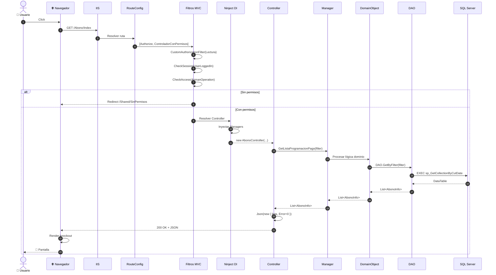
```mermaid
sequenceDiagram
    autonumber
    actor U as 👤 Usuario
    participant B as 🌐 Navegador
    participant IIS as IIS
    participant RF as RouteConfig
    participant F as Filtros MVC
    participant Ninj as Ninject DI
    participant C as Controller
    participant M as Manager
    participant DO as DomainObject
    participant D as DAO
    participant DB as SQL Server

    U->>B: Click
    B->>IIS: GET /Abono/Index
    IIS->>RF: Resolver ruta
    RF->>F: [Authorize, ControladorConPermisos]
    F->>F: CustomAuthorizationFilter(Lectura)
    F->>F: CheckSession(UserLoggedIn)
    F->>F: CheckAccess(AzmanOperation)
    
    alt Sin permisos
        F-->>B: Redirect /Shared/SinPermisos
    else Con permisos
        F->>Ninj: Resolver Controller
        Ninj->>Ninj: Inyectar Managers
        Ninj-->>C: new AbonoController(...)
        C->>M: GetListaProgramacionPago(filter)
        M->>DO: Procesar lógica dominio
        DO->>D: DAO.GetByFilter(filter)
        D->>DB: EXEC sp_GetCollectionByCutDate
        DB-->>D: DataTable
        D-->>DO: List<AbonoInfo>
        DO-->>M: List<AbonoInfo>
        M-->>C: List<AbonoInfo>
        C->>C: Json(new { lista, Error=0 })
        C-->>B: 200 OK + JSON
        B->>B: Render knockout
        B-->>U: 🎉 Pantalla
    end
```

### 2.2 Petición con Parallel.Invoke (AbonoController)

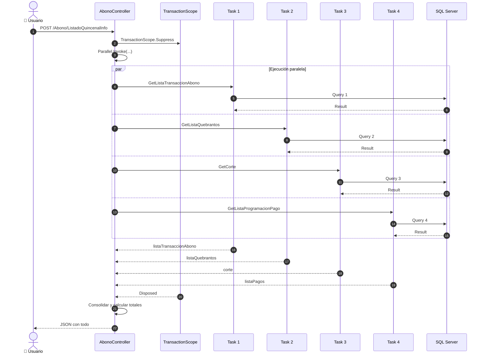
```mermaid
sequenceDiagram
    autonumber
    actor U as 👤 Usuario
    participant C as AbonoController
    participant TS as TransactionScope
    participant T1 as Task 1
    participant T2 as Task 2
    participant T3 as Task 3
    participant T4 as Task 4
    participant DB as SQL Server

    U->>C: POST /Abono/ListadoQuincenalInfo
    C->>TS: TransactionScope.Suppress
    C->>C: Parallel.Invoke(...)
    
    par Ejecución paralela
        C->>T1: GetListaTransaccionAbono
        T1->>DB: Query 1
        DB-->>T1: Result
    and
        C->>T2: GetListaQuebrantos
        T2->>DB: Query 2
        DB-->>T2: Result
    and
        C->>T3: GetCorte
        T3->>DB: Query 3
        DB-->>T3: Result
    and
        C->>T4: GetListaProgramacionPago
        T4->>DB: Query 4
        DB-->>T4: Result
    end
    
    T1-->>C: listaTransaccionAbono
    T2-->>C: listaQuebrantos
    T3-->>C: corte
    T4-->>C: listaPagos
    TS-->>C: Disposed
    
    C->>C: Consolidar y calcular totales
    C-->>U: JSON con todo
```

### 2.3 Reporte en segundo plano (ReporteSegundoPlanHelper)

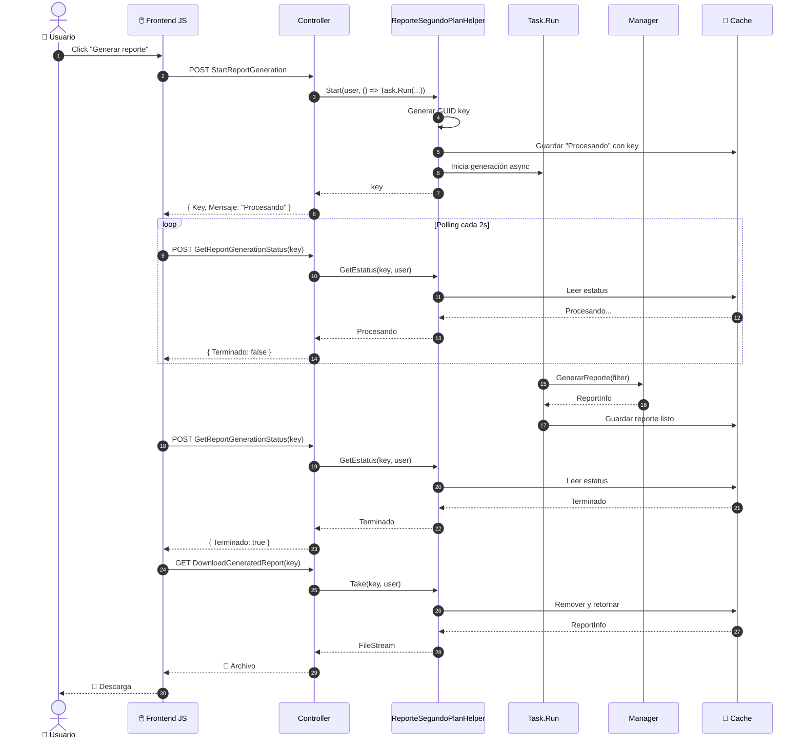
```mermaid
sequenceDiagram
    autonumber
    actor U as 👤 Usuario
    participant JS as 🖱️ Frontend JS
    participant C as Controller
    participant H as ReporteSegundoPlanHelper
    participant Task as Task.Run
    participant M as Manager
    participant Cache as 💾 Cache

    U->>JS: Click "Generar reporte"
    JS->>C: POST StartReportGeneration
    C->>H: Start(user, () => Task.Run(...))
    H->>H: Generar GUID key
    H->>Cache: Guardar "Procesando" con key
    H->>Task: Inicia generación async
    H-->>C: key
    C-->>JS: { Key, Mensaje: "Procesando" }
    
    loop Polling cada 2s
        JS->>C: POST GetReportGenerationStatus(key)
        C->>H: GetEstatus(key, user)
        H->>Cache: Leer estatus
        Cache-->>H: Procesando...
        H-->>C: Procesando
        C-->>JS: { Terminado: false }
    end
    
    Task->>M: GenerarReporte(filter)
    M-->>Task: ReportInfo
    Task->>Cache: Guardar reporte listo
    
    JS->>C: POST GetReportGenerationStatus(key)
    C->>H: GetEstatus(key, user)
    H->>Cache: Leer estatus
    Cache-->>H: Terminado
    H-->>C: Terminado
    C-->>JS: { Terminado: true }
    
    JS->>C: GET DownloadGeneratedReport(key)
    C->>H: Take(key, user)
    H->>Cache: Remover y retornar
    Cache-->>H: ReportInfo
    H-->>C: FileStream
    C-->>JS: 📄 Archivo
    JS-->>U: 🎉 Descarga
```

---

## 3. Base de datos

### 3.1 Diagrama ER completo del núcleo

```mermaid
erDiagram
    SUCURSAL ||--o{ ENLACE : "opera"
    SUCURSAL ||--o{ CLIENTE : "registra"
    SUCURSAL ||--o{ CAJA : "tiene"
    SUCURSAL ||--o{ USUARIO : "emplea"
    SUCURSAL ||--o{ TRANSACCION_ABONO : "captura"
    
    ENLACE ||--o{ CLIENTE : "atiende"
    ENLACE ||--o| ENLACE_CONFIG : "configura"
    ENLACE ||--o{ VALE : "coloca"
    ENLACE ||--o{ SOLICITUD_CREDITO : "solicita"
    ENLACE ||--o{ CONVENIO : "tiene"
    ENLACE ||--o{ CONDONACION : "tiene"
    ENLACE ||--o{ SEGURO_NULO : "tiene"
    ENLACE ||--o{ EVALUACION_FINANCIERA : "evalúa"
    
    CLIENTE ||--o{ CLIENTE_IMAGEN : "tiene"
    CLIENTE ||--o| INFORMACION_LABORAL : "tiene"
    CLIENTE ||--o{ REFERENCIA_CLIENTE : "tiene"
    CLIENTE ||--o{ CLIENTE_TARJETA : "tiene"
    CLIENTE ||--o{ AVAL : "tiene"
    CLIENTE ||--o{ BENEFICIARIO : "tiene"
    CLIENTE ||--o{ CLIENTE_IMAGENES_APP : "tiene"
    
    VALE ||--o| PAGARE : "se convierte"
    VALE ||--o{ PAGARE_EVENTO : "evento"
    VALE ||--o{ PAGARE_PERSONAL : "personal"
    VALE ||--o{ PAGARE_AUTO : "auto"
    VALE ||--o{ PAGARE_GEMS : "gems"
    VALE ||--o{ PAGARE_AHORRO : "ahorro"
    VALE ||--o{ PAGARE_SUSTENTABILIDAD : "sustentabilidad"
    
    PAGARE ||--|| TABLA_AMORTIZACION : "usa"
    PAGARE ||--o{ PROGRAMACION_PAGO : "genera"
    PAGARE ||--o| TRANSFERENCIA : "entrega"
    PAGARE ||--o{ PAGARE_DOMICILIO : "domicilios"
    
    PROGRAMACION_PAGO ||--o{ ABONO : "recibe"
    
    ABONO }o--|| TRANSACCION_ABONO : "en"
    TRANSACCION_ABONO }o--|| CUENTA : "usa"
    TRANSACCION_ABONO }o--|| MEDIO_PAGO : "usa"
    
    TRANSFERENCIA }o--o| CHEQUE : "puede ser"
    TRANSFERENCIA }o--|| TIPO_ABONO : "es"
    
    TRANSFER_BATCH ||--o{ TRANSFER : "agrupa"
    
    CONVENIO ||--o{ CONVENIO_DETALLE : "detalle"
    CONVENIO ||--o{ PAGARE_CONVENIO : "genera"
    CONVENIO ||--o{ TABLA_AMORTIZACION_CONVENIO : "genera"
    
    CONDONACION ||--o{ CONDONACION_DETALLE : "detalle"
    
    SEGURO_NULO ||--o{ SEGURO_NULO_DETALLE : "detalle"
    SEGURO_NULO ||--o{ PAGARE_SEGURO_NULO : "genera"
    
    FIDEICOMISO ||--o{ FIDEICOMISO_DETALLE : "contiene"
    FIDEICOMISO ||--o{ SOCIO_FIDEICOMISO_PORCENTAJE : "porcentajes"
    FIDEICOMISO_DETALLE }o--|| VALE : "referencia"
    
    PROSPECTOS ||--o| SOLICITUD_CREDITO_PROSPECTO : "tiene"
    PROSPECTOS ||--o| ESTUDIO_SOCIOECONOMICO_PROSPECTO : "tiene"
    PROSPECTOS ||--o| ESTUDIO_SOCIOECONOMICO_AVAL : "tiene"
    PROSPECTOS ||--o| PROSPECTO_ENLACE_CEROPAPEL : "firma"
    PROSPECTOS ||--o{ PROSPECTO_IMAGEN : "imágenes"
    PROSPECTOS ||--o{ PROSPECTO_PROYECCION : "proyecciones"
    PROSPECTOS ||--o| QUASH_RESPOND : "score"
    
    PRE_REGISTRO_PROSPECTOS ||--o{ PRE_REGISTRO_VALIDACION : "valida"
    PRE_REGISTRO_PROSPECTOS ||--o{ PRE_REGISTRO_PROSPECTO_LINKS : "links"
    LEADS_WEB ||--o{ PRE_REGISTRO_PROSPECTOS : "convierte"
    
    ASP_NET_USERS ||--o{ ASP_NET_USER_ROLES : "tiene"
    ASP_NET_ROLES ||--o{ ASP_NET_USER_ROLES : "asignado"
    ASP_NET_ROLES ||--o{ PERMISO_ROL_CONTROLADOR : "accede"
    ASP_NET_ROLES ||--o{ PERMISO_ROL_OPERATION : "opera"
    OPERATION ||--o{ PERMISO_ROL_OPERATION : "referencia"
    ASP_NET_USERS ||--o{ PERMISO_USUARIO_SUCURSAL : "asignado"
    ASP_NET_USERS ||--o{ PERMISO_USUARIO_CAJA : "asignado"
    ASP_NET_USERS ||--o{ PERMISO_USUARIO_ROL : "tiene"
    
    EMPRESA ||--o{ SUCURSAL : "contiene"
    PLAZA ||--o{ SUCURSAL : "agrupa"
    
    ESTADO ||--o{ MUNICIPIO : "contiene"
    MUNICIPIO ||--o{ COLONIA : "contiene"
```

### 3.2 Relaciones por módulo

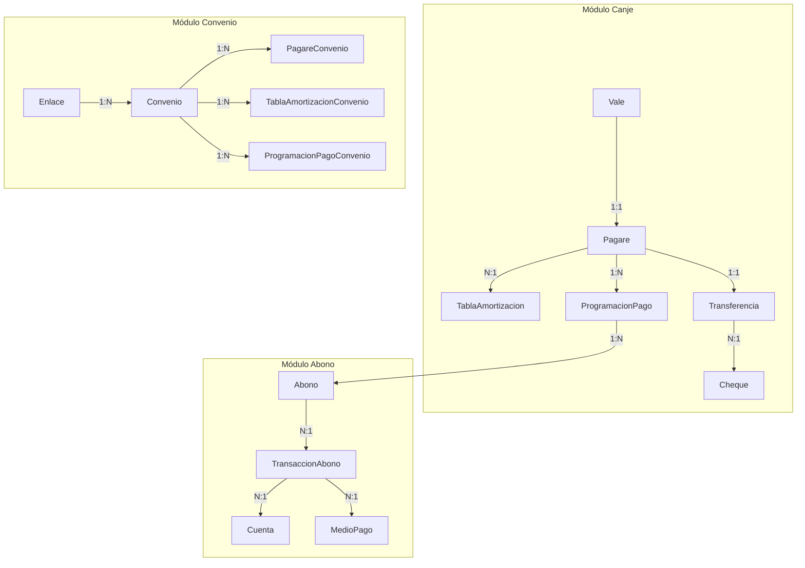
```mermaid
graph TB
    subgraph "Módulo Canje"
        V[Vale]
        P[Pagare]
        TA[TablaAmortizacion]
        PP[ProgramacionPago]
        T[Transferencia]
        C[Cheque]
        
        V -->|1:1| P
        P -->|N:1| TA
        P -->|1:N| PP
        P -->|1:1| T
        T -->|N:1| C
    end
    
    subgraph "Módulo Abono"
        AB[Abono]
        TX[TransaccionAbono]
        CU[Cuenta]
        MP[MedioPago]
        
        PP -->|1:N| AB
        AB -->|N:1| TX
        TX -->|N:1| CU
        TX -->|N:1| MP
    end
    
    subgraph "Módulo Convenio"
        CV[Convenio]
        PC[PagareConvenio]
        TAC[TablaAmortizacionConvenio]
        PPC[ProgramacionPagoConvenio]
        
        EN[Enlace] -->|1:N| CV
        CV -->|1:N| PC
        CV -->|1:N| TAC
        CV -->|1:N| PPC
    end
```

### 3.3 Distribución de entidades por BD

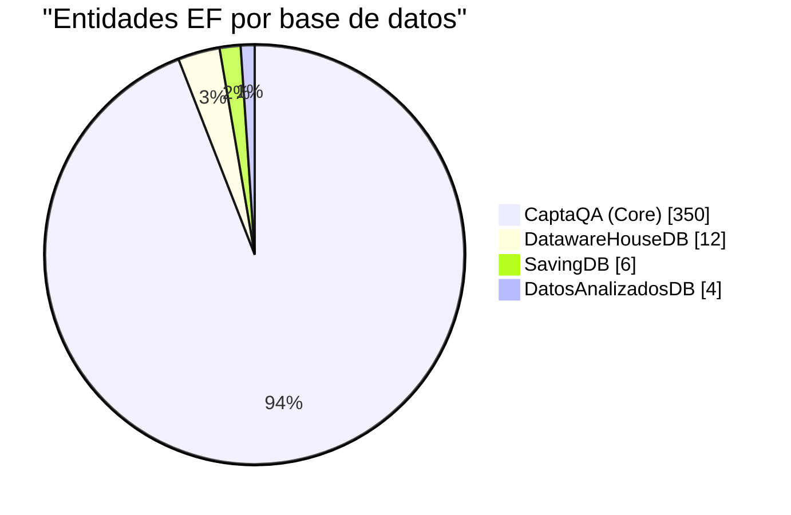
```mermaid
pie showData
    title "Entidades EF por base de datos"
    "CaptaQA (Core)" : 350
    "DatawareHouseDB" : 12
    "SavingDB" : 6
    "DatosAnalizadosDB" : 4
```

### 3.4 Conexión de las 4 BD

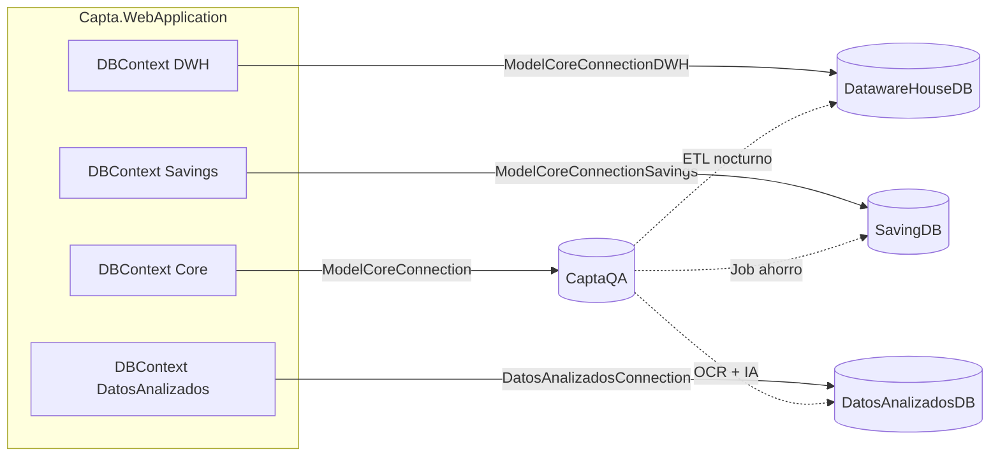
```mermaid
graph LR
    subgraph WebApp["Capta.WebApplication"]
        Ctx1[DBContext Core]
        Ctx2[DBContext DWH]
        Ctx3[DBContext Savings]
        Ctx4[DBContext DatosAnalizados]
    end
    
    Ctx1 -->|ModelCoreConnection| Core[(CaptaQA)]
    Ctx2 -->|ModelCoreConnectionDWH| DWH[(DatawareHouseDB)]
    Ctx3 -->|ModelCoreConnectionSavings| Savings[(SavingDB)]
    Ctx4 -->|DatosAnalizadosConnection| Datos[(DatosAnalizadosDB)]
    
    Core -.->|ETL nocturno| DWH
    Core -.->|Job ahorro| Savings
    Core -.->|OCR + IA| Datos
```

---

## 4. Flujos de negocio

### 4.1 Canje de vale

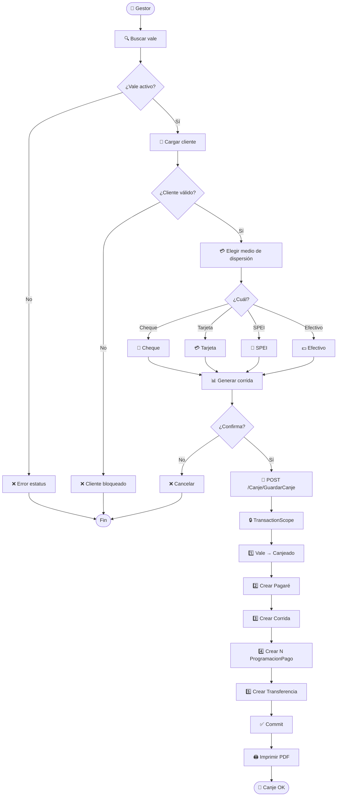
```mermaid
flowchart TD
    Start([🎫 Gestor]) --> Buscar[🔍 Buscar vale]
    Buscar --> Valida1{¿Vale activo?}
    Valida1 -->|No| Err1[❌ Error estatus]
    Err1 --> End1([Fin])
    
    Valida1 -->|Sí| CargarCliente[👤 Cargar cliente]
    CargarCliente --> Valida2{¿Cliente válido?}
    Valida2 -->|No| Err2[❌ Cliente bloqueado]
    Err2 --> End1
    
    Valida2 -->|Sí| ElegirMedio[💳 Elegir medio de dispersión]
    ElegirMedio --> TipoMedio{¿Cuál?}
    
    TipoMedio -->|Cheque| Cheque[📝 Cheque]
    TipoMedio -->|Tarjeta| Tarjeta[💳 Tarjeta]
    TipoMedio -->|SPEI| SPEI[🏦 SPEI]
    TipoMedio -->|Efectivo| Efectivo[💵 Efectivo]
    
    Cheque --> Corrida
    Tarjeta --> Corrida
    SPEI --> Corrida
    Efectivo --> Corrida
    
    Corrida[📊 Generar corrida] --> Confirma{¿Confirma?}
    Confirma -->|No| Cancelar[❌ Cancelar]
    Cancelar --> End1
    
    Confirma -->|Sí| Guardar[💾 POST /Canje/GuardarCanje]
    
    Guardar --> TS[🔒 TransactionScope]
    TS --> S1[1️⃣ Vale → Canjeado]
    S1 --> S2[2️⃣ Crear Pagaré]
    S2 --> S3[3️⃣ Crear Corrida]
    S3 --> S4[4️⃣ Crear N ProgramacionPago]
    S4 --> S5[5️⃣ Crear Transferencia]
    S5 --> Commit[✅ Commit]
    
    Commit --> Print[🖨️ Imprimir PDF]
    Print --> End2([🎉 Canje OK])
```

### 4.2 Captura de abono

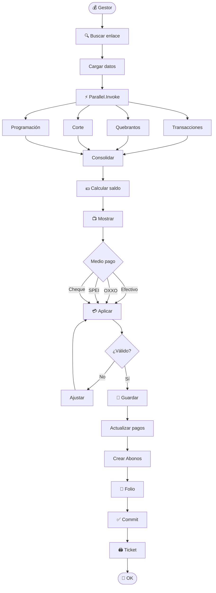
```mermaid
flowchart TD
    Start([💰 Gestor]) --> Buscar[🔍 Buscar enlace]
    Buscar --> Cargar[Cargar datos]
    Cargar --> Par[⚡ Parallel.Invoke]
    
    Par --> P1[Transacciones]
    Par --> P2[Quebrantos]
    Par --> P3[Corte]
    Par --> P4[Programación]
    
    P1 --> Cons[Consolidar]
    P2 --> Cons
    P3 --> Cons
    P4 --> Cons
    
    Cons --> Calc[💵 Calcular saldo]
    Calc --> Mostrar[📺 Mostrar]
    
    Mostrar --> Elegir{Medio pago}
    Elegir -->|Efectivo| Aplicar
    Elegir -->|OXXO| Aplicar
    Elegir -->|SPEI| Aplicar
    Elegir -->|Cheque| Aplicar
    
    Aplicar[💳 Aplicar] --> Valida{¿Válido?}
    Valida -->|No| Ajustar[Ajustar]
    Ajustar --> Aplicar
    
    Valida -->|Sí| Guardar[💾 Guardar]
    Guardar --> Actualizar[Actualizar pagos]
    Actualizar --> CrearAb[Crear Abonos]
    CrearAb --> Folio[🔢 Folio]
    Folio --> Commit[✅ Commit]
    Commit --> Print[🖨️ Ticket]
    Print --> End([🎉 OK])
```

### 4.3 Corte quincenal

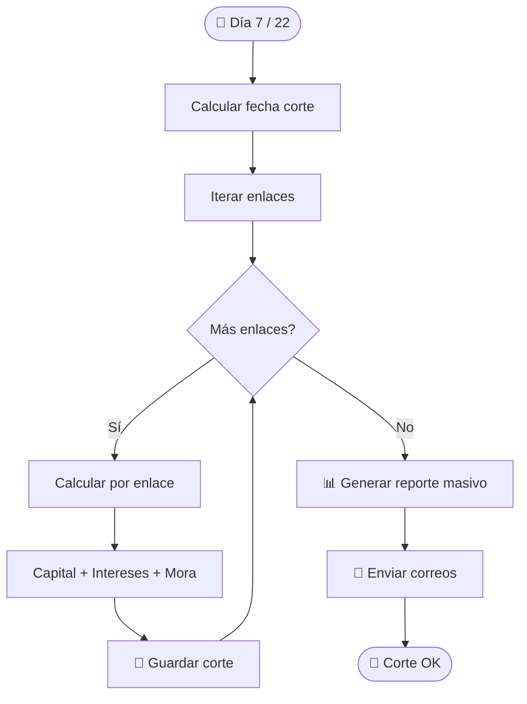
```mermaid
flowchart TD
    Start([📅 Día 7 / 22]) --> CalcCorte[Calcular fecha corte]
    CalcCorte --> Iterar[Iterar enlaces]
    
    Iterar --> LoopEnlace{Más enlaces?}
    LoopEnlace -->|Sí| Calc[Calcular por enlace]
    Calc --> CalcularCorte[Capital + Intereses + Mora]
    CalcularCorte --> Guardar[💾 Guardar corte]
    Guardar --> LoopEnlace
    
    LoopEnlace -->|No| Reporte[📊 Generar reporte masivo]
    Reporte --> EnviarCorreo[📧 Enviar correos]
    EnviarCorreo --> End([🎉 Corte OK])
```

### 4.4 Convenio

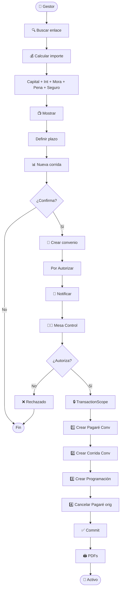
```mermaid
flowchart TD
    Start([📄 Gestor]) --> Buscar[🔍 Buscar enlace]
    Buscar --> Calc[💰 Calcular importe]
    Calc --> Desglosar[Capital + Int + Mora + Pena + Seguro]
    Desglosar --> Mostrar[📺 Mostrar]
    
    Mostrar --> Plazo[Definir plazo]
    Plazo --> Corrida[📊 Nueva corrida]
    Corrida --> Confirma{¿Confirma?}
    Confirma -->|No| End1([Fin])
    
    Confirma -->|Sí| Crear[💾 Crear convenio]
    Crear --> Estatus1[Por Autorizar]
    Estatus1 --> Notificar[📧 Notificar]
    
    Notificar --> Authorize[👨‍💼 Mesa Control]
    Authorize --> Autoriza{¿Autoriza?}
    Autoriza -->|No| Rechazar[❌ Rechazado]
    Rechazar --> End1
    
    Autoriza -->|Sí| TS[🔒 TransactionScope]
    TS --> S1[1️⃣ Crear Pagaré Conv]
    S1 --> S2[2️⃣ Crear Corrida Conv]
    S2 --> S3[3️⃣ Crear Programación]
    S3 --> S4[4️⃣ Cancelar Pagaré orig]
    S4 --> Commit[✅ Commit]
    Commit --> Print[🖨️ PDFs]
    Print --> End2([🎉 Activo])
```

### 4.5 Condonación

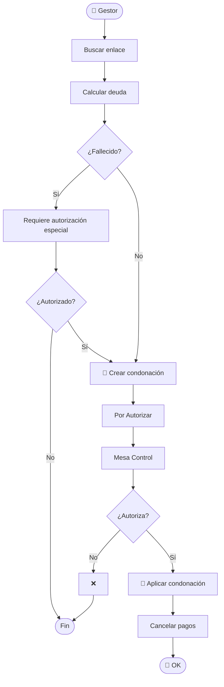
```mermaid
flowchart TD
    Start([📝 Gestor]) --> Buscar[Buscar enlace]
    Buscar --> Calc[Calcular deuda]
    Calc --> ValidaFallecido{¿Fallecido?}
    
    ValidaFallecido -->|Sí| RequiereAuth[Requiere autorización especial]
    ValidaFallecido -->|No| Crear
    
    RequiereAuth --> Auth1{¿Autorizado?}
    Auth1 -->|No| End1([Fin])
    Auth1 -->|Sí| Crear
    
    Crear[💾 Crear condonación] --> Estatus1[Por Autorizar]
    Estatus1 --> Auth2[Mesa Control]
    Auth2 --> Auth3{¿Autoriza?}
    Auth3 -->|No| Rechazar[❌]
    Rechazar --> End1
    
    Auth3 -->|Sí| Aplicar[💾 Aplicar condonación]
    Aplicar --> Cancelar[Cancelar pagos]
    Cancelar --> End2([🎉 OK])
```

### 4.6 Transferencia / Dispersión (STP)

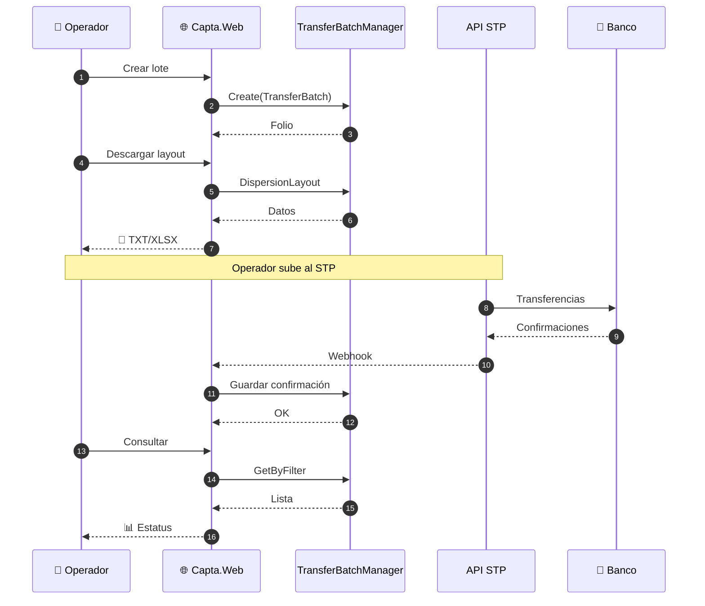
```mermaid
sequenceDiagram
    autonumber
    participant Op as 👤 Operador
    participant Web as 🌐 Capta.Web
    participant Man as TransferBatchManager
    participant STP as API STP
    participant Bank as 🏦 Banco

    Op->>Web: Crear lote
    Web->>Man: Create(TransferBatch)
    Man-->>Web: Folio
    
    Op->>Web: Descargar layout
    Web->>Man: DispersionLayout
    Man-->>Web: Datos
    Web-->>Op: 📄 TXT/XLSX
    
    Note over Op,STP: Operador sube al STP
    
    STP->>Bank: Transferencias
    Bank-->>STP: Confirmaciones
    
    STP-->>Web: Webhook
    Web->>Man: Guardar confirmación
    Man-->>Web: OK
    
    Op->>Web: Consultar
    Web->>Man: GetByFilter
    Man-->>Web: Lista
    Web-->>Op: 📊 Estatus
```

### 4.7 Cierre de Tape de Cartera

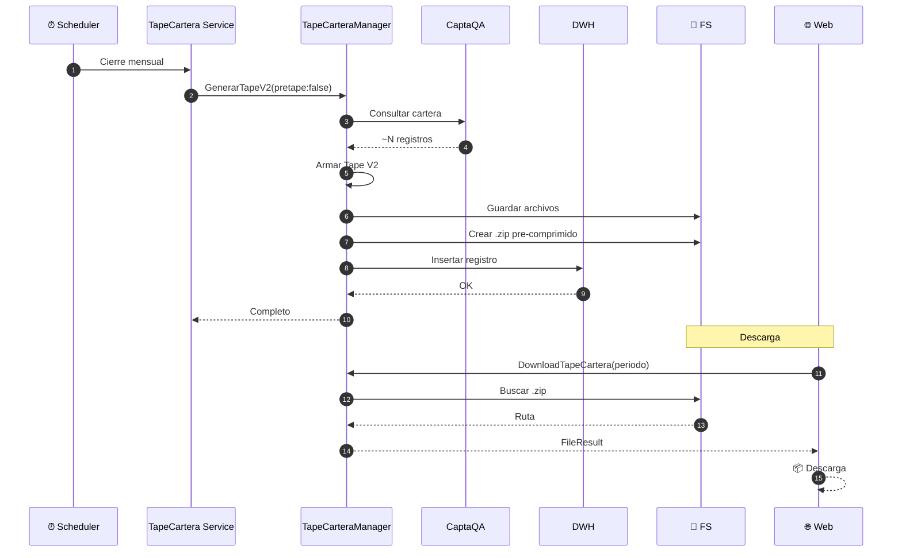
```mermaid
sequenceDiagram
    autonumber
    participant Job as ⏰ Scheduler
    participant Svc as TapeCartera Service
    participant Man as TapeCarteraManager
    participant DB as CaptaQA
    participant DWH as DWH
    participant FS as 📁 FS
    participant Web as 🌐 Web

    Job->>Svc: Cierre mensual
    Svc->>Man: GenerarTapeV2(pretape:false)
    Man->>DB: Consultar cartera
    DB-->>Man: ~N registros
    Man->>Man: Armar Tape V2
    Man->>FS: Guardar archivos
    Man->>FS: Crear .zip pre-comprimido
    Man->>DWH: Insertar registro
    DWH-->>Man: OK
    Man-->>Svc: Completo
    
    Note over Web,FS: Descarga
    Web->>Man: DownloadTapeCartera(periodo)
    Man->>FS: Buscar .zip
    FS-->>Man: Ruta
    Man-->>Web: FileResult
    Web-->>Web: 📦 Descarga
```

### 4.8 Prospecto → Enlace

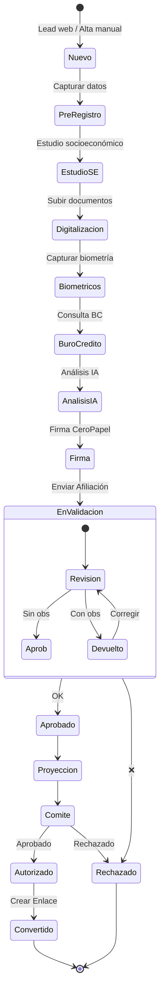
```mermaid
stateDiagram-v2
    [*] --> Nuevo: Lead web / Alta manual
    Nuevo --> PreRegistro: Capturar datos
    PreRegistro --> EstudioSE: Estudio socioeconómico
    EstudioSE --> Digitalizacion: Subir documentos
    Digitalizacion --> Biometricos: Capturar biometría
    Biometricos --> BuroCredito: Consulta BC
    BuroCredito --> AnalisisIA: Análisis IA
    AnalisisIA --> Firma: Firma CeroPapel
    Firma --> EnValidacion: Enviar Afiliación
    
    state EnValidacion {
        [*] --> Revision
        Revision --> Aprob: Sin obs
        Revision --> Devuelto: Con obs
        Devuelto --> Revision: Corregir
    }
    
    EnValidacion --> Aprobado: OK
    EnValidacion --> Rechazado: ❌
    
    Aprobado --> Proyeccion
    Proyeccion --> Comite
    Comite --> Autorizado: Aprobado
    Comite --> Rechazado: Rechazado
    
    Autorizado --> Convertido: Crear Enlace
    Convertido --> [*]
    Rechazado --> [*]
```

---

## 5. Estados y máquinas de estado

### 5.1 Estados de un Vale

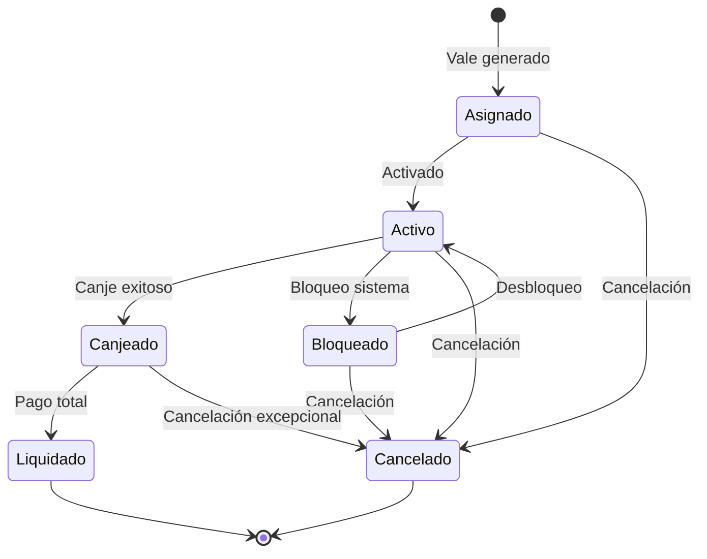
```mermaid
stateDiagram-v2
    [*] --> Asignado: Vale generado
    Asignado --> Activo: Activado
    Asignado --> Cancelado: Cancelación
    
    Activo --> Canjeado: Canje exitoso
    Activo --> Bloqueado: Bloqueo sistema
    Activo --> Cancelado: Cancelación
    
    Bloqueado --> Activo: Desbloqueo
    Bloqueado --> Cancelado: Cancelación
    
    Canjeado --> Liquidado: Pago total
    Canjeado --> Cancelado: Cancelación excepcional
    
    Liquidado --> [*]
    Cancelado --> [*]
```

### 5.2 Estados de un Pagaré

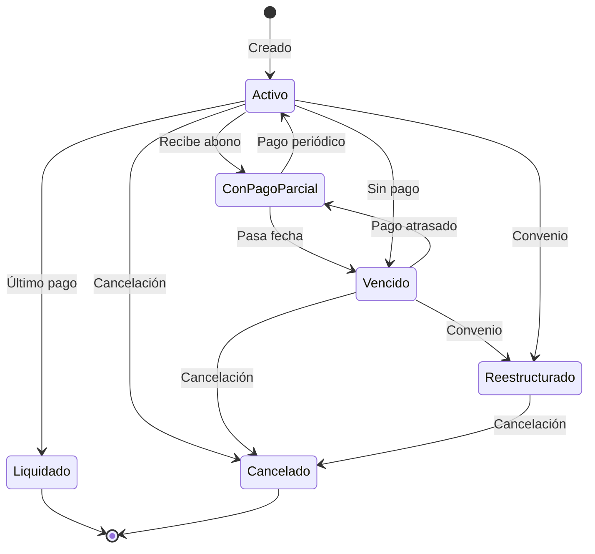
```mermaid
stateDiagram-v2
    [*] --> Activo: Creado
    Activo --> ConPagoParcial: Recibe abono
    ConPagoParcial --> Activo: Pago periódico
    ConPagoParcial --> Vencido: Pasa fecha
    Activo --> Vencido: Sin pago
    Vencido --> ConPagoParcial: Pago atrasado
    Vencido --> Reestructurado: Convenio
    Activo --> Reestructurado: Convenio
    Activo --> Cancelado: Cancelación
    Vencido --> Cancelado: Cancelación
    Activo --> Liquidado: Último pago
    Reestructurado --> Cancelado: Cancelación
    Liquidado --> [*]
    Cancelado --> [*]
```

### 5.3 Estados de una Transferencia

```mermaid
stateDiagram-v2
    [*] --> Pendiente: Creada
    Pendiente --> Proceso: Enviada a STP
    Proceso --> Cobrada: Confirmada
    Proceso --> Rechazada: Rechazo STP
    Proceso --> Cancelada: Cancelación
    Cobrada --> Devolucion: Devolución
    Rechazada --> Sustituida: Sustitución
    Devolucion --> Sustitucion: Sustitución
    Cancelada --> [*]
    Cobrada --> [*]
    Sustituida --> [*]
    Sustitucion --> [*]
```

### 5.4 Estados de un Prospecto

```mermaid
stateDiagram-v2
    [*] --> Nuevo
    Nuevo --> PreRegistro
    PreRegistro --> EstudioSocio
    EstudioSocio --> Digitalizacion
    Digitalizacion --> Biometricos
    Biometricos --> BC
    BC --> AnalisisRiesgo
    AnalisisRiesgo --> Firma
    Firma --> EnValidacion
    
    EnValidacion --> Rechazado: Rechaza
    EnValidacion --> Autorizado: Aprueba
    
    Rechazado --> EnValidacion: Corrección
    Autorizado --> Convertido: Crear Enlace
    
    Convertido --> [*]
    Rechazado --> [*]
```

### 5.5 Estados de un Convenio

```mermaid
stateDiagram-v2
    [*] --> PorAutorizar: Creado
    PorAutorizar --> Autorizado: Aprobado
    PorAutorizar --> Rechazado: Rechazado
    PorAutorizar --> Cancelado: Cancelado
    
    Autorizado --> Activo: Vigente
    Activo --> Liquidado: Pagado
    Activo --> Cancelado: Cancelado
    
    Liquidado --> [*]
    Rechazado --> [*]
    Cancelado --> [*]
```

### 5.6 Estados de una Evaluación Financiera

```mermaid
stateDiagram-v2
    [*] --> Inactivo: Creada
    Inactivo --> Activo: Activación Afiliación
    Activo --> Bloqueado: Bloqueo nocturno
    Bloqueado --> Activo: Desbloqueo manual
    Activo --> Extendido: Extensión límite
    Extendido --> Activo: Vence extensión
    Activo --> Inactivo: Desactivación
    Bloqueado --> [*]
```

### 5.7 Estados de un Pre-registro

```mermaid
stateDiagram-v2
    [*] --> Prospeccion: Captura
    Prospeccion --> Documentos: Docs cargados
    Documentos --> EnValidacion: Enviado
    EnValidacion --> Devuelto: Con obs
    Devuelto --> Documentos: Corregido
    EnValidacion --> Autorizado: OK
    Autorizado --> [*]
```

---

## 6. Componentes y dependencias

### 6.1 Dependencias entre proyectos

```mermaid
graph TB
    subgraph "Solución"
        Test[Capta.Test]
        WA[Capta.WebApplication]
        Core[Capta.Core]
        Model[Capta.Model]
        Contracts[Capta.Contracts]
    end
    
    subgraph "Servicios Windows"
        SVC1[Capta.Service.FileWatcher]
        SVC2[Capta.Service.CustomerLock]
        SVC3[Capta.Service.STPEnvio]
        SVC4[Capta.Service.SMS]
        SVC5[Capta.Service.ColaConsulta]
        SVC6[Capta.Service.TapeCartera]
    end
    
    subgraph "Web APIs"
        API1[Capta.Buro.Api]
        API2[Capta.VoucherVerify.Api]
        API3[Capta.FideicomisoCesion.Api]
    end
    
    subgraph "Otros"
        Prospectos[Capta.Services.Prospectos]
    end
    
    Test -.-> WA
    Test -.-> Core
    Test -.-> Contracts
    
    WA --> Core
    WA --> Contracts
    
    Core --> Model
    Core --> Contracts
    
    Model --> Contracts
    
    SVC1 --> Core
    SVC2 --> Core
    SVC3 --> Core
    SVC4 --> Core
    SVC5 --> Core
    SVC6 --> Core
    
    SVC1 --> Contracts
    SVC2 --> Contracts
    SVC3 --> Contracts
    SVC4 --> Contracts
    SVC5 --> Contracts
    SVC6 --> Contracts
    
    API1 --> Core
    API2 --> Core
    API3 --> Core
    
    Prospectos --> Core
```

### 6.2 Componentes de Capta.Core

```mermaid
graph TB
    subgraph "Capta.Core"
        subgraph "Servicios"
            Managers[Managers<br/>~140]
            DomainObjects[DomainObjects<br/>~150]
            UseCases[UseCases<br/>2]
            ServiceImpl[Servicios Impl<br/>2]
            Accessors[Accessors<br/>11]
        end
        
        subgraph "Integration"
            DAOs[DAOs<br/>~150]
            BaseClassDAO[BaseClassDAO]
            DapperDAO[BaseClassDapperDAO]
        end
        
        subgraph "Soporte"
            Helper[Helper<br/>~25]
            Logger[Logger]
            Utilerias[Utilerias]
            Interfaces[Interfaces<br/>12]
        end
    end
    
    Managers --> DomainObjects
    Managers --> UseCases
    Managers --> Accessors
    Managers --> DAOs
    DomainObjects --> DAOs
    DomainObjects --> Helper
    DAOs --> BaseClassDAO
    DAOs --> DapperDAO
    Managers -.-> Logger
    DomainObjects -.-> Logger
```

### 6.3 Componentes de Capta.WebApplication

```mermaid
graph TB
    subgraph "Capta.WebApplication"
        Controllers[Controllers<br/>~180]
        Views[Views<br/>~700 .cshtml]
        Filters[Filters]
        Security[Securirty<br/>Azman]
        AppStart[App_Start]
        Helpers[Helpers]
        Middleware[Middleware]
        Models[Models Identity]
    end
    
    subgraph "App_Start"
        Ninject[NinjectWebCommon]
        Route[RouteConfig]
        Bundle[BundleConfig]
        StartupAuth[Startup.Auth]
        FilterConfig[FilterConfig]
    end
    
    subgraph "Securirty"
        Access[Access]
        CheckAccess[CheckAccess]
        CheckSession[CheckSession]
        CustomAuth[CustomAuthorizationFilter]
    end
    
    AppStart --> Ninject
    AppStart --> Route
    AppStart --> Bundle
    AppStart --> StartupAuth
    AppStart --> FilterConfig
    
    Controllers --> Filters
    Controllers --> Security
    Controllers --> Helpers
    Security --> Access
    Security --> CheckAccess
    Security --> CheckSession
    Security --> CustomAuth
    Controllers --> Models
    Middleware -.-> Controllers
```

### 6.4 Árbol de dependencias de un Controller típico

```mermaid
graph TB
    AbonoController[AbonoController] --> PPMan[ProgramacionPagoManager]
    AbonoController --> AbMan[AbonoManager]
    AbonoController --> AntMan[AnticipoManager]
    AbonoController --> CatMan[CatalogoManager]
    AbonoController --> CobMan[CobranzaManager]
    AbonoController --> RepMan[ReporteManager]
    AbonoController --> TAMan[TransaccionAbonoManager]
    AbonoController --> UsuMan[UsuarioManager]
    AbonoController --> CliMan[ClienteManager]
    AbonoController --> SucMan[SucursalManager]
    AbonoController --> CueMan[CuentaManager]
    AbonoController --> TAQMan[TransaccionAbonoQuebrantosManager]
    AbonoController --> LogMan[LogErrorManager]
    
    PPMan --> PPDAO[ProgramacionPagoDAO]
    AbMan --> AbDAO[AbonoDAO]
    TAMan --> TADAO[TransaccionAbonoDAO]
    
    PPDAO --> DB[(SQL Server)]
    AbDAO --> DB
    TADAO --> DB
    
    RepMan --> RepDAO[ReporteDAO]
    RepDAO --> RDLC[Reports RDLC]
```

---

## 7. Seguridad

### 7.1 Flujo de autenticación y autorización (Azman)

```mermaid
flowchart TD
    Start([👤 Usuario]) --> Login[🔐 POST /Account/Login]
    Login --> Val[ASP.NET Identity]
    Val -->|Falla| Err[❌ Inválido]
    Err --> Start
    
    Val -->|OK| Cookie[🍪 Cookie OWIN]
    Cookie --> Session[📦 Session UserLoggedIn]
    Session --> Home[🏠 /Home/Index]
    
    Home --> Menu[🍔 HomeController.Menu]
    Menu --> LeerAzman[📋 PermisoRolControlador]
    LeerAzman --> Filtrar[🔍 Filtrar]
    Filtrar --> Render[✅ Menú]
    
    Render --> Click[🖱️ Click usuario]
    Click --> F1{[Authorize]}
    F1 -->|No auth| Login
    F1 -->|OK| F2{[ControladorConPermisos]}
    F2 -->|No| SP[⛔ SinPermisos]
    F2 -->|OK| F3{[CustomAuthorizationFilter]}
    F3 -->|No| SP
    F3 -->|OK| F4{[CheckSession]}
    F4 -->|No| Login
    F4 -->|OK| F5{[CheckAccess]}
    F5 -->|No| SP
    F5 -->|OK| Run[✅ Ejecutar]
    Run --> Fin([🎉])
    SP --> Fin
```

### 7.2 Jerarquía de roles

```mermaid
graph TB
    Admin[👑 Administrador]
    Admin --> Sup[📊 Supervisor]
    Admin --> Aud[🔍 Auditoría Interna]
    Admin --> Fin[💰 Finanzas]
    
    Sup --> Coord[👥 Coordinador]
    Sup --> Mesa[⚖️ Mesa de Control]
    
    Coord --> Gest[💼 Gestor]
    Coord --> Prom[🎯 Promotor]
    
    Gest --> CC[📞 Call Center]
    Prom --> Afil[✍️ Afiliación]
    
    Admin --> Cob[💰 Cobranza]
    Admin --> Ops[⚙️ Operaciones]
    
    style Admin fill:#f5a623,stroke:#8a5a10,color:#fff
    style Sup fill:#7b68ee,stroke:#3e2f9e,color:#fff
    style Aud fill:#52c41a,stroke:#2a6e10,color:#fff
```

### 7.3 Flujo de permisos por operación

```mermaid
sequenceDiagram
    participant U as Usuario
    participant A as Access
    participant DB as PermisoRolControlador
    participant Op as AzmanOperation

    U->>A: HasAccess(OperationX)
    A->>A: Obtener rol del usuario
    A->>DB: SELECT Controlador, Operacion
    DB-->>A: Lista de operaciones
    A->>A: Check si OperationX está
    A-->>U: true/false
    
    U->>A: HasAdministrator(user)
    A->>A: Verificar rol Administrador
    A-->>U: true/false
```

### 7.4 Flujo de CeroPapel (firma digital)

```mermaid
sequenceDiagram
    autonumber
    participant Web as 🌐 Capta.Web
    participant Man as CeroPapelManager
    participant API as ✍️ CeroPapel API
    participant Cli as 👤 Cliente
    participant DB as CaptaQA

    Web->>Man: IniciarFirma(prospectoId)
    Man->>API: POST /external-document
    API-->>Man: { uuid, linkAliada, linkAval }
    Man->>DB: Guardar enlace
    Man-->>Web: Enlaces
    
    Web->>Cli: 📧 Enviar SMS + link
    Cli->>API: Firma digital
    API-->>API: Procesa firma
    
    Web->>Man: ConsultarDocumento(uuid)
    Man->>API: GET /document/{uuid}
    API-->>Man: { status, documentUrl }
    Man->>DB: Actualizar estatus
    Man-->>Web: Estatus
    
    Web->>Man: GuardarContrato(prospectoId, uuid, url)
    Man->>API: Descargar PDF
    API-->>Man: PDF bytes
    Man->>DB: Guardar URL
    Man-->>Web: OK
```

---

## 8. Infraestructura y despliegue

### 8.1 Topología de despliegue

```mermaid
graph TB
    subgraph Internet["🌐 Internet"]
        Users[👥 Usuarios]
        ExtAPI[🔌 APIs externas]
    end
    
    subgraph DMZ["DMZ"]
        WAF[🔥 WAF/Firewall]
        LB[⚖️ Load Balancer]
    end
    
    subgraph AppTier["Capa de Aplicación"]
        IIS1[IIS Server 1]
        IIS2[IIS Server 2]
        Svc1[⚙️ Windows Services]
    end
    
    subgraph DataTier["Capa de Datos"]
        SQL1[(🗄️ SQL Server<br/>CaptaQA)]
        SQL2[(📊 SQL Server DWH)]
        SQL3[(💵 SQL Server Savings)]
        FS[📁 File Server<br/>Uploads/Expedientes]
        NAS[💾 NAS<br/>Backups]
    end
    
    subgraph Monitoring["Monitoreo"]
        Log[📝 log4net]
        Event[📋 Event Viewer]
        APM[📊 APM/Monitoring]
    end
    
    Users --> WAF
    ExtAPI --> WAF
    WAF --> LB
    LB --> IIS1
    LB --> IIS2
    IIS1 --> Svc1
    IIS2 --> Svc1
    IIS1 --> SQL1
    IIS2 --> SQL1
    Svc1 --> SQL1
    IIS1 --> SQL2
    IIS2 --> SQL3
    Svc1 --> SQL2
    IIS1 --> FS
    Svc1 --> FS
    SQL1 --> NAS
    IIS1 -.-> Log
    IIS2 -.-> Log
    Svc1 -.-> Log
    Log -.-> APM
```

### 8.2 Pipeline de despliegue

```mermaid
flowchart LR
    Dev[👨‍💻 Developer] --> Git[📦 Git Repo]
    Git --> Build[🔨 MSBuild]
    Build --> Tests{🧪 Tests}
    Tests -->|Falla| Notify[📧 Notificar]
    Notify --> Dev
    Tests -->|OK| QA[🚀 Deploy QA]
    QA --> Smoke[🔥 Smoke Test]
    Smoke --> Approve{👀 Aprobación}
    Approve -->|No| Fix[🔧 Fix]
    Fix --> Dev
    Approve -->|Sí| PROD[🚀 Deploy PROD]
    PROD --> Monitor[📊 Monitoring]
    Monitor --> Rollback{🔙 Rollback?}
    Rollback -->|Sí| RollbackOp[↩️ Rollback]
    RollbackOp --> QA
    Rollback -->|No| Done[✅ Producción]
```

### 8.3 Estructura de deploy

```mermaid
graph TB
    subgraph Server["🖥️ Servidor Producción"]
        subgraph IIS["IIS"]
            AppPool[🔧 App Pool]
            Site1[🌐 capta-web]
            Site2[🌐 capta-buro-api]
            Site3[🌐 capta-voucher-api]
        end
        
        subgraph Services["⚙️ Windows Services"]
            S1[Capta.Service.FileWatcher]
            S2[Capta.Service.CustomerLock]
            S3[Capta.Service.STPEnvio]
            S4[Capta.Service.SMS]
            S5[Capta.Service.ColaConsulta]
            S6[Capta.Service.TapeCartera]
        end
        
        subgraph Files["📁 Sistema de Archivos"]
            Config[C:\Capta\Config]
            Uploads[C:\Capta\Uploads]
            Expedientes[C:\Capta\ExpedienteDigital]
            Prospectos[C:\Capta\Prospecto]
            Contract[C:\Contratos\CeroPapel]
            Reports[C:\Capta\Reports]
        end
        
        subgraph Logs["📝 Logs"]
            AppLog[log4net logs]
            IISLog[IIS logs]
        end
    end
    
    subgraph Data["🗄️ Data Tier"]
        SQL[(SQL Server)]
        NAS[💾 NAS Backups]
    end
    
    IIS --> Data
    Services --> Data
    IIS --> Files
    Services --> Files
    IIS --> Logs
    Services --> Logs
```

---

## 9. Diagramas de clases

### 9.1 Modelo de capas (patrón del proyecto)

```mermaid
classDiagram
    class BaseController {
        +UserManager~ApplicationUser~
        +AuthenticationManager
        +Session
        +GetSucursalSeleccionada() int
        +GetCajaSeleccionada() int
        +ArmarEnlace() string
        +File() FileResult
        +Json() JsonResult
    }
    
    class AbonoController {
        -ProgramacionPagoManager _programacionPagoManager
        -AbonoManager _manager
        -AnticipoManager _anticipoManager
        -CatalogoManager _catalogoManager
        -CobranzaManager _cobranzaManager
        -ReporteManager _reporteManager
        -TransaccionAbonoManager _transaccionAbonoManager
        +Index() ActionResult
        +ListadoQuincenalInfo() JsonResult
        +Create() JsonResult
        +CreateOtrosIngresos() JsonResult
        +CancelarTransaccionAbono() JsonResult
        +ListaAbonoDesglosado() JsonResult
        +ExportExcel() JsonResult
        +DownloadFile() FileContentResult
    }
    
    class AbonoManager {
        +GetListaTransaccionAbonoPorEnlaceId() List
        +GetAbonosPorProgramacionPago() List
        +GuardarListaAbonos() void
        +CancelarTransaccionAbono() void
        +GetAbonoDesglosados() List
        +ExportExcel() MemoryStream
        +CsvExport() byte[]
        +ReportReceiptMoneyPdf() byte[]
    }
    
    class AbonoDomainObjects {
        +Procesar() void
        +Validar() bool
    }
    
    class AbonoDAO {
        +GetByFilter() List~AbonoInfo~
        +GetByProgramacionPagoId() List
        +Save() int
    }
    
    BaseController <|-- AbonoController
    AbonoController --> AbonoManager
    AbonoManager --> AbonoDomainObjects
    AbonoDomainObjects --> AbonoDAO
```

### 9.2 Modelo de Managers más usados

```mermaid
classDiagram
    class ProgramacionPagoManager {
        +GetListaProgramacionPago() List
        +GetByPagareId() List
        +GetPostergationDate() List
        +GenerarSaldosInsolutos() Task
        +ExistePago() bool
    }
    
    class AbonoManager {
        +GetAbonosPorProgramacionPago() List
        +GuardarListaAbonos() void
        +CancelarTransaccionAbono() void
        +GetAbonoDesglosados() List
    }
    
    class CobranzaManager {
        +GetCorte() CorteInfo
        +GetSaldoDistribuidor() SaldoDistribuidorInfo
        +GuardarCorte() void
        +ObtenerCargosPorCobrarPorFiltro() List
        +ObtenerCobranzaPorFiltro() List
    }
    
    class TransaccionAbonoManager {
        +GetById() TransaccionAbonoInfo
        +GuardarConTransaccion() int
        +AplicarPagosClientes() Tuple
        +UpdateTransaccionAbono() void
    }
    
    class ClienteManager {
        +GetById() ClienteInfo
        +GetPager() Pager~ClienteInfo~
        +Create() int
        +Update() void
        +SustituirEnlace() int
    }
    
    ProgramacionPagoManager --> AbonoManager : AbonoController inyecta ambos
    CobranzaManager --> ProgramacionPagoManager : comparte
    TransaccionAbonoManager --> AbonoManager : aplica sobre
```

### 9.3 Modelo de entidades principales

```mermaid
classDiagram
    class Cliente {
        +int Id
        +int EnlaceId
        +int SucursalId
        +string NombreCompleto
        +string RFC
        +string CURP
        +DateTime FechaNacimiento
        +Estatus Estatus
        +DateTime FechaRegistro
    }
    
    class Enlace {
        +int Id
        +int Codigo
        +string NombreCompleto
        +TipoEnlace Tipo
        +Nivel Nivel
        +int SucursalId
        +Estatus Estatus
    }
    
    class Vale {
        +int Id
        +int NumeroVale
        +int EnlaceId
        +int ClienteId
        +EstatusVale Estatus
        +DateTime FechaAsignacion
    }
    
    class Pagare {
        +int Id
        +int Folio
        +int ValeId
        +int ClienteId
        +int CorridaId
        +decimal ImportePagare
        +DateTime FechaRegistro
        +EstatusPagare Estatus
    }
    
    class TablaAmortizacion {
        +int Id
        +decimal Capital
        +decimal Intereses
        +int PlazoPrestamo
        +decimal PagoProgramado
        +FrecuenciaPago Frecuencia
        +DateTime FechaInicioPago
    }
    
    class ProgramacionPago {
        +int Id
        +int PagareId
        +int NumeroPago
        +DateTime FechaPagoProgramado
        +decimal PagoProgramado
        +EstatusPagoProgramado Estatus
        +TipoAbono TipoAbono
    }
    
    class Abono {
        +int Id
        +int ProgramacionPagoId
        +int TransaccionAbonoId
        +decimal Pago
        +decimal SaldoPago
        +DateTime FechaRegistro
        +bool Activo
    }
    
    class TransaccionAbono {
        +int Id
        +int SucursalId
        +int EnlaceId
        +int ClienteId
        +decimal Importe
        +int MedioPagoId
        +DateTime FechaOperacion
        +int Folio
    }
    
    Cliente "1" --> "N" Vale
    Enlace "1" --> "N" Cliente
    Enlace "1" --> "N" Vale
    Vale "1" --> "1" Pagare
    Pagare "1" --> "1" TablaAmortizacion
    Pagare "1" --> "N" ProgramacionPago
    ProgramacionPago "1" --> "N" Abono
    Abono "N" --> "1" TransaccionAbono
```

### 9.4 Modelo de Filters (contratos)

```mermaid
classDiagram
    class BaseFilter {
        +int Page
        +int Rows
        +string SortBy
        +bool IsAsc
        +string IdentityName
        +int TotalCount
        +int TotalPages
        +int CurrentPage
    }
    
    class ClienteFilter {
        +int Id
        +string Descripcion
        +int SucursalId
        +int EnlaceId
        +Estatus Estatus
        +DateTime FechaCorte
    }
    
    class CobranzaFilter {
        +int SucursalId
        +int EnlaceId
        +int SolicitudId
        +DateTime FechaCorte
        +DateTime FechaPago
        +DateTime FechaIni
        +DateTime FechaFin
    }
    
    class AbonoFilter {
        +int SucursalId
        +int EnlaceId
        +int ClienteId
        +DateTime FechaIni
        +DateTime FechaFin
        +EstatusRegistro Estatus
    }
    
    class PagareFilter {
        +int Id
        +string Descripcion
        +int SucursalId
        +int SolicitudId
        +int ValeId
        +TipoAbono TipoAbono
        +TipoEnlace TipoEnlace
    }
    
    class CanjeFilter {
        +int SucursalId
        +EstatusVale Estatus
        +TipoOrigen TipoOrigen
        +DateTime FechaIni
        +DateTime FechaFin
        +bool Pendientes
    }
    
    BaseFilter <|-- ClienteFilter
    BaseFilter <|-- CobranzaFilter
    BaseFilter <|-- AbonoFilter
    BaseFilter <|-- PagareFilter
    BaseFilter <|-- CanjeFilter
```

### 9.5 Modelo de Info (DTOs)

```mermaid
classDiagram
    class BaseInfo {
        +int Id
        +DateTime FechaRegistro
        +string UsuarioRegistro
        +Estatus Estatus
    }
    
    class ClienteInfo {
        +string Nombre
        +string ApellidoP
        +string ApellidoM
        +string RFC
        +string CURP
        +DateTime FechaNacimiento
        +string Calle
        +string Colonia
        +List~ReferenciaClienteInfo~ ReferenciaClienteList
        +EnlaceInfo Enlace
    }
    
    class AbonoInfo {
        +decimal Pago
        +decimal SaldoPago
        +decimal PagoProgramado
        +decimal PagoMinimo
        +DateTime FechaPago
        +DateTime FechaRegistro
        +EstatusPagoProgramado Estatus
        +TipoAbono TipoAbono
    }
    
    class TransaccionAbonoInfo {
        +int Folio
        +decimal Importe
        +DateTime FechaOperacion
        +string NumeroCuenta
        +MedioPagoInfo MedioPago
        +CuentaInfo Cuenta
    }
    
    class PagareInfo {
        +int Folio
        +decimal ImportePagare
        +DateTime FechaRegistro
        +DateTime FechaVencimiento
        +EstatusPagare Estatus
        +List~PagareEventoInfo~ Eventos
        +List~BeneficiarioPagareInfo~ BeneficiarioPagareList
    }
    
    BaseInfo <|-- ClienteInfo
    BaseInfo <|-- AbonoInfo
    BaseInfo <|-- TransaccionAbonoInfo
    BaseInfo <|-- PagareInfo
```

### 9.6 Patrón de un DAO típico

```mermaid
classDiagram
    class BaseClassDAO {
        <<abstract>>
        +DBContext _context
        +GetConnection() SqlConnection
        +SetCommandTimeout() void
    }
    
    class BaseClassDapperDAO {
        <<abstract>>
        +GetConnection() SqlConnection
        +Query~T~() List~T~
        +Execute() int
    }
    
    class AbonoDAO {
        +GetByFilter() List~AbonoInfo~
        +GetByProgramacionPagoId() List~AbonoInfo~
        +Save() int
        +Update() void
        +Delete() void
    }
    
    class ClienteDAO {
        +GetById() ClienteInfo
        +GetPager() Pager~ClienteInfo~
        +GetByFilter() List~ClienteInfo~
        +Save() int
        +Update() void
    }
    
    class ProgramacionPagoDAO {
        +GetListaProgramacionPago() List
        +GetByPagareId() List
        +Update() void
        +GenerarSaldosInsolutos() void
    }
    
    BaseClassDAO <|-- AbonoDAO
    BaseClassDAO <|-- ClienteDAO
    BaseClassDAO <|-- ProgramacionPagoDAO
    BaseClassDapperDAO <|-- AbonoDAO
    BaseClassDapperDAO <|-- ClienteDAO
```

### 9.7 Modelo del esquema Azman

```mermaid
classDiagram
    class AspNetUsers {
        +string Id
        +string UserName
        +string Nombre
        +string ApellidoPaterno
        +string ApellidoMaterno
        +string Compañia
        +Estatus Estatus
        +DateTime FechaRegistro
    }
    
    class AspNetRoles {
        +string Id
        +string Name
    }
    
    class AspNetUserRoles {
        +string UserId
        +string RoleId
    }
    
    class Rol {
        +int Id
        +string Descripcion
        +int Nivel
    }
    
    class PermisoRolControlador {
        +int Id
        +int RolId
        +string Controlador
        +int OperationId
    }
    
    class PermisoRolOperation {
        +int Id
        +int RolId
        +int OperationId
    }
    
    class Operation {
        +int Id
        +string Codigo
        +string Descripcion
    }
    
    class PermisoUsuarioSucursal {
        +int Id
        +string UserName
        +int SucursalId
    }
    
    AspNetUsers "1" --> "N" AspNetUserRoles
    AspNetRoles "1" --> "N" AspNetUserRoles
    AspNetRoles "1" --> "N" PermisoRolControlador
    AspNetRoles "1" --> "N" PermisoRolOperation
    Operation "1" --> "N" PermisoRolOperation
    Operation "1" --> "N" PermisoRolControlador
    AspNetUsers "1" --> "N" PermisoUsuarioSucursal
```

---

## 10. Diagramas adicionales

### 10.1 Pipeline de build y deploy

```mermaid
flowchart LR
    subgraph Dev["👨‍💻 Desarrollo"]
        Code[Código fuente]
        Commit[Git commit]
        Push[Git push]
    end
    
    subgraph Build["🔨 Build"]
        Restore[Restore NuGet]
        Compile[MSBuild]
        T4[Ejecutar T4]
        Publish[Web Deploy]
    end
    
    subgraph QA["🧪 QA"]
        DeployQA[Deploy QA]
        Tests[Smoke Test]
    end
    
    subgraph Prod["🚀 Prod"]
        Approve[👀 Aprobación]
        DeployProd[Deploy]
        Monitor[📊 Monitoring]
    end
    
    Code --> Commit
    Commit --> Push
    Push --> Restore
    Restore --> Compile
    Compile --> T4
    T4 --> Publish
    Publish --> DeployQA
    DeployQA --> Tests
    Tests --> Approve
    Approve --> DeployProd
    DeployProd --> Monitor
```

### 10.2 Arquitectura de las 4 BD

```mermaid
graph TB
    subgraph Core["🗄️ CaptaQA"]
        C1[Clientes, Enlaces]
        C2[Vales, Pagarés]
        C3[Pagos, Abonos]
        C4[Convenios, Condonaciones]
        C5[Prospectos, Pre-registro]
        C6[Fideicomiso, Cesiones]
    end
    
    subgraph DWH["📊 DatawareHouseDB"]
        D1[TapeCartera V1/V2]
        D2[CarteraCorte]
        D3[CreditosActivos]
        D4[CreditosQuebrantados]
        D5[AbonoDesglosado]
    end
    
    subgraph Sav["💵 SavingDB"]
        S1[Investment]
        S2[Partner]
        S3[Withdrawal]
        S4[Payment]
    end
    
    subgraph DA["🤖 DatosAnalizadosDB"]
        A1[AnalisisDocumento]
        A2[AnalisisEstadoCuenta]
        A3[ProyeccionSugerida]
    end
    
    C2 -.->|ETL| D1
    C3 -.->|ETL| D5
    C1 -.->|OCR + IA| A1
    C1 -.->|Job| S1
```

### 10.3 Mapa de integraciones externas

```mermaid
graph TB
    Capta[🌐 Capta.Credivoucher]
    
    subgraph Firma["✍️ Firma Digital"]
        CeroPapel[api.ceropapel.mx]
    end
    
    subgraph IA["🤖 IA / Análisis"]
        AnalisisRiesgo[bts-captasoluciones.site/analizar-riesgo]
        VerificarDoc[bts-captasoluciones.site/verificar-documento]
    end
    
    subgraph Financiero["💰 Financiero"]
        STP[STP - api.stp.mx]
        Nubarium[api-nubarium.captavale.com]
        Quash[api.quash.ai]
    end
    
    subgraph Comunicacion["📧 Comunicación"]
        SMTP[SMTP]
        SMS[Proveedor SMS]
        WhatsApp[WhatsApp]
    end
    
    subgraph CRM["📋 CRM"]
        MakeWebhook[hook.us2.make.com]
        Oxxo[OXXO]
    end
    
    Capta --> Firma
    Capta --> IA
    Capta --> Financiero
    Capta --> Comunicacion
    Capta --> CRM
```

### 10.4 Distribución de componentes por proyecto

```mermaid
pie showData
    title "Componentes por proyecto"
    "Views (.cshtml)" : 700
    "Infos (DTOs)" : 500
    "Entidades EF" : 350
    "Enums" : 200
    "Filters" : 180
    "Controllers" : 180
    "DomainObjects" : 150
    "DAOs" : 150
    "Managers" : 140
    "Exports" : 90
    "Stored Procedures" : 70
    "Reportes" : 40
    "Constants" : 34
    "Helpers" : 25
    "Accessors" : 11
```

---

*Fin de la colección de diagramas*